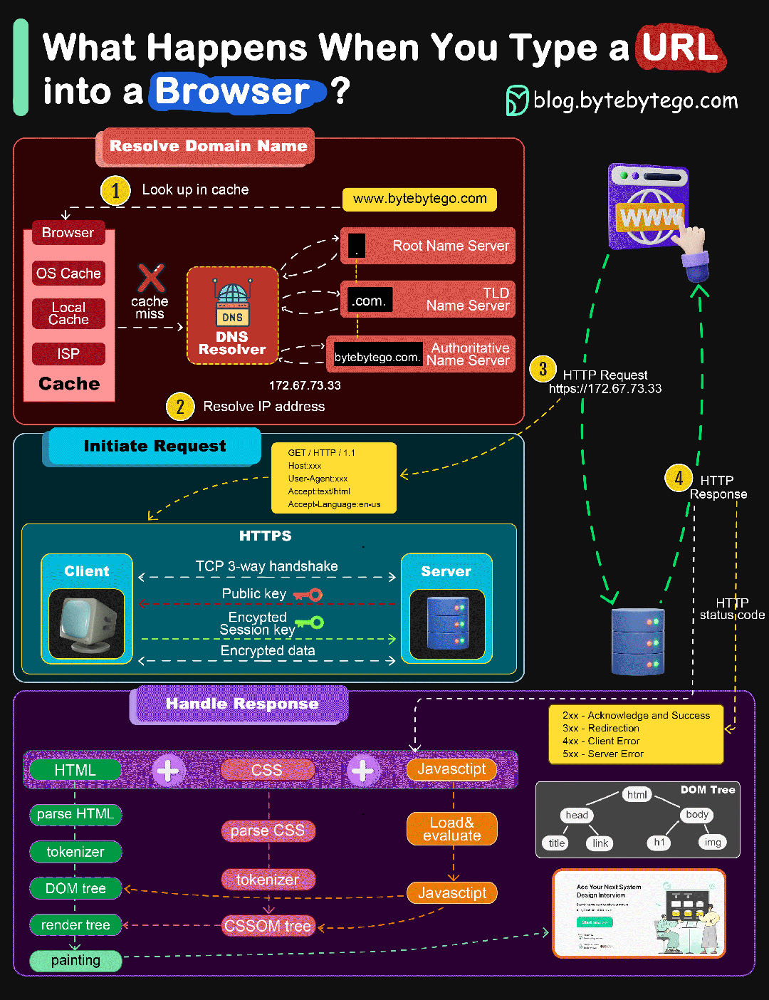

### 1.浏览器输入一个url后，会发生什么

第1步：用户在浏览器输入url并回车。首先要做的是将url转换为IP地址。从url到IP地址的映射通常存储在缓存中，因此浏览器会在多层缓存中查找IP地址：浏览器缓存、操作系统缓存、本地缓存和ISP缓存。如果浏览器在缓存中找不到映射，就会请求DNS解析器进行解析。

第2步：如果在任何缓存中都找不到IP地址，浏览器就会转到DNS服务器进行递归DNS查找，直到找到IP地址为止。

第3步：有了服务器的IP地址，浏览器就会向服务器发送HTTP请求。为了安全访问服务器资源，我们应始终使用HTTPS。浏览器首先通过TCP三次握手与服务器建立TCP连接。然后向客户端发送公钥。客户端使用公钥加密会话密钥并发送给服务器。服务器使用私钥解密会话密钥。然后，客户端和服务端就可以使用会话密钥来交换加密数据，进行通信。

第4步：服务器处理请求并发回响应。相应成功时，状态代码为200。响应包含3个部分：HTML、CSS和Javascript。浏览器会解析HTML生成DOM树、解析CSS生成CSSOM树。然后将DOM树和CSSOM树合并为渲染树，渲染内容并返回给用户。

