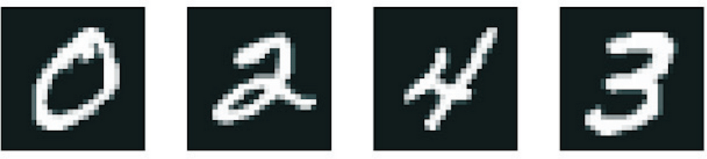
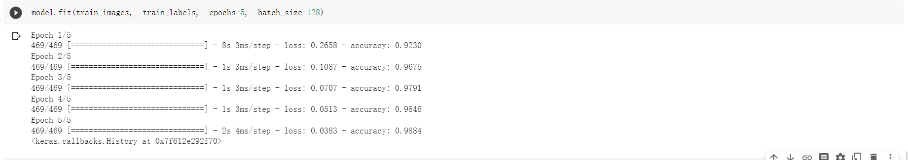
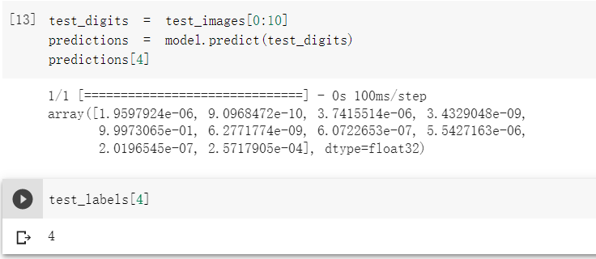

## 任务描述
> 将手写数字的灰度图像（28 像素×28 像素）划分到 10 个类别中（从 0 到 9） 




## 数据集介绍

> MNIST 数据集，它是机器学习领域的一个经典数据集 ，这个数据集包含 60 000 张训练图像和 10 000 张测试图像，由美国国家标准与技术研究院（National Institute of Standards and Technology，即 MNIST 中的 NIST）在 20 世纪 80 年代收集而成。你可以将“解决”MNIST 问题看作深度学习的“Hello World”。


## 步骤一（加载 Keras 中的 MNIST 数据集）

```
from tensorflow.keras.datasets import mnist
(train_images, train_labels), (test_images, test_labels) = mnist.load_data()
```

从keras引入mnist数据集，然后加载训练集和测试集。

train_images 和 train_labels 组成了训练集，模型将从这些数据中进行学习。然后，我们在测试集（包括 test_images 和 test_labels）上对模型进行测试。

图像被编码为 NumPy 数组，而标签是一个数字数组，取值范围是 0～9。图像和标签一一对应

## 步骤二（神经网络架构）

```
from tensorflow import keras
from tensorflow.keras import layers
model = keras.Sequential([
    layers.Dense(512, activation="relu"),
    layers.Dense(10, activation="softmax")
])
```

神经网络的核心组件是层（layer）。你可以将层看成数据过滤器：进去一些数据，出来的数据变得更加有用。具体来说，层从输入数据中提取表示——我们期望这种表示有助于解决手头的问题。大多数深度学习工作涉及将简单的层链接起来，从而实现渐进式的数据蒸馏（data distillation）。深度学习模型就像是处理数据的筛子，包含一系列越来越精细的数据过滤器（也就是层）。

本例中的模型包含 2 个 Dense 层，它们都是密集连接（也叫全连接）的神经层。第1层是一个relu层，relu是一个激活函数，卷积神经网络中，使用该函数的作用是去除卷积结果中的负值，保留正值不变。relu激活函数只在输入大于0时才激活一个节点，当输入小于0时，输出为零，当输入大于0时，输出等于输入。第 2 层（也是最后一层）是一个 10 路 softmax 分类层，它将返回一个由 10 个概率值（总和为 1）组成的数组。每个概率值表示当前数字图像属于 10 个数字类别中某一个的概率。

## 步骤三（编译）

```
model.compile(optimizer="rmsprop",
              loss="sparse_categorical_crossentropy",
              metrics=["accuracy"])
```

在训练模型之前，我们还需要指定编译（compilation）步骤的 3 个参数。

- 优化器（optimizer）：模型基于训练数据来自我更新的机制，其目的是提高模型性能。

- 损失函数（loss function）：模型如何衡量在训练数据上的性能，从而引导自己朝着正确的方向前进。
- 指标（metric）：本例只关心精度（accuracy），即正确分类的图像所占比例。

## 步骤四（准备图像数据）

```
train_images = train_images.reshape((60000, 28 * 28))
train_images = train_images.astype("float32") / 255
test_images = test_images.reshape((10000, 28 * 28))
test_images = test_images.astype("float32") / 255
```

在开始训练之前，我们先对数据进行预处理，将其变换为模型要求的形状，并缩放到所有值都在 [0, 1] 区间。前面提到过，训练图像保存在一个 uint8 类型的数组中，其形状为 (60000, 28, 28)，取值区间为 [0, 255]。我们将把它变换为一个 float32 数组，其形状为 (60000, 28 * 28)，取值范围是 [0, 1]。
## 步骤五（训练模型）

```
model.fit(train_images, train_labels, epochs=5, batch_size=128)
```

训练过程中显示了两个数字：一个是模型在训练数据上的损失值（loss），另一个是模型在训练数据上的精度（acc）。我们很快就在训练数据上达到了 0.988（98.8%）的精度。


## 步骤六（测试）

```
test_digits = test_images[0:10]
predictions = model.predict(test_digits)
predictions[4]
```



我们使用模式预测测试集中前10个样本，然后看索引为4的预测结果，发现索引为4的图片是数字4的概率为99.97%，然后打印索引为4的标签，确实是数字4.