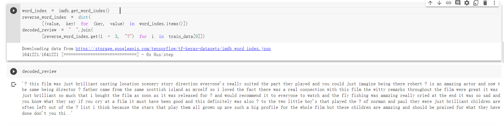
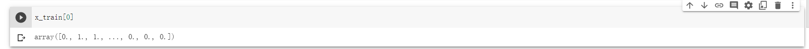
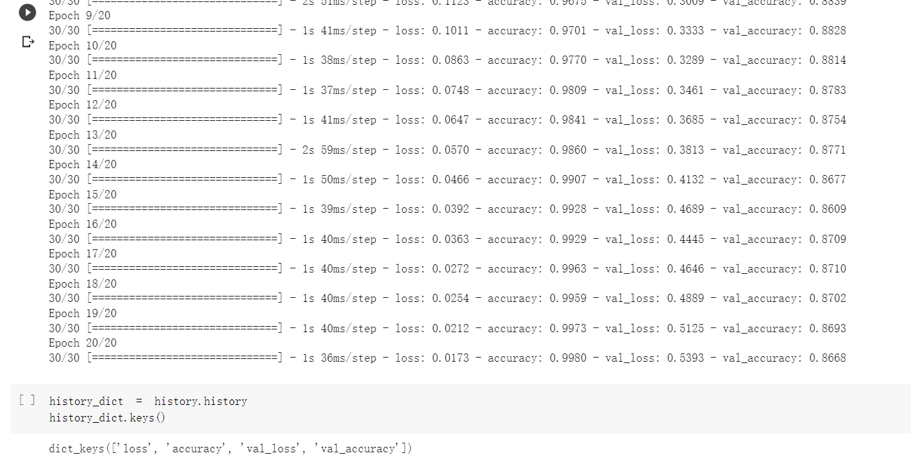
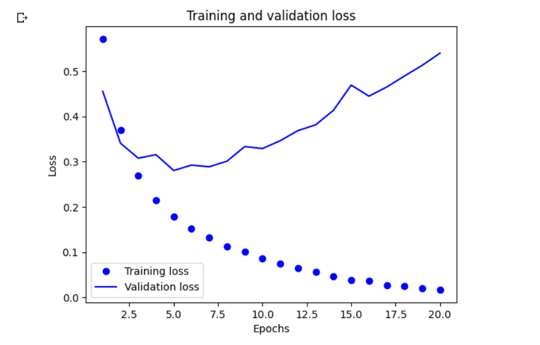
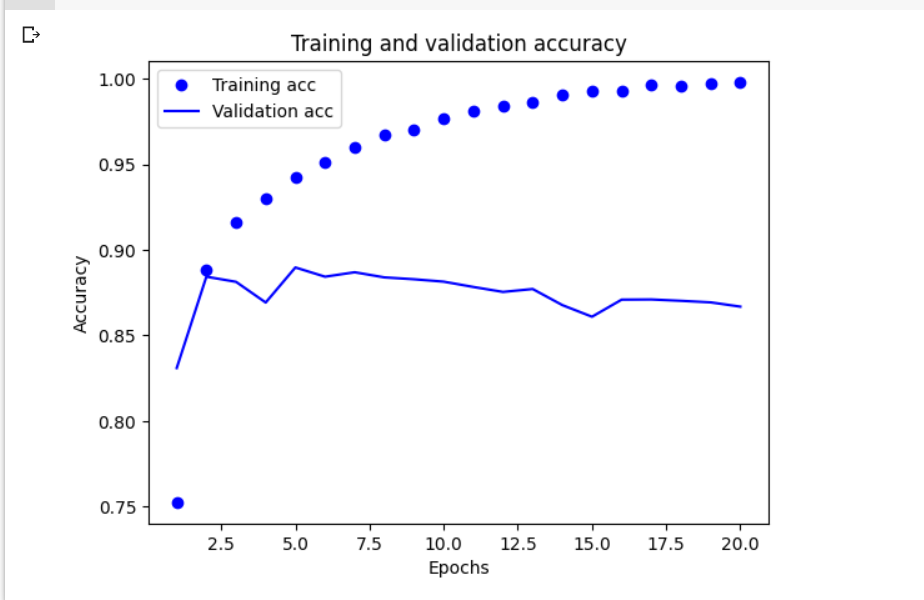
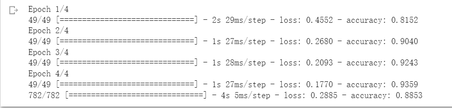
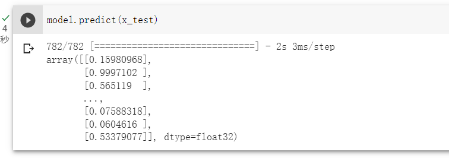

## 任务描述
> 根据影评文本将其划分为正面或负面  


## 数据集介绍

> IMDB 数据集，它包含来自互联网电影数据库（IMDB）的 50000 条严重两极化的评论。数据集被分为 25000 条用于训练的评论与 25 000 条用于测试的评论，训练集和测试集都包含 50% 的正面评论与 50% 的负面评论。


## 步骤一（加载 IMDB 数据集 ）

```
from tensorflow.keras.datasets import imdb
(train_data, train_labels), (test_data, test_labels) = imdb.load_data(
    num_words=10000)
```

参数 num_words=10000 的意思是仅保留训练数据中前 10 000 个最常出现的单词。低频词将被舍弃。这样一来，我们得到的向量数据不会太大，便于处理。如果没有这个限制，那么我们需要处理训练数据中的 88585 个单词。这个数字太大，且没有必要。许多单词只出现在一个样本中，它们对于分类是没有意义的。

train_data 和 test_data 这两个变量都是由评论组成的列表，每条评论又是由单词索引组成的列表（表示单词序列）。train_labels 和 test_labels 都是由 0 和 1 组成的列表，其中 0 代表负面（negative），1 代表正面（positive）。

## 步骤二（评论解码为文本 ）

```
word_index = imdb.get_word_index()  
reverse_word_index = dict(
    [(value, key) for (key, value) in word_index.items()])  
decoded_review = " ".join(
    [reverse_word_index.get(i - 3, "?") for i in train_data[0]])   
```



对评论解码。索引减去了 3，因为 0、1、2 分别是为“padding”（ 填充） 

## 步骤三（multi-hot 编码 ）

```
import numpy as np
def vectorize_sequences(sequences, dimension=10000):
    results = np.zeros((len(sequences), dimension))  
    for i, sequence in enumerate(sequences):
        for j in sequence:
            results[i, j] = 1.   
    return results
x_train = vectorize_sequences(train_data)  
x_test = vectorize_sequences(test_data)   
y_train = np.asarray(train_labels).astype("float32")
y_test = np.asarray(test_labels).astype("float32")
```



整数列表的长度各不相同，但神经网络处理的是大小相同的数据批量。你需要将列表转换为张量，转换方法有以下两种。

- 填充列表，使其长度相等，再将列表转换成形状为 (samples, max_length) 的整数张量，然后在模型第一层使用能处理这种整数张量的层（也就是 Embedding 层）。

- multi-hot 编码，将其转换为由 0 和 1 组成的向量。举个例子，将序列 [8, 5] 转换成一个 10 000 维向量，只有索引 8 和 5 对应的元素是 1，其余元素都是 0。然后，模型第一层可以用 Dense 层，它能够处理浮点数向量数据。

## 步骤四（构建模型）

```
from tensorflow import keras
from tensorflow.keras import layers
model = keras.Sequential([
    layers.Dense(16, activation="relu"),
    layers.Dense(16, activation="relu"),
    layers.Dense(1, activation="sigmoid")
])
```

中间层使用 relu 作为激活函数，最后一层使用 sigmoid 激活函数，以便输出一个介于 0 和 1 之间的概率值（表示样本目标值等于“1”的可能性，即评论为正面的可能性）。relu 函数将所有负值归零（见图 4-2），sigmoid 函数则将任意值“压缩”到 [0, 1] 区间内（见图 4-3），其输出可以看作概率值。

## 步骤五（编译模型 ）

```
model.compile(optimizer="rmsprop",
              loss="binary_crossentropy",
              metrics=["accuracy"])
```

需要选择损失函数和优化器。由于这是一个二分类问题，模型输出是一个概率值（模型最后一层只有一个单元并使用 sigmoid 激活函数），所以最好使用 binary_crossentropy（二元交叉熵）损失函数。这并不是唯一可行的选择，比如你还可以使用 mean_squared_error（均方误差）。但对于输出概率值的模型，交叉熵（crossentropy）通常是最佳选择。交叉熵是一个来自于信息论领域的概念，用于衡量概率分布之间的距离，在这个例子中就是真实分布与预测值之间的距离。

## 步骤六（分出验证集）

```
x_val = x_train[:10000]
partial_x_train = x_train[10000:]
y_val = y_train[:10000]
partial_y_train = y_train[10000:]
```

深度学习模型不应该在训练数据上进行评估；标准做法是使用验证集来监控训练过程中的模型精度。下面我们将从原始训练数据中留出 10000 个样本作为验证集 

## 步骤七（训练模型）

```
history = model.fit(partial_x_train,
                    partial_y_train,
                    epochs=20,
                    batch_size=512,
                    validation_data=(x_val, y_val))
```



我们将使用由 512 个样本组成的小批量，对模型训练 20 轮，即对训练数据的所有样本进行 20 次迭代。与此同时，我们还要监控在留出的 10 000 个样本上的损失和精度。可以通过 validation_data 参数传入验证数据，

## 步骤八（绘制训练损失和验证损失）

```
import matplotlib.pyplot as plt
history_dict = history.history
loss_values = history_dict["loss"]
val_loss_values = history_dict["val_loss"]
epochs = range(1, len(loss_values) + 1)
plt.plot(epochs, loss_values, "bo", label="Training loss")   
plt.plot(epochs, val_loss_values, "b", label="Validation loss")   
plt.title("Training and validation loss")
plt.xlabel("Epochs")
plt.ylabel("Loss")
plt.legend()
plt.show()
```



## 步骤九（绘制训练精度和验证精度）

```
plt.clf()   ←---- 清空图像
acc = history_dict["accuracy"]
val_acc = history_dict["val_accuracy"]
plt.plot(epochs, acc, "bo", label="Training acc")
plt.plot(epochs, val_acc, "b", label="Validation acc")
plt.title("Training and validation accuracy")
plt.xlabel("Epochs")
plt.ylabel("Accuracy")
plt.legend()
plt.show()
```



训练损失每轮都在减小，训练精度每轮都在提高。这正是梯度下降优化的预期结果——我们想要最小化的量随着每次迭代变得越来越小。但验证损失和验证精度并非如此，它们似乎在第 4 轮达到峰值。这正是我之前警告过的一种情况：模型在训练数据上的表现越来越好，但在前所未见的数据上不一定表现得越来越好。准确地说，这种现象叫作过拟合（overfit）：在第 4 轮之后，你对训练数据过度优化，最终学到的表示仅针对于训练数据，无法泛化到训练集之外的数据。

在这种情况下，为防止过拟合，可以在 4 轮之后停止训练。

## 步骤十（重新训练）

```
model = keras.Sequential([
    layers.Dense(16, activation="relu"),
    layers.Dense(16, activation="relu"),
    layers.Dense(1, activation="sigmoid")
])
model.compile(optimizer="rmsprop",
              loss="binary_crossentropy",
              metrics=["accuracy"])
model.fit(x_train, y_train, epochs=4, batch_size=512)
results = model.evaluate(x_test, y_test)
```



调整训练轮数，这种相当简单的方法得到了约 88% 的精度。 

## 步骤十一（利用模型预测）

```
model.predict(x_test)
```



模型对某些样本的结果非常确信（大于等于 0.99，或小于等于 0.01），但对其他样本不那么确信（0.6 或 0.4）。 