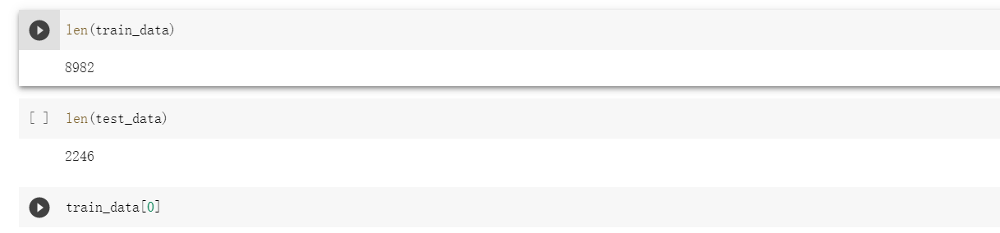
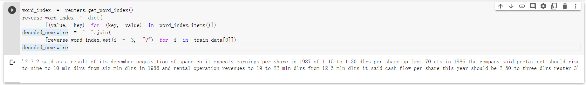
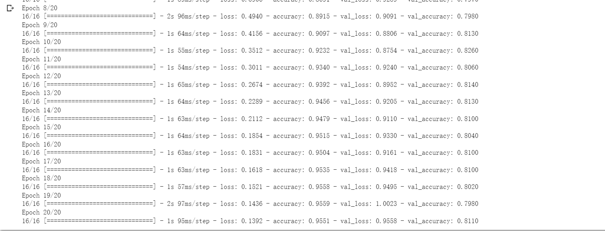
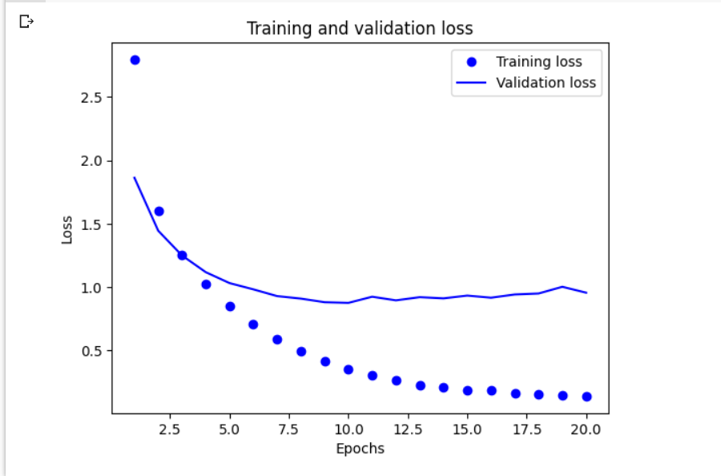
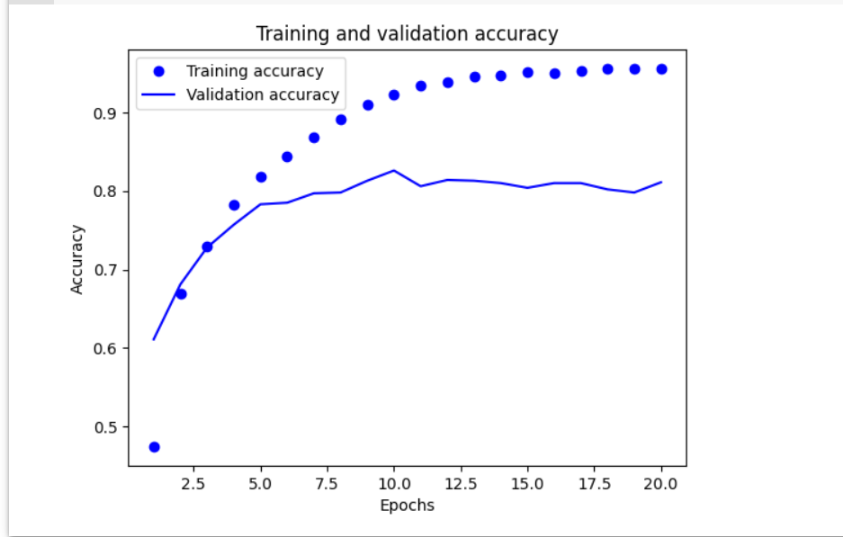
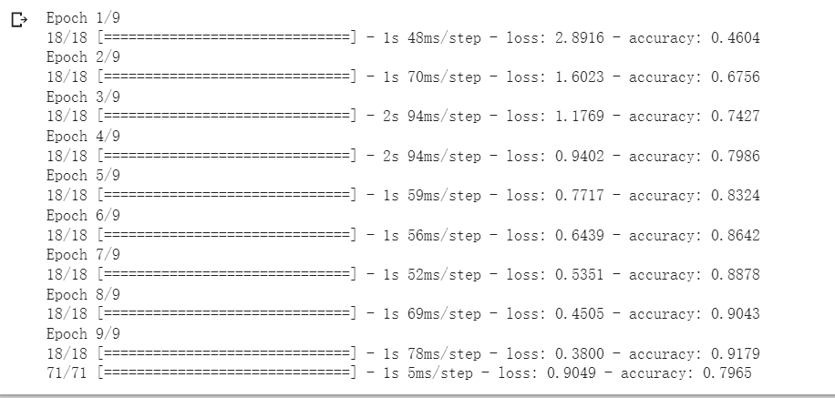
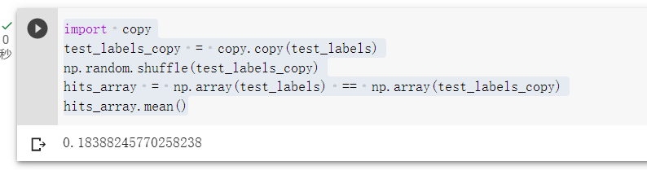
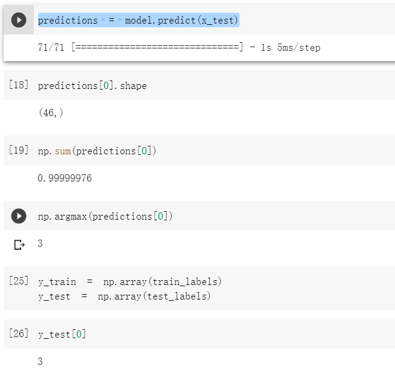
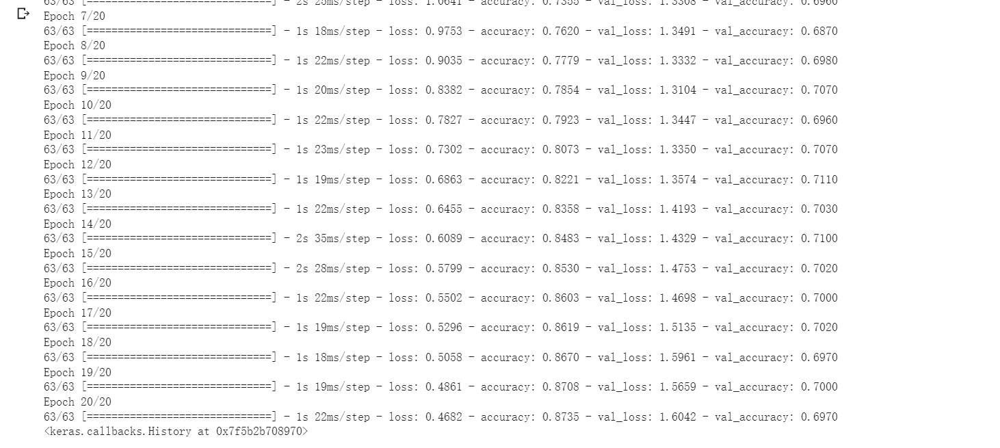

## 任务描述
> 构建一个模型，把路透社新闻划分到 46 个互斥的主题中。由于有多个类别，因此这是一个多分类（multiclass classification）问题。   


## 数据集介绍

> REUTERS  数据集，它包含许多短新闻及其对应的主题，由路透社于 1986 年发布。它是一个简单且广泛使用的文本分类数据集，其中包括 46 个主题。某些主题的样本相对较多，但训练集中的每个主题都有至少 10 个样本。


## 步骤一（加载 REUTERS 数据集 ）

```
from tensorflow.keras.datasets import reuters
(train_data, train_labels), (test_data,  test_labels) = reuters.load_data(
    num_words=10000)
```



与 IMDB 数据集一样，参数 num_words=10000 将数据限定为前 10 000 个最常出现的单词。我们有 8982 个训练样本和 2246 个测试样本。

## 步骤二（新闻解码为文本 ）

```
word_index = reuters.get_word_index()
reverse_word_index = dict(
    [(value, key) for (key, value) in word_index.items()])
decoded_newswire = " ".join(
    [reverse_word_index.get(i - 3, "?") for i in train_data[0]])
decoded_newswire
```



对新闻解码。索引减去了 3，因为 0、1、2 分别是为“padding”（ 填充） 

## 步骤三（向量化）

```
import numpy as np
def vectorize_sequences(sequences, dimension=10000):
    results = np.zeros((len(sequences), dimension))  
    for i, sequence in enumerate(sequences):
        for j in sequence:
            results[i, j] = 1.   
    return results
x_train = vectorize_sequences(train_data)  
x_test = vectorize_sequences(test_data)

def to_one_hot(labels, dimension=46):
    results = np.zeros((len(labels), dimension))
    for i, label in enumerate(labels):
        results[i, label] = 1.
    return results
y_train = to_one_hot(train_labels)  
y_test = to_one_hot(test_labels)
```

将标签向量化有两种方法：既可以将标签列表转换为一个整数张量，也可以使用 one-hot 编码。one-hot 编码是分类数据的一种常用格式，也叫分类编码（categorical encoding）。在这个例子中，标签的 one-hot 编码就是将每个标签表示为全零向量，只有标签索引对应的元素为 1

## 步骤四（构建模型）

```
from tensorflow import keras
from tensorflow.keras import layers
model = keras.Sequential([
    layers.Dense(64, activation="relu"),
    layers.Dense(64, activation="relu"),
    layers.Dense(46, activation="softmax")
])
```

- 模型的最后一层是大小为 46 的 Dense 层。也就是说，对于每个输入样本，神经网络都会输出一个 46 维向量。这个向量的每个元素（每个维度）代表不同的输出类别。
- 最后一层使用了 softmax 激活函数。模型将输出一个在 46 个输出类别上的概率分布——对于每个输入样本，模型都会生成一个 46 维输出向量，其中 output[i] 是样本属于第 i 个类别的概率。46 个概率值的总和为 1。


## 步骤五（编译模型 ）

```
model.compile(optimizer="rmsprop",
              loss="categorical_crossentropy",
              metrics=["accuracy"])
```

最好的损失函数是 categorical_crossentropy（分类交叉熵），它衡量的是两个概率分布之间的距离，这里两个概率分布分别是模型输出的概率分布和标签的真实分布。我们训练模型将这两个分布的距离最小化，从而让输出结果尽可能接近真实标签。

## 步骤六（分出验证集）

```
x_val = x_train[:1000]
partial_x_train = x_train[1000:]
y_val = y_train[:1000]
partial_y_train = y_train[1000:]
```

深度学习模型不应该在训练数据上进行评估；标准做法是使用验证集来监控训练过程中的模型精度。下面我们将从原始训练数据中留出 1000 个样本作为验证集 

## 步骤七（训练模型）

```
history = model.fit(partial_x_train,
                    partial_y_train,
                    epochs=20,
                    batch_size=512,
                    validation_data=(x_val, y_val))
```



我们将使用由 512 个样本组成的小批量，对模型训练 20 轮，即对训练数据的所有样本进行 20 次迭代。与此同时，我们还要监控在留出的 1000 个样本上的损失和精度。可以通过 validation_data 参数传入验证数据，

## 步骤八（绘制训练损失和验证损失）

```
import matplotlib.pyplot as plt
loss = history.history["loss"]
val_loss = history.history["val_loss"]
epochs = range(1, len(loss) + 1)
plt.plot(epochs, loss, "bo", label="Training loss")
plt.plot(epochs, val_loss, "b", label="Validation loss")
plt.title("Training and validation loss")
plt.xlabel("Epochs")
plt.ylabel("Loss")
plt.legend()
plt.show()
```



## 步骤九（绘制训练精度和验证精度）

```
plt.clf()  
acc = history.history["accuracy"]
val_acc = history.history["val_accuracy"]
plt.plot(epochs, acc, "bo", label="Training accuracy")
plt.plot(epochs, val_acc, "b", label="Validation accuracy")
plt.title("Training and validation accuracy")
plt.xlabel("Epochs")
plt.ylabel("Accuracy")
plt.legend()
plt.show()
```



模型在 9 轮之后开始过拟合。我们从头开始训练一个新模型，训练 9 轮，然后在测试集上评估模型。 

## 步骤十（重新训练）

```
model = keras.Sequential([
    layers.Dense(64, activation="relu"),
    layers.Dense(64, activation="relu"),
    layers.Dense(46, activation="softmax")
])
model.compile(optimizer="rmsprop",
              loss="categorical_crossentropy",
              metrics=["accuracy"])
model.fit(x_train,
          y_train,
          epochs=9,
          batch_size=512)
results = model.evaluate(x_test, y_test)
```



这种方法可以达到约 80% 的精度。对于均衡的二分类问题，完全随机的分类器能达到 50% 的精度。但在这个例子中，我们有 46 个类别，各类别的样本数量可能还不一样。那么一个随机基准模型的精度是多少呢？我们可以通过快速实现随机基准模型来验证一下。

```
import copy
test_labels_copy = copy.copy(test_labels)
np.random.shuffle(test_labels_copy)
hits_array = np.array(test_labels) == np.array(test_labels_copy)
hits_array.mean()
```



可以看到，随机分类器的分类精度约为 18%。从这个角度来看，我们的模型结果看起来相当不错。 

## 步骤十一（利用模型预测）

```
predictions = model.predict(x_test)
```



predictions 的每个元素都是长度为 46 的向量。这个向量的所有元素总和为 1，因为它们形成了一个概率分布。向量的最大元素就是预测类别，即概率最高的类别。 

## 步骤十二（调整模型参数）

修改损失函数和中间层层数，重新训练

```
model.compile(optimizer="rmsprop",
              loss="sparse_categorical_crossentropy",
              metrics=["accuracy"])
              
model = keras.Sequential([
    layers.Dense(64, activation="relu"),
    layers.Dense(4, activation="relu"),
    layers.Dense(46, activation="softmax")
])
model.compile(optimizer="rmsprop",
              loss="categorical_crossentropy",
              metrics=["accuracy"])
model.fit(partial_x_train,
          partial_y_train,
          epochs=20,
          batch_size=128,
          validation_data=(x_val, y_val))
```



现在模型的最大验证精度约为 70%，比之前下降了 9%。导致下降的主要原因在于，我们试图将大量信息（这些信息足以找到 46 个类别的分离超平面）压缩到维度过小的中间层。模型能够将大部分必要信息塞进这个 4 维表示中，但并不是全部信息。