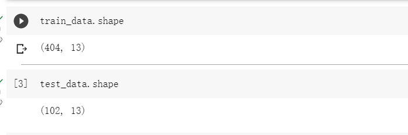
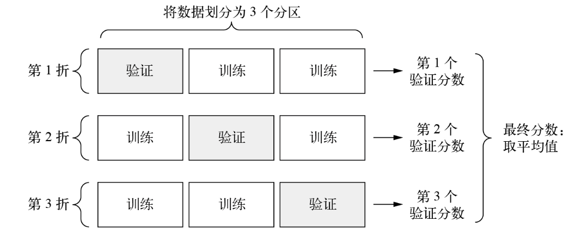
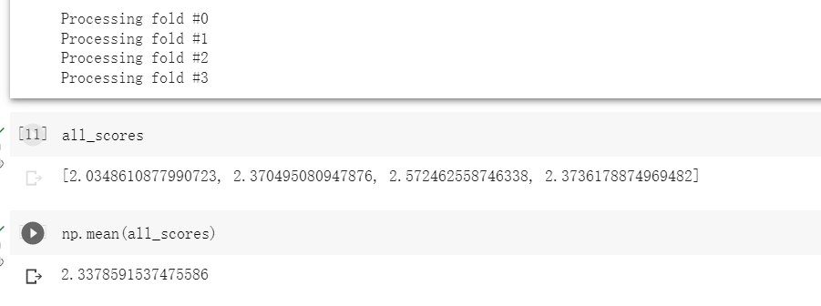
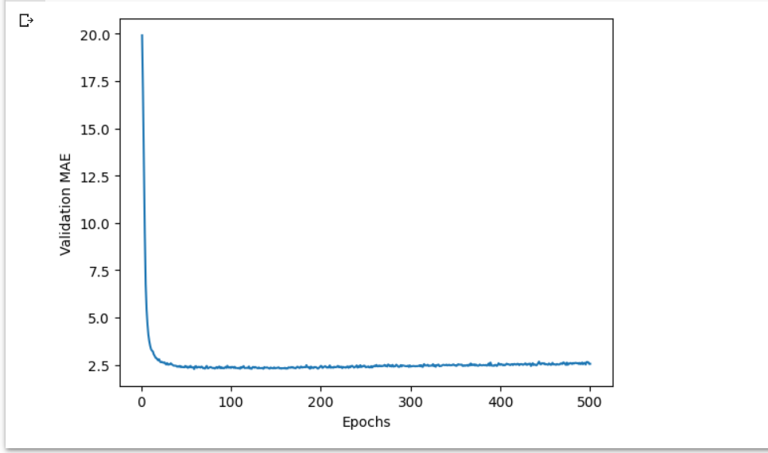
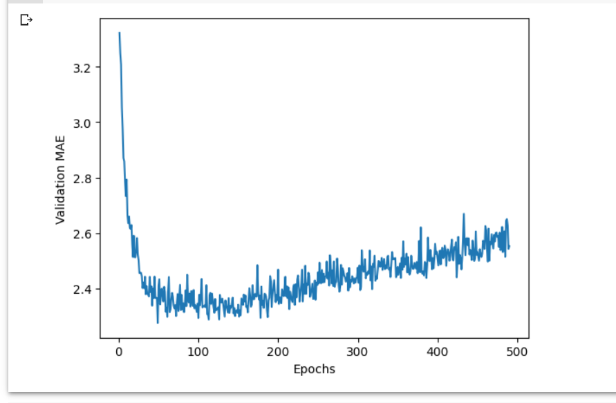
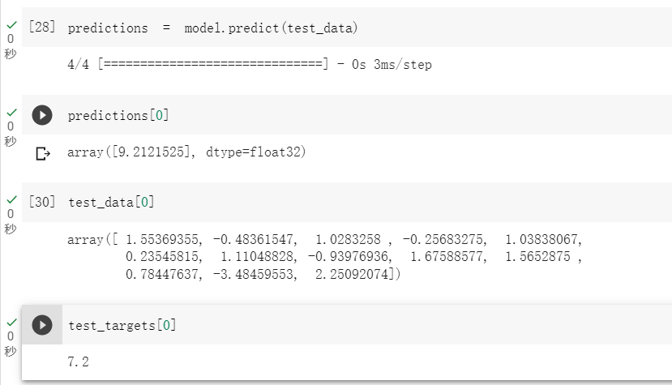

## 任务描述
> 已知20 世纪 70 年代中期波士顿郊区的一些数据点，如犯罪率、地方房产税率等，预测当时波士顿郊区房价的中位数  


## 数据集介绍

> BOSTON_HOUSING 数据集，包含的数据点相对较少，只有 506 个，划分为 404 个训练样本和 102 个测试样本。输入数据的每个特征（比如犯罪率）都有不同的取值范围。有的特征是比例，取值在 0 和 1 之间；有的取值在 1 和 12 之间；还有的取值在 0 和 100 之间。


## 步骤一（加载数据集 ）

```
from tensorflow.keras.datasets import boston_housing
(train_data, train_targets), (test_data, test_targets) = (boston_housing.load_data())
```



有 404 个训练样本和 102 个测试样本，每个样本都有 13 个数值特征，比如人均犯罪率、住宅的平均房间数、高速公路可达性等。 

## 步骤二（数据标准化）

```
mean = train_data.mean(axis=0)
train_data -= mean
std = train_data.std(axis=0)
train_data /= std
test_data -= mean
test_data /= std 
```

将取值范围差异很大的数据输入到神经网络中，这是有问题的。模型可能会自动适应这种取值范围不同的数据，但这肯定会让学习变得更加困难。对于这类数据，普遍采用的最佳处理方法是对每个特征进行标准化，即对于输入数据的每个特征（输入数据矩阵的每一列），减去特征平均值，再除以标准差，这样得到的特征平均值为 0，标准差为 1。用 NumPy 可以很容易实现数据标准化。

## 步骤三（构建模型）

```
def build_model():
    model = keras.Sequential([  
        layers.Dense(64, activation="relu"),
        layers.Dense(64, activation="relu"),
        layers.Dense(1)
    ])
    model.compile(optimizer="rmsprop", loss="mse", metrics=["mae"])
    return model
```

- 模型：由于样本数量很少，因此我们将使用一个非常小的模型。它包含两个中间层，每层有 64 个单元。一般来说，训练数据越少，过拟合就会越严重，而较小的模型可以降低过拟合。模型的最后一层只有一个单元且没有激活，它是一个线性层。这是标量回归（标量回归是预测单一连续值的回归）的典型设置。添加激活函数将限制输出范围。如果向最后一层添加 sigmoid 激活函数，那么模型只能学会预测 0 到 1 的值。这里最后一层是纯线性的，所以模型可以学会预测任意范围的值。
- 损失函数：编译模型用的是 mse 损失函数，即均方误差（mean squared error，MSE），预测值与目标值之差的平方。这是回归问题常用的损失函数。

- 指标：在训练过程中还要监控一个新指标：平均绝对误差（mean absolute error，MAE）。它是预测值与目标值之差的绝对值。如果这个问题的 MAE 等于 0.5，就表示预测房价与实际价格平均相差 500 美元。


## 步骤四（K折交叉验证）

```
import numpy as np
from tensorflow import keras
from tensorflow.keras import layers
k = 4
num_val_samples = len(train_data) // k
num_epochs = 100
all_scores = []
for i in range(k):
    print(f"Processing fold #{i}")
    val_data = train_data[i * num_val_samples: (i + 1) * num_val_samples]  
    val_targets = train_targets[i * num_val_samples: (i + 1) * num_val_samples]
    partial_train_data = np.concatenate(   
        [train_data[:i * num_val_samples],
         train_data[(i + 1) * num_val_samples:]],
        axis=0)
    partial_train_targets = np.concatenate(
        [train_targets[:i * num_val_samples],
         train_targets[(i + 1) * num_val_samples:]],
        axis=0)
    model = build_model()  
    model.fit(partial_train_data, partial_train_targets,  
              epochs=num_epochs, batch_size=16, verbose=0)
    val_mse, val_mae = model.evaluate(val_data, val_targets, verbose=0)   
    all_scores.append(val_mae)
```



为了在调节参数（比如训练轮数）的同时对模型进行评估，我们可以将数据划分为训练集和验证集，正如前面的例子所做的那样。但由于数据点很少，验证集会非常小（比如大约 100 个样本），因此验证分数可能会有很大波动，这取决于我们所选择的验证集和训练集。也就是说，验证分数对于验证集的划分方式可能会有很大的方差，这样我们就无法对模型进行可靠的评估。在这种情况下，最佳做法是使用 K 折交叉验证。

这种方法将可用数据划分为 K 个分区（K 通常取 4 或 5），实例化 K 个相同的模型，然后将每个模型在 K-1 个分区上训练，并在剩下的一个分区上进行评估。模型的验证分数等于这 K 个验证分数的平均值。



每次运行模型得到的验证分数确实有很大差异，从 2.0 到 2.6 不等。平均分数（2.3）是比单一分数更可靠的指标——这就是 *K* 折交叉验证的核心要点。 

## 步骤五（调整训练轮数）

```
num_epochs = 500
all_mae_histories = []
for i in range(k):
    print(f"Processing fold #{i}")
    val_data = train_data[i * num_val_samples: (i + 1) * num_val_samples]   
    val_targets = train_targets[i * num_val_samples: (i + 1) * num_val_samples]
    partial_train_data = np.concatenate(  
        [train_data[:i * num_val_samples],
         train_data[(i + 1) * num_val_samples:]],
        axis=0)
    partial_train_targets = np.concatenate(
        [train_targets[:i * num_val_samples],
         train_targets[(i + 1) * num_val_samples:]],
        axis=0)
    model = build_model()  
    history = model.fit(partial_train_data, partial_train_targets, verbose=0）
                        validation_data=(val_data, val_targets),
                        epochs=num_epochs, batch_size=16, verbose=0)
    mae_history = history.history["val_mae"]
    all_mae_histories.append(mae_history)
```

## 步骤六（计算平均值）

```
average_mae_history = [
    np.mean([x[i] for x in all_mae_histories]) for i in range(num_epochs)]
```

深度学习模型不应该在训练数据上进行评估；标准做法是使用验证集来监控训练过程中的模型精度。下面我们将从原始训练数据中留出 10 000 个样本作为验证集 

## 步骤七（绘制验证 MAE 曲线 ）

```
import matplotlib.pyplot as plt
plt.plot(range(1, len(average_mae_history) + 1), average_mae_history)
plt.xlabel("Epochs")
plt.ylabel("Validation MAE")
plt.show()
```



前几轮的验证 MAE 远大于后面的轮次，很难看清这张图的规律。我们忽略前 10 个数据点，因为它们的取值范围与曲线上的其他点不同 。

```
truncated_mae_history = average_mae_history[10:]
plt.plot(range(1, len(truncated_mae_history) + 1), truncated_mae_history)
plt.xlabel("Epochs")
plt.ylabel("Validation MAE")
plt.show()
```



可以看出，验证 MAE 在 100 轮（包含剔除的那 10 轮）后不再显著降低，再之后就开始过拟合了。 

## 步骤八（房价预测）

