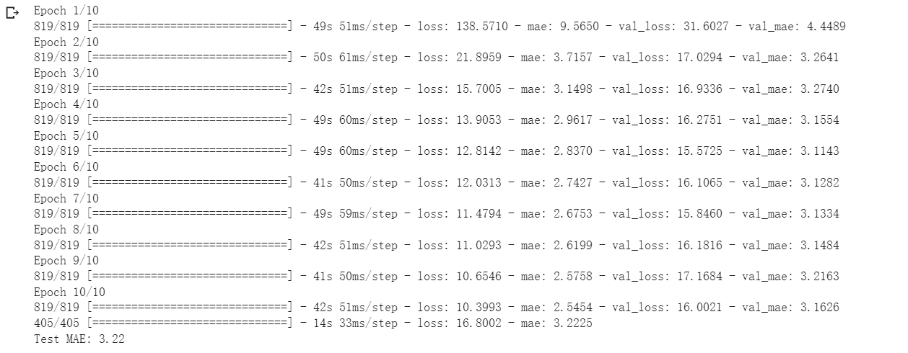

## 任务描述
> 已知每小时测量的气压、湿度等数据的时间序列（数据由屋顶的一组传感器记录），预测 24 小时之后的温度。 

## 数据集介绍

> 数据集由德国耶拿的马克斯 • 普朗克生物地球化学研究所的气象站记录。在这个数据集中，每 10 分钟记录 14 个物理量（如温度、气压、湿度、风向等），其中包含多年的记录。原始数据可追溯至 2003 年，但本例仅使用 2009 年～2016 年的数据。

## 步骤一（下载数据集）

```
!wget https://s3.amazonaws.com/keras-datasets/jena_climate_2009_2016.csv.zip
```

## 步骤二（解压并提取数据）

```
!unzip jena_climate_2009_2016.csv.zip
```

## 步骤三（查看耶拿天气数据集 ）

```
import os
fname = os.path.join("jena_climate_2009_2016.csv")

with open(fname) as f:
    data = f.read()

lines = data.split("\n")
header = lines[0].split(",")
lines = lines[1:]
print(header)
print(len(lines))
```


## 步骤四（解析数据 ）

```
import numpy as np
temperature = np.zeros((len(lines),))
raw_data = np.zeros((len(lines), len(header) - 1))
for i, line in enumerate(lines):
    values = [float(x) for x in line.split(",")[1:]]
    temperature[i] = values[1]  
    raw_data[i, :] = values[:]  
```

绘制温度随时间的变化曲线（单位为摄氏度）：

```
from matplotlib import pyplot as plt
plt.plot(range(len(temperature)), temperature)
```


由于每 10 分钟记录一次数据，因此每天有 144 个数据点（24×6=144）。 

绘制前 10 天的温度时间序列 ：

```
plt.plot(range(1440), temperature[:1440])
```


## 步骤五（数据分割）

我们将前 50% 的数据用于训练，随后的 25% 用于验证，最后的 25% 用于测试。处理时间序列数据时，有一点很重要：验证数据和测试数据应该比训练数据更靠后，因为你是要根据过去预测未来，而不是反过来，所以验证 / 测试划分应该反映这一点。如果将时间轴反转，有些问题就会变得简单得多。

```
num_train_samples = int(0.5 * len(raw_data))
num_val_samples = int(0.25 * len(raw_data))
num_test_samples = len(raw_data) - num_train_samples - num_val_samples
print("num_train_samples:", num_train_samples)
print("num_val_samples:", num_val_samples)
print("num_test_samples:", num_test_samples)
```


## 步骤六（数据规范化 ）

首先，我们对数据进行预处理，将其转换为神经网络可以处理的格式。我们将对每个时间序列分别做规范化，使其处于相近的范围，并且都取较小的值。我们使用前 210 225 个时间步作为训练数据，所以只计算这部分数据的均值和标准差。

```
mean = raw_data[:num_train_samples].mean(axis=0)
raw_data -= mean
std = raw_data[:num_train_samples].std(axis=0)
raw_data /= std
```

## 步骤七（创建dataset）

我们将使用 timeseries_dataset_from_array() 来创建 3 个数据集，分别用于训练、验证和测试。我们将使用以下参数值。

- sampling_rate = 6：观测数据的采样频率是每小时一个数据点，也就是说，每 6 个数据点保留一个。

- sequence_length = 120：给定过去 5 天（120 小时）的观测数据。
- delay = sampling_rate * (sequence_length + 24 - 1)：序列的目标是序列结束 24 小时之后的温度。

创建训练数据集时，使用前 50% 的数据。对于验证数据集，使用接下来 25% 的数据。对于测试数据集，使用剩余数据。

```
sampling_rate = 6
sequence_length = 120
delay = sampling_rate * (sequence_length + 24 - 1)
batch_size = 256

train_dataset = keras.utils.timeseries_dataset_from_array(
    raw_data[:-delay],
    targets=temperature[delay:],
    sampling_rate=sampling_rate,
    sequence_length=sequence_length,
    shuffle=True,
    batch_size=batch_size,
    start_index=0,
    end_index=num_train_samples)

val_dataset = keras.utils.timeseries_dataset_from_array(
    raw_data[:-delay],
    targets=temperature[delay:],
    sampling_rate=sampling_rate,
    sequence_length=sequence_length,
    shuffle=True,
    batch_size=batch_size,
    start_index=num_train_samples,
    end_index=num_train_samples + num_val_samples)

test_dataset = keras.utils.timeseries_dataset_from_array(
    raw_data[:-delay],
    targets=temperature[delay:],
    sampling_rate=sampling_rate,
    sequence_length=sequence_length,
    shuffle=True,
    batch_size=batch_size,
    start_index=num_train_samples + num_val_samples)
```

## 步骤八（基于常识的基准的 MAE ）

```
def evaluate_naive_method(dataset):
    total_abs_err = 0.
    samples_seen = 0
    for samples, targets in dataset:
        preds = samples[:, -1, 1] * std[1] + mean[1]  
        total_abs_err += np.sum(np.abs(preds - targets))
        samples_seen += samples.shape[0]
    return total_abs_err / samples_seen

print(f"Validation MAE: {evaluate_naive_method(val_dataset):.2f}")
print(f"Test MAE: {evaluate_naive_method(test_dataset):.2f}")
```


对于这个基于常识的基准，验证 MAE 为 2.44 摄氏度，测试 MAE 为 2.62 摄氏度。因此，如果假设 24 小时之后的温度总是与现在相同，那么平均会偏差约 2.5 摄氏度。接下来，我们将利用深度学习知识来得到更好的结果。

## 步骤九（密集连接模型）

```
from tensorflow import keras
from tensorflow.keras import layers

inputs = keras.Input(shape=(sequence_length, raw_data.shape[-1]))
x = layers.Flatten()(inputs)
x = layers.Dense(16, activation="relu")(x)
outputs = layers.Dense(1)(x)
model = keras.Model(inputs, outputs)

callbacks = [
    keras.callbacks.ModelCheckpoint("jena_dense.keras",  
    save_best_only=True)
]
model.compile(optimizer="rmsprop", loss="mse", metrics=["mae"])
history = model.fit(train_dataset,
                    epochs=10,
                    validation_data=val_dataset,
                    callbacks=callbacks)

model = keras.models.load_model("jena_dense.keras")   
print(f"Test MAE: {model.evaluate(test_dataset)[1]:.2f}")

```

首先将数据展平，然后是两个 Dense 层。最后一个 Dense 层没有激活函数，这是回归问题的典型特征。我们使用均方误差（MSE）作为损失，而不是平均绝对误差（MAE），因为 MSE 在 0 附近是光滑的（而 MAE 不是），这对梯度下降来说是一个有用的属性。我们在 compile() 中监控 MAE 这项指标。


## 步骤十（一维卷积模型）

```
inputs = keras.Input(shape=(sequence_length, raw_data.shape[-1]))
x = layers.Conv1D(8, 24, activation="relu")(inputs)
x = layers.MaxPooling1D(2)(x)
x = layers.Conv1D(8, 12, activation="relu")(x)
x = layers.MaxPooling1D(2)(x)
x = layers.Conv1D(8, 6, activation="relu")(x)
x = layers.GlobalAveragePooling1D()(x)
outputs = layers.Dense(1)(x)
model = keras.Model(inputs, outputs)

callbacks = [
    keras.callbacks.ModelCheckpoint("jena_conv.keras",
    save_best_only=True)
]
model.compile(optimizer="rmsprop", loss="mse", metrics=["mae"])
history = model.fit(train_dataset,
                    epochs=10,
                    validation_data=val_dataset,
                    callbacks=callbacks)

model = keras.models.load_model("jena_conv.keras")
print(f"Test MAE: {model.evaluate(test_dataset)[1]:.2f}")
```



事实证明，这个模型的性能甚至比密集连接模型更差。它的验证 MAE 约为 3.2 摄氏度，比基于常识的基准差很多。出了什么问题？有以下两个原因。

- 首先，天气数据并不完全遵循平移不变性假设。虽然数据具有每日周期性，但早晨的数据与傍晚或午夜的数据具有不同的属性。天气数据只在某个时间尺度上具有平移不变性。

- 其次，数据的顺序很重要。要想预测第 2 天的温度，最新的数据比 5 天前的数据包含更多的信息。一维卷积神经网络无法利用这一点。特别是，最大汇聚层和全局平均汇聚层在很大程度上破坏了顺序信息。

## 步骤十一（基于 LSTM 的模型）

```
inputs = keras.Input(shape=(sequence_length, raw_data.shape[-1]))
x = layers.LSTM(16)(inputs)
outputs = layers.Dense(1)(x)
model = keras.Model(inputs, outputs)

callbacks = [
    keras.callbacks.ModelCheckpoint("jena_lstm.keras",
                                    save_best_only=True)
]
model.compile(optimizer="rmsprop", loss="mse", metrics=["mae"])
history = model.fit(train_dataset,
                    epochs=10,
                    validation_data=val_dataset,
                    callbacks=callbacks)

model = keras.models.load_model("jena_lstm.keras")
print(f"Test MAE: {model.evaluate(test_dataset)[1]:.2f}")
```


该模型的结果比之前的模型好多了！测试 MAE 为 2.67 摄氏度。基于 LSTM 的模型终于超越了基于常识的基准（尽管目前只超越了一点点），这证明了机器学习在这项任务上的价值。 