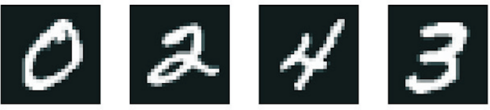
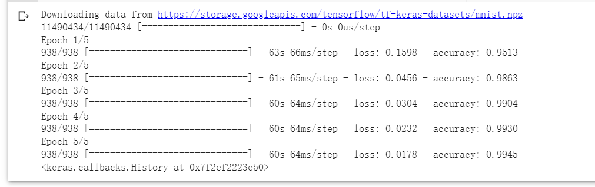
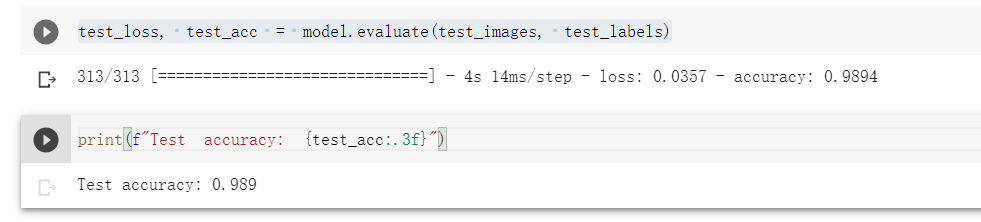

## 任务描述
> 将手写数字的灰度图像（28 像素×28 像素）划分到 10 个类别中（从 0 到 9） 



## 数据集介绍

> MNIST 数据集，它是机器学习领域的一个经典数据集 ，这个数据集包含 60 000 张训练图像和 10 000 张测试图像，由美国国家标准与技术研究院（National Institute of Standards and Technology，即 MNIST 中的 NIST）在 20 世纪 80 年代收集而成。你可以将“解决”MNIST 问题看作深度学习的“Hello World”。


## 步骤一（加载 MNIST 数据集）

```
from tensorflow.keras.datasets import mnist
(train_images, train_labels), (test_images, test_labels) = mnist.load_data()
```

从keras引入mnist数据集，然后加载训练集和测试集。

train_images 和 train_labels 组成了训练集，模型将从这些数据中进行学习。然后，我们在测试集（包括 test_images 和 test_labels）上对模型进行测试。

图像被编码为 NumPy 数组，而标签是一个数字数组，取值范围是 0～9。图像和标签一一对应

## 步骤二（神经网络架构）

```
from tensorflow import keras
from tensorflow.keras import layers
inputs = keras.Input(shape=(28, 28, 1))
x = layers.Conv2D(filters=32, kernel_size=3, activation="relu")(inputs)
x = layers.MaxPooling2D(pool_size=2)(x)
x = layers.Conv2D(filters=64, kernel_size=3, activation="relu")(x)
x = layers.MaxPooling2D(pool_size=2)(x)
x = layers.Conv2D(filters=128, kernel_size=3, activation="relu")(x)
x = layers.Flatten()(x)
outputs = layers.Dense(10, activation="softmax")(x)
model = keras.Model(inputs=inputs, outputs=outputs)
```

可以看到，每个 Conv2D 层和 MaxPooling2D 层的输出都是一个形状为 (height, width, channels) 的 3 阶张量。宽度和高度这两个维度的尺寸通常会随着模型加深而减小。通道数对应传入 Conv2D 层的第一个参数（32、64 或 128）。

在最后一个 Conv2D 层之后，我们得到了形状为 (3, 3, 128) 的输出，即通道数为 128 的 3×3 特征图。下一步是将这个输出传入密集连接分类器中，即 Dense 层的堆叠，你已经很熟悉了。这些分类器可以处理 1 阶的向量，而当前输出是 3 阶张量。为了让二者匹配，我们先用 Flatten 层将三维输出展平为一维，然后再添加 Dense 层。

最后，我们进行十类别分类，所以最后一层使用带有 10 个输出的 softmax 激活函数。

## 步骤三（编译并训练卷积神经网路）

```
from tensorflow.keras.datasets import mnist

(train_images, train_labels), (test_images, test_labels) = mnist.load_data()
train_images = train_images.reshape((60000, 28, 28, 1))
train_images = train_images.astype("float32") / 255
test_images = test_images.reshape((10000, 28, 28, 1))
test_images = test_images.astype("float32") / 255
model.compile(optimizer="rmsprop",
              loss="sparse_categorical_crossentropy",
              metrics=["accuracy"])
model.fit(train_images, train_labels, epochs=5, batch_size=64)
```



由于我们要做的是带有 softmax 输出的十类别分类，因此要使用分类交叉熵损失，而且由于标签是整数，因此要使用稀疏分类交叉熵损失 sparse_categorical_crossentropy。

## 步骤四（评估卷积神经网络 ）

```
test_loss, test_acc = model.evaluate(test_images, test_labels)
```



这个简单的卷积神经网络的测试精度达到了 98.9% 

