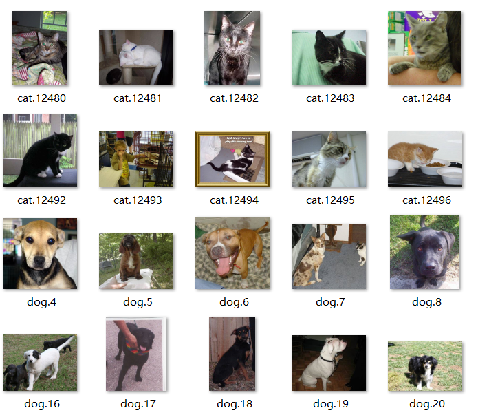
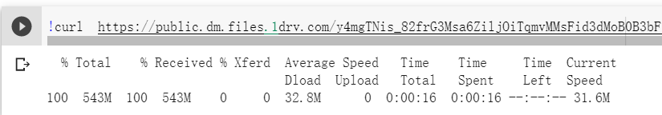
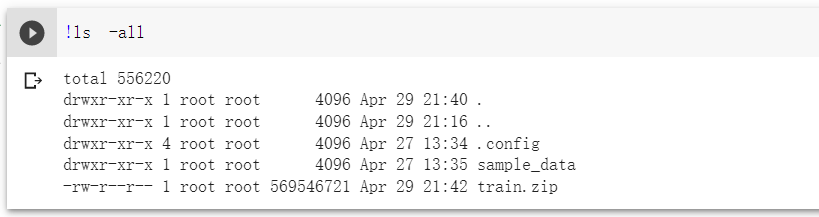
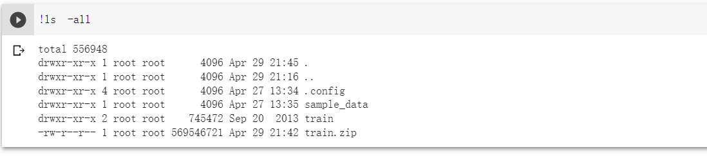
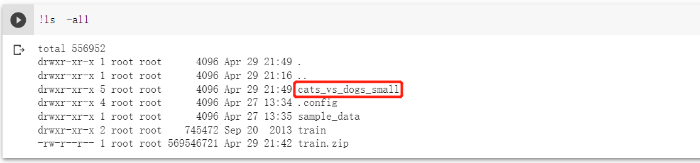
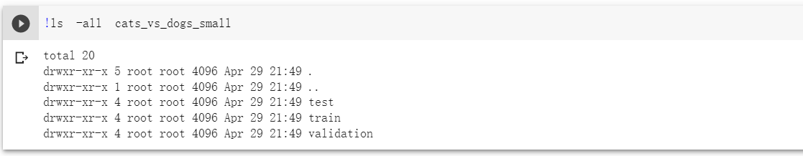
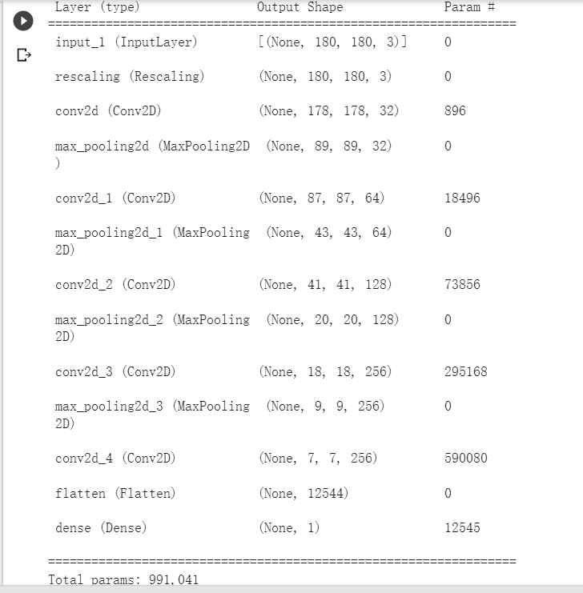
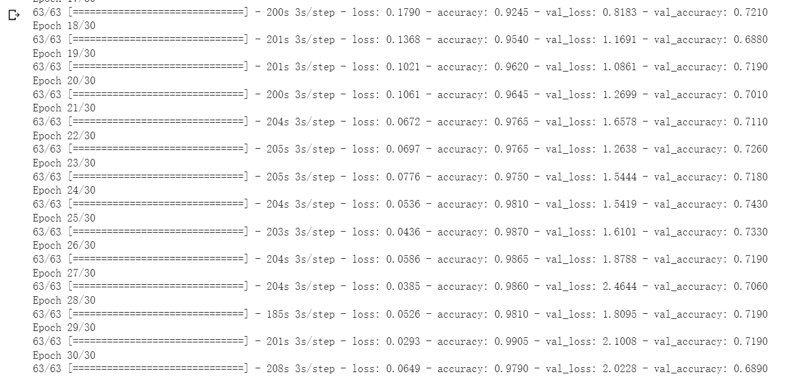
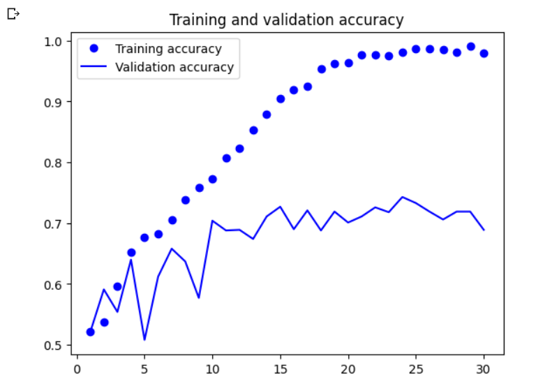
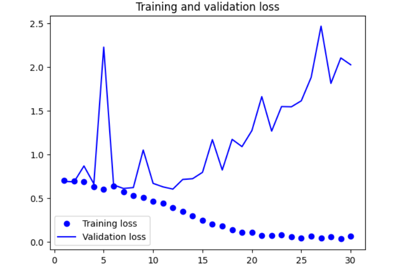

## 任务描述
> 给定一个图像，识别是猫还是狗 



## 数据集介绍

> 猫狗分类数据集由 Kaggle 提供，在 2013 年底作为一项计算机视觉竞赛的一部分，当时卷积神经网络还不是主流算法。可以从 Kaggle 网站下载原始数据集 Dogs vs. Cats。
>
> 这个数据集包含 25 000 张猫和狗的图像（每个类别各有 12 500 张），压缩后的大小为 543 MB。


## 步骤一（下载数据集）

```
!curl https://public.dm.files.1drv.com/y4meMrMBWeYXOWWjpFj7fxpAbOeVTS1XolBX-uO90dlZQzsdvWcAvkk5Gwj3-ctSZXa8Ho0y_QTCjuRHSlwUzze-0Tx_k6Sm2cCW8g9C3alGcO0X4vl1jdR3LHQeP4pcLe1p4X5xGhjeFi7gtszZOhxjFUkx4HjViPJCG85ntgKzsAmI5vjq3UzSMOrknmoZQLTU1C-Dx6ExxexemZofNrIfqHWJkz4GXgmNiH3CyD6R2U?AVOverride=1 --output /content/train.zip
```



首先从kaggle下载Dogs vs. Cats数据集，下载下来是一个train.zip格式的文件。由于谷歌的Colab上传文件太慢，可以先上传到oneDrive平台，再通过curl从平台下载下来。



可以看到train.zip文件有500多M，说明下载成功。

## 步骤二（解压并提取数据）

```
!unzip -qq train.zip
```



解压之后多了一个train目录

```
import os, shutil, pathlib
original_dir = pathlib.Path("train")   
new_base_dir = pathlib.Path("cats_vs_dogs_small")   

def make_subset(subset_name, start_index, end_index):   
    for category in ("cat", "dog"):
        dir = new_base_dir / subset_name / category
        os.makedirs(dir)
        fnames = [f"{category}.{i}.jpg"
                  for i in range(start_index, end_index)]
        for fname in fnames:
            shutil.copyfile(src=original_dir / fname,
                            dst=dir / fname)

make_subset("train", start_index=0, end_index=1000)   
make_subset("validation", start_index=1000, end_index=1500)   
make_subset("test", start_index=1500, end_index=2500) 
```

下载数据并解压后，我们将创建一个新数据集，其中包含 3 个子集：训练集，每个类别各 1000 个样本；验证集，每个类别各 500 个样本；测试集，每个类别各 1000 个样本。我们通过调用几次 shutil 来创建这个子数据集。



发现多了一个cats_vs_dogs_small目录



train是用每个类别的前 1000 张图像创建的训练子集，test是 用每个类别接下来的 500 张图像创建验证子集 ，validation是用每个类别接下来的 1000 张图像创建测试子集 。

现在我们有 2000 张训练图像、1000 张验证图像和 2000 张测试图像。在这 3 个集合中，两个类别的样本数相同，所以这是一个均衡的二分类问题，分类精度可作为衡量成功的指标。

## 步骤三（构建模型）

```
from tensorflow import keras
from tensorflow.keras import layers

inputs = keras.Input(shape=(180, 180, 3))  
x = layers.Rescaling(1./255)(inputs)   
x = layers.Conv2D(filters=32, kernel_size=3, activation="relu")(x)
x = layers.MaxPooling2D(pool_size=2)(x)
x = layers.Conv2D(filters=64, kernel_size=3, activation="relu")(x)
x = layers.MaxPooling2D(pool_size=2)(x)
x = layers.Conv2D(filters=128, kernel_size=3, activation="relu")(x)
x = layers.MaxPooling2D(pool_size=2)(x)
x = layers.Conv2D(filters=256, kernel_size=3, activation="relu")(x)
x = layers.MaxPooling2D(pool_size=2)(x)
x = layers.Conv2D(filters=256, kernel_size=3, activation="relu")(x)
x = layers.Flatten()(x)
outputs = layers.Dense(1, activation="sigmoid")(x)
model = keras.Model(inputs=inputs, outputs=outputs)
```

卷积神经网络由 Conv2D 层（使用 relu 激活函数）和 MaxPooling2D 层交替堆叠而成。但因为这里要处理更大的图像和更复杂的问题，所以需要相应地增大模型，增加两个 Conv2D+MaxPooling2D 的组合。这样做既可以增大模型容量，又可以进一步缩小特征图尺寸，使其在进入 Flatten 层时尺寸不会太大。本例初始输入的尺寸为 180 像素×180 像素（这是一个随意的选择），最后在 Flatten 层之前的特征图尺寸为 7×7。

因为这是一个二分类问题，所以模型的最后一层是使用 sigmoid 激活函数的单个单元（大小为 1 的 Dense 层）。这个单元表示的是模型认为样本属于某个类别的概率。

```
model.summary()
```



在模型中，特征图的深度逐渐增大（从 32 增大到 256），而特征图的尺寸则逐渐缩小（从 178×178 缩小到 7×7）。几乎所有卷积神经网络都是这种模式。

模型最开始是一个 Rescaling 层，它将图像输入（初始取值范围是 [0, 255] 区间）的取值范围缩放到 [0, 1] 区间。

## 步骤四（编译）

```
model.compile(loss="binary_crossentropy",
              optimizer="rmsprop",
              metrics=["accuracy"])
```

模型编译将使用 rmsprop 优化器。模型最后一层是单一的 sigmoid 单元，所以我们将使用二元交叉熵作为损失函数

## 步骤五（数据预处理）

```
from tensorflow.keras.utils import image_dataset_from_directory
train_dataset = image_dataset_from_directory(
    new_base_dir / "train",
    image_size=(180, 180),
    batch_size=32)
validation_dataset = image_dataset_from_directory(
    new_base_dir / "validation",
    image_size=(180, 180),
    batch_size=32)
test_dataset = image_dataset_from_directory(
    new_base_dir / "test",
    image_size=(180, 180),
    batch_size=32)
```

将数据输入模型之前，应该将数据格式化为经过预处理的浮点数张量。当前数据以 JPEG 文件的形式存储在硬盘上，所以数据预处理步骤大致如下。

- 读取 JPEG 文件。

- 将 JPEG 文件解码为 RGB 像素网格。

- 将这些像素网格转换为浮点数张量。

- 将这些张量调节为相同大小（本例为 180×180）。

- 将数据打包成批量（一个批量包含 32 张图像）。

Keras 拥有自动完成这些步骤的工具。具体地说，Keras 包含实用函数 image_dataset_from_directory()，它可以快速建立数据管道，自动将磁盘上的图像文件转换为预处理好的张量批量。

调用 image_dataset_from_directory(directory)，首先会列出 directory 的子目录，并假定每个子目录都包含某一个类别的图像。然后，它会为每个子目录下的图像文件建立索引。最后，它会创建并返回一个 tf.data.Dataset 对象，用于读取这些文件、打乱其顺序、将其调节为相同大小并打包成批量。

## 步骤六（利用 Dataset 训练模型）

```
callbacks = [
    keras.callbacks.ModelCheckpoint(
        filepath="convnet_from_scratch.keras",
        save_best_only=True,
        monitor="val_loss")
]
history = model.fit(
    train_dataset,
    epochs=30,
    validation_data=validation_dataset,
    callbacks=callbacks)
```



我们将使用 fit() 方法的 validation_data 参数来监控模型在另一个 Dataset 对象上的验证指标。

请注意，我们还将使用 ModelCheckpoint 回调函数，在每轮过后保存模型。我们将指定文件的保存路径，并设置参数 save_best_only=True 和 monitor="val_loss"。这两个参数的作用是，只有当 val_loss 指标的当前值低于训练过程之前的所有值时，回调函数才会保存一个新文件（覆盖之前的文件）。这样做可以保证保存的文件始终包含最佳训练轮次的模型状态，即在验证数据上取得最佳性能的模型状态。因此，如果出现过拟合，我们不必用较少的轮数重新训练一个新模型，只需重新加载已保存的文件。

## 步骤七（绘制精度曲线和损失曲线）

```
import matplotlib.pyplot as plt
accuracy = history.history["accuracy"]
val_accuracy = history.history["val_accuracy"]
loss = history.history["loss"]
val_loss = history.history["val_loss"]
epochs = range(1, len(accuracy) + 1)
plt.plot(epochs, accuracy, "bo", label="Training accuracy")
plt.plot(epochs, val_accuracy, "b", label="Validation accuracy")
plt.title("Training and validation accuracy")
plt.legend()
plt.figure()
plt.plot(epochs, loss, "bo", label="Training loss")
plt.plot(epochs, val_loss, "b", label="Validation loss")
plt.title("Training and validation loss")
plt.legend()
plt.show()
```





可以看出过拟合的特征。训练精度随时间线性增加，直到接近 100%，而验证精度的最大值只有 75%。验证损失在仅 10 轮之后就达到最小值，然后在一段时间内变化不大，而训练损失则随着训练的进行一直线性减小。

## 步骤八（在测试集上评估模型）

```
test_model = keras.models.load_model("convnet_from_scratch.keras")
test_loss, test_acc = test_model.evaluate(test_dataset)
print(f"Test accuracy: {test_acc:.3f}")
```

我们得到的测试精度为 70%。（由于神经网络初始化的随机性，你得到的结果可能会有不到 1% 的差距。）由于训练样本相对较少（2000 个），因此过拟合是我们最关心的问题。下面使用数据增强方法来降低过拟合。

## 步骤九（数据增强）

数据增强……

## 步骤十（重新定义模型）

重新定义模型……

## 步骤十一（训练模型）

训练模型……