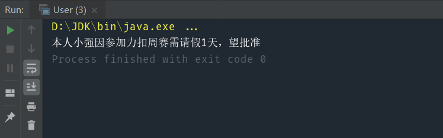

> 定义一个操作中的算法的骨架，而将一些步骤延迟到子类中。模板方法使得子类可以不改变一个算法的结构即可重定义该算法的某些特定步骤。 

#### 核心：关于继承的设计模式，父类是子类的模板

比如我们平时的生活中需要请假，通常会给我们一份请假条模板，基本的信息已经填好，我们只需要在未填的地方加上名字、请假理由、请假时间 

> 本人 ____ 因 ____ 需请假 ___ 天，望批准！ 

# 1.模拟实现

实现代码：
```java
class LeaveRequest {

    void request() {
        System.out.print("本人");
        System.out.print("小强");
        System.out.print("因");
        System.out.print("参加力扣比赛");
        System.out.print("需请假");
        System.out.print("1");
        System.out.print("天，望批准");
    }
}
```

测试代码：

```java
public class User {
    public static void main(String[] args) {
        LeaveRequest req=new LeaveRequest();
        req.request();
    }
}
```

#  2.使用组合模式实现

实现代码：

```java
abstract class LeaveRequest {
    void request() {
        System.out.print("本人");
        System.out.print(name());
        System.out.print("因");
        System.out.print(reason());
        System.out.print("需请假");
        System.out.print(duration());
        System.out.print("天，望批准");
    }

    abstract String name();
    abstract String reason();
    abstract String duration();
}

public class MyLeaveRequest extends LeaveRequest{
    @Override
    String name() {
        return "小强";
    }

    @Override
    String reason() {
        return "参加力扣周赛";
    }

    @Override
    String duration() {
        return "1";
    }
}
```

测试代码：

```java
public class User {
    public static void main(String[] args) {
        MyLeaveRequest req=new MyLeaveRequest();
        req.request();
    }
}
```



可以看到，在这份模板中，所有的其他步骤（固定字符串）都是稳定的，只有姓名、请假原因、请假时长是抽象的，需要延迟到子类去实现。

在使用模板方法模式时，我们可以为不同的模板方法设置不同的控制权限：

- 如果不希望子类覆写模板中的某个方法，使用 final 修饰此方法；

- 如果要求子类必须覆写模板中的某个方法，使用 abstract 修饰此方法；
- 如果没有特殊要求，可使用 protected 或 public 修饰此方法，子类可根据实际情况考虑是否覆写。

