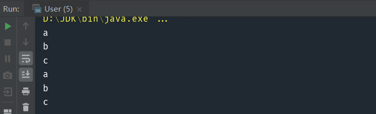

> 提供一种方法访问一个容器对象中的各个元素，而又不需暴露该对象的内部细节。 

#### 核心：定义next和hasNext方法，让外部类使用这两个方法来遍历容器，从而达到隐藏容器内部实现的目的

设想一个场景：我们有一个类中存在一个列表。这个列表需要提供给外部类访问，但我们不希望外部类修改其中的数据。 

通常来说，将成员变量提供给外部类访问有两种方式：

- 将此列表设置为 public 变量；

- 添加 getData() 方法，返回此列表。

但这两种方式都有一个致命的缺点，它们无法保证外部类不修改其中的数据。外部类拿到 data 对象后，可以随意修改列表内部的元素，这会造成极大的安全隐患。我们可以通过提供两个方法实现此效果：

- 提供一个 String next() 方法，使得外部类可以按照次序，一条一条的读取数据；

- 提供一个 boolean hasNext() 方法，告知外部类是否还有下一条数据。

# 1.迭代器模式实现（v1）

实现代码：
```java
public class MyList {
    private List<String> data= Arrays.asList("a","b","c");
    private int index=0;

    public String next(){
        return data.get(index++);
    }

    public boolean hasNext(){
        return index<data.size();
    }
}

```

测试代码：

```java
public class User {
    public static void main(String[] args) {
        MyList myList=new MyList();
        while(myList.hasNext()){
            System.out.println(myList.next());
        }
        while(myList.hasNext()){
            System.out.println(myList.next());
        }
    }
}
```

由于没有给外部类暴露 data 成员变量，所以我们可以保证数据是安全的。

但这样的实现还有一个问题：当遍历完成后，hasNext() 方法就会一直返回 false，无法再一次遍历了，所以我们必须在一个合适的地方把 index 重置成 0。

#  2.迭代器模式实现（v2）

实现代码：

```java
public interface Iterator<E> {
    E next();
    
    boolean hasNext();
}

public class MyList {
    private List<String> data= Arrays.asList("a","b","c");

    public Iterator iterator(){
        return new Itr();
    }

    public class Itr implements Iterator{
        private int index=0;

        @Override
        public String next() {
            return data.get(index++);
        }

        @Override
        public boolean hasNext() {
            return index<data.size();
        }
    }
}
```

测试代码：

```java
public class User {
    public static void main(String[] args) {
        MyList myList=new MyList();
        Iterator iterator=myList.iterator();
        while(iterator.hasNext()){
            System.out.println(iterator.next());
        }

        iterator=myList.iterator();
        while(iterator.hasNext()){
            System.out.println(iterator.next());
        }
    }
}

```

使用 next() 方法和 hasNext() 方法来遍历列表是一个完全通用的方法，我们可以为其创建一个接口，取名为 Iterator，Iterator 的意思是迭代器，迭代的意思是重复反馈，这里是指我们依次遍历列表中的元素。

然后在 MyList 类中，每次遍历时生成一个迭代器，将 index 变量放到迭代器中。由于每个迭代器都是新生成的，所以每次遍历时的 index 自然也就被重置成 0 了。

# 3.迭代器模式实现（v3）

实现代码：

```java
public interface Iterable<T> {
    Iterator<T> iterator();
}

public interface Iterator<E> {
    E next();
    boolean hasNext();
}

public class MyList implements Iterable<String>{
    private List<String> data= Arrays.asList("a","b","c");

    @Override
    public Iterator<String> iterator() {
        return new Itr();
    }

    private class Itr implements Iterator<String> {
        private int index=0;

        @Override
        public boolean hasNext() {
            return index<data.size();
        }

        @Override
        public String next() {
            return data.get(index++);
        }
    }
}
```

测试代码：

```java
public class User {

    public static void main(String[] args) {
        MyList myList=new MyList();

        Iterator iterator=myList.iterator();
        while(iterator.hasNext()){
            System.out.println(iterator.next());
        }

        iterator=myList.iterator();
        while(iterator.hasNext()){
            System.out.println(iterator.next());
        }
    }
}
```



对Iterator再次进行了封装，只要实现Iterable，重写iterator方法，就能使用迭代器访问。

我们平时常用的 for-each 循环，也是迭代器模式的一种应用。在 Java 中，只要实现了 Iterable 接口的类，都被视为可迭代访问的。Iterable 中的核心方法只有一个，也就是刚才我们在 MyList 类中实现过的用于获取迭代器的 iterator() 方法。