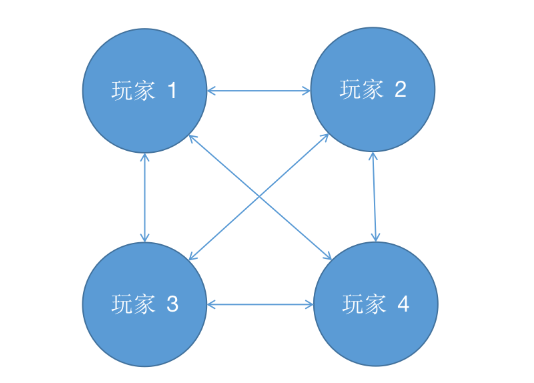
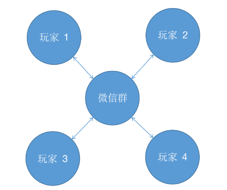

> 将对象之间的网状结构转化为星型结构，解除对象之间的耦合，比如消息中间件RabbitMq 。

#### 核心：通过引入中介者，将网状耦合结构变成星型结构

比如，在我们打麻将时，每两个人之间都可能存在输赢关系。如果每笔交易都由输家直接发给赢家，就会出现一种网状耦合关系。 



# 1.模拟实现

实现代码：
```java
public class Player {
    // 初始资金 100 元
    public int money=100;

    public void win(Player player,int money){
        // 输钱的人扣减相应的钱
        player.money-=money;
        // 自己的余额增加
        this.money+=money;
    }

}
```

测试代码：

```java
public class User {
    public static void main(String[] args) {
        Player player1=new Player();
        Player player2=new Player();
        Player player3=new Player();
        Player player4=new Player();

        player1.win(player2,5);
        player1.win(player3,10);
        player2.win(player3,15);
        player2.win(player4,10);
        System.out.println("四人剩余的                                                                       钱:"+player1.money+","+player2.money+","+player3.money+","+player4.money);
    }
}
```

在客户端中，每两位玩家需要进行交易时，都会增加程序耦合度，相当于每位玩家都需要和其他所有玩家打交道，这是一种不好的做法。

此时，我们可以引入一个中介类 —— 微信群，只要输家将自己输的钱发到微信群里，赢家从微信群中领取对应金额即可。网状的耦合结构就变成了星形结构：




#  2.中介者模式实现

实现代码：

```java
public class Group {
    public int money;
}

public class Player {
    public int money=100;
    public Group group;

    Player(Group group){
        this.group=group;
    }

    public void charge(int money){
        // 输了钱将钱发到群里 或 在群里领取自己赢的钱
        group.money-=money;
        // 自己的余额相应地增加或减少
        this.money+=money;
    }
}


```

测试代码：

```java
public class User {
    public static void main(String[] args) {
        Group group=new Group();
        Player player1=new Player(group);
        Player player2=new Player(group);
        Player player3=new Player(group);
        Player player4=new Player(group);

        player1.charge(15);
        player2.charge(20);
        player3.charge(-25);
        player4.charge(-10);
        System.out.println("四人剩余的  				                                                       钱:"+player1.money+","+player2.money+","+player3.money+","+player4.money); 
    }
}
```

可以看到，通过引入中介者，客户端的代码变得更加清晰了。大家不需要再互相打交道，所有交易通过中介者完成即可。 中介者模式的缺点也很明显：由于它将所有的职责都移到了中介者类中，也就是说中介类需要处理所有类之间的协调工作，这可能会使中介者演变成一个超级类。所以使用中介者模式时需要权衡利弊。