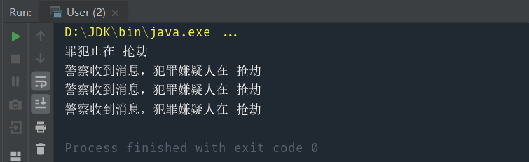

> 定义对象间的一种一对多的依赖关系，当一个对象的状态发生改变时，所以依赖于他的对象都会收到通知，并被自动更新。

#### 核心：处理一对多的依赖关系，被观察的对象改变时，多个观察者都能收到通知

比如，警察一直观察着杰克的一举一动，只要杰克有什么违法行为，警察马上行动，抓捕杰克。

这个过程中：

- 警察称之为观察者（Observer）

- 杰克称之为被观察者（Observable，可观察的）
- 警察观察杰克的这个行为称之为订阅（subscribe），或者注册（register）
- 杰克违法后，警察抓捕杰克的行动称之为响应（update）

# 1.观察者模式实现

实现代码：
```java
public interface Observer {
    void update(String event);
}

public class PolicyObserver implements Observer{
    @Override
    public void update(String event) {
        System.out.println("警察收到消息，犯罪嫌疑人在 "+event);
    }
}

public class Observable {
    private List<Observer> observers=new ArrayList<>();

    public void addObserver(Observer observer){
        observers.add(observer);
    }

    public void addObserverList(List<Observer> list){
        observers.addAll(list);
    }

    public void deleteObserver(Observer observer){
        observers.remove(observer);
    }

    public void notifyObservers(String event){
        for(Observer observer:observers){
            observer.update(event);
        }
    }
}

public class CriminalObservable extends Observable{
    public void crime(String event){
        System.out.println("罪犯正在 "+event);
        notifyObservers(event);
    }
}
```

测试代码：

```java
public class User {
    public static void main(String[] args) {
        CriminalObservable jack=new CriminalObservable();
        PolicyObserver policyA=new PolicyObserver();
        PolicyObserver policyB=new PolicyObserver();
        PolicyObserver policyC=new PolicyObserver();
        jack.addObserverList(Arrays.asList(policyA,policyB,policyC));
        jack.crime("抢劫");
    }
}
```



可以看到，所有的观察者都被通知到了。当某个观察者不需要继续观察时，调用 removeObserver 即可。 

