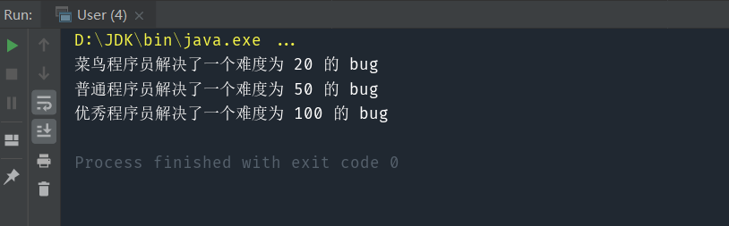

> 使多个对象都有机会处理请求，从而避免请求的发送者和请求的接收者之间的耦合关系。将这些对象连成一条链，并沿着这条链传递该请求，直到有一个对象处理它为止。

#### 核心：处理职责相同，程度不同的对象，使其在一条链上传递

比如，普通的程序员可以解决中等难度的 bug，优秀程序员可以解决困难的 bug，而菜鸟程序员只能解决简单的 bug。为了将其量化，我们用一个数字来表示 bug 的难度，(0, 20] 表示简单，(20,50] 表示中等， (50,100] 表示困难，我们来模拟一个 bug 解决的流程。

# 1.模拟实现

实现代码：
```java
public class Bug {
    //Bug的难度值
    int value;
    public Bug(int value){
        this.value=value;
    }
}

public class Programmer {
    //程序员类型:普通、中等、优秀
    String type;

    public Programmer(String type){
        this.type=type;
    }

    public void solve(Bug bug){
        System.out.println(type + "程序员解决了一个难度为 " + bug.value + " 的 bug");
    }
}
```

测试代码：

```java
public class User {
    public static void main(String[] args) {
        Programmer newbie = new Programmer("菜鸟");
        Programmer normal = new Programmer("普通");
        Programmer good = new Programmer("优秀");

        Bug easy = new Bug(20);
        Bug middle = new Bug(50);
        Bug hard = new Bug(100);

        handleBug(newbie,easy);
        handleBug(normal,easy);
        handleBug(good,easy);

        handleBug(newbie,middle);
        handleBug(normal,middle);
        handleBug(good,middle);

        handleBug(newbie,hard);
        handleBug(normal,hard);
        handleBug(good,hard);

    }

    public static void handleBug(Programmer programmer,Bug bug){
        if(programmer.type.equals("菜鸟")&&bug.value>0&&bug.value<=20){
            programmer.solve(bug);
        }
        else if(programmer.type.equals("普通")&&bug.value>20&&bug.value<=50){
            programmer.solve(bug);
        }
        else if(programmer.type.equals("优秀")&&bug.value>50&&bug.value<=100){
            programmer.solve(bug);
        }
    }
}
```

输出没有问题，说明功能完美实现了，但在这个程序中，我们让每个程序员都尝试处理了每一个 bug，这也就相当于大家围着讨论每个 bug 该由谁解决，这无疑是非常低效的做法。

# 2.责任链模式实现

实现代码：

```java
public class Bug {
    //Bug的难度值
    int value;
    public Bug(int value){
        this.value=value;
    }
}

public abstract class Programmer {
    //指向下一个责任者
    protected Programmer next;

    //设置下一个责任者
    public void setNext(Programmer next){
        this.next=next;
    }

    //抽象的处理Bug的方法
    abstract void handle(Bug bug);
}

public class NewbieProgrammer extends Programmer{
    @Override
    void handle(Bug bug) {
        if(bug.value>0&&bug.value<=20){
            solve(bug);
        }
        else if(next!=null){
            next.handle(bug);
        }
    }

    public void solve(Bug bug){
        System.out.println("菜鸟程序员解决了一个难度为 " + bug.value + " 的 bug");
    }
}

public class NormalProgrammer extends Programmer{
    @Override
    void handle(Bug bug) {
        if(bug.value>20&&bug.value<=50){
            solve(bug);
        }
        else if(next!=null){
            next.handle(bug);
        }
    }

    public void solve(Bug bug){
        System.out.println("普通程序员解决了一个难度为 " + bug.value + " 的 bug");
    }
}

public class GoodProgrammer extends Programmer{
    @Override
    void handle(Bug bug) {
        if(bug.value>50&&bug.value<=100){
            solve(bug);
        }
        else if(next!=null){
            next.handle(bug);
        }
    }

    public void solve(Bug bug){
        System.out.println("优秀程序员解决了一个难度为 " + bug.value + " 的 bug");
    }
}
```

测试代码：

```java
public class User {
    public static void main(String[] args) {
        Programmer newbieProgrammer=new NewbieProgrammer();
        Programmer normalProgrammer=new NormalProgrammer();
        Programmer goodProgrammer=new GoodProgrammer();

        Bug easy = new Bug(20);
        Bug middle = new Bug(50);
        Bug hard = new Bug(100);

        //生成责任链
        newbieProgrammer.setNext(normalProgrammer);
        normalProgrammer.setNext(goodProgrammer);

        //从菜鸟程序员开始处理
        newbieProgrammer.handle(easy);
        newbieProgrammer.handle(middle);
        newbieProgrammer.handle(hard);

    }
}
```



我们通过 setNext() 方法将三个程序员组成了一条责任链，由菜鸟程序员接收所有的 bug，发现自己不能处理的 bug，就传递给普通程序员，普通程序员收到 bug 后，如果发现自己不能解决，则传递给优秀程序员。