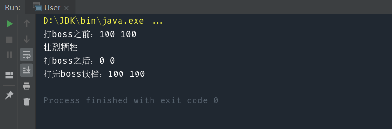

> 在不破环封装的条件下，通过备忘录对象来存储另一个对象内部状态的快照，在将来合适的时候把这个对象还原为存储起来的状态。

#### 核心：存储对象的状态，以便恢复

比如，游戏中的存档、读档功能。当我们在打大boss之前，通常会将自己的游戏进度存档保存，以保证自己打不过 Boss 的话，还能重新读档恢复状态。  

# 1.模拟实现

实现代码：
```java
public class Player {
    private int life=100;

    private int magic=100;

    public void fightBoss(){
        life-=100;
        magic-=100;
        if(life<=0){
            System.out.println("壮烈牺牲");
        }
    }

    public int getLife() {
        return life;
    }

    public void setLife(int life) {
        this.life = life;
    }

    public int getMagic() {
        return magic;
    }

    public void setMagic(int magic) {
        this.magic = magic;
    }
}
```

测试代码：

```java
public class User {
    public static void main(String[] args) {
        Player player=new Player();
        //存档
        int saveLife=player.getLife();
        int saveMagic=player.getMagic();
        System.out.println("打boss之前："+player.getLife()+" "+player.getMagic());

        //打boss
        player.fightBoss();
        System.out.println("打boss之后："+player.getLife()+" "+player.getMagic());

        //读档,恢复到打boss之前的状态
        player.setLife(saveLife);
        player.setMagic(saveMagic);
        System.out.println("打完boss读档："+player.getLife()+" "+player.getMagic());
    }
}
```

# 2.备忘录模式实现

实现代码：

```java
public class Memento {
    int life;
    int magic;

    Memento(int life,int magic){
        this.life=life;
        this.magic=magic;
    }
}

public class Player {
    private int life=100;

    private int magic=100;

    //存档
    public Memento saveMemento(){
        return new Memento(life,magic);
    }

    //读档
    public void loadMemento(int life,int magic){
        this.life=life;
        this.magic=magic;
    }

    public void fightBoss(){
        life-=100;
        magic-=100;
        if(life<=0){
            System.out.println("壮烈牺牲");
        }
    }

    public int getLife() {
        return life;
    }

    public void setLife(int life) {
        this.life = life;
    }

    public int getMagic() {
        return magic;
    }

    public void setMagic(int magic) {
        this.magic = magic;
    }
}
```

测试代码：

```java
public class User {
    public static void main(String[] args) {
        Player player=new Player();
        //存档
        Memento memento=player.saveMemento();
        System.out.println("打boss之前："+memento.life+" "+memento.magic);

        //打boss
        player.fightBoss();
        System.out.println("打boss之后："+player.getLife()+" "+player.getMagic());

        //读档
        player.loadMemento(memento.life,memento.magic);
        System.out.println("打完boss读档："+memento.life+" "+memento.magic);
    }
}
```



可以看到，打完boss牺牲之后，通过读档重新恢复了之前的血量和蓝量。

备忘录模式的优点是：

- 给用户提供了一种可以恢复状态的机制，使用户能够比较方便的回到某个历史的状态

- 实现了信息的封装，使得用户不需要关心状态的保存细节

缺点是：

- 消耗资源，如果类的成员变量过多，势必会占用比较大的资源，而且每一次保存都会消耗一定的内存。
