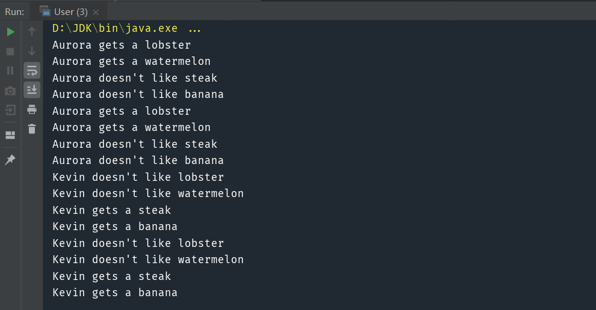

> 表示一个作用于某对象结构中的各元素的操作，它使你可以在不改变各元素类的前提下，定义作用于这些元素的新操作。

#### 核心：将数据的结构和对数据的操作分离

比如，我们去吃自助餐，每个人喜欢的食物是不一样的。Aurora 喜欢吃龙虾和西瓜，Kevin 喜欢吃牛排和香蕉，餐厅不可能单独为某一位顾客专门准备食物。所以餐厅的做法是将所有的食物都准备好，顾客按照需求自由取用。此时，顾客和餐厅之间就形成了一种访问者与被访问者的关系。  

# 1.访问者模式实现（v1）

实现代码：
```java
class Restaurant {
    private String lobster = "lobster";
    private String watermelon = "watermelon";
    private String steak = "steak";
    private String banana = "banana";

    public void welcome(IVisitor visitor) {
        visitor.chooseLobster(lobster);
        visitor.chooseWatermelon(watermelon);
        visitor.chooseSteak(steak);
        visitor.chooseBanana(banana);
    }
}

public interface IVisitor {
    void chooseLobster(String lobster);

    void chooseWatermelon(String watermelon);

    void chooseSteak(String steak);

    void chooseBanana(String banana);
}

public class Aurora implements IVisitor {
    @Override
    public void chooseLobster(String lobster) {
        System.out.println("Aurora gets a " + lobster);
    }

    @Override
    public void chooseWatermelon(String watermelon) {
        System.out.println("Aurora gets a " + watermelon);
    }

    @Override
    public void chooseSteak(String steak) {
        System.out.println("Aurora doesn't like " + steak);
    }

    @Override
    public void chooseBanana(String banana) {
        System.out.println("Aurora doesn't like " + banana);
    }
}
```

测试代码：

```java
public class User {
    public static void main(String[] args) {
        Restaurant restaurant = new Restaurant();
        IVisitor Aurora = new Aurora();
        restaurant.welcome(Aurora);
    }
}
```

可以看到，Aurora 对每一种食物做出了自己的选择，这就是一个最简单的访问者模式，它已经体现出了访问者模式的核心思想：将数据的结构和对数据的操作分离。

本例中，顾客需要选择餐厅的食物，由于每个顾客对食物的选择是不一样的，如果在餐厅类中处理每位顾客的需求，必然导致餐厅类职责过多。所以我们并没有在餐厅类中处理顾客的需求，而是将所有的食物通过接口暴露出去，欢迎每位顾客来访问。顾客只要实现访问者接口就能访问到所有的食物，然后在接口方法中做出自己的选择。

为什么很多书中说访问者模式是最复杂的设计模式呢？原因就在于《设计模式》一书中给访问者模式设计了一个“双重分派”的机制，而 Java 只支持单分派，用单分派语言强行模拟出双重分派才导致了访问者模式看起来比较复杂。

# 2.访问者模式实现（v2）

实现代码：

```java
class Restaurant {
    // 准备当天的食物
    private List<Food> prepareFoods() {
        List<Food> foods = new ArrayList<>();
        // 简单模拟，每种食物添加 2 份
        for (int i = 0; i < 2; i++) {
            foods.add(new Lobster());
            foods.add(new Watermelon());
            foods.add(new Steak());
            foods.add(new Banana());
        }
        return foods;
    }

    // 欢迎顾客来访
    public void welcome(IVisitor visitor) {
        // 获取当天的食物
        List<Food> foods = prepareFoods();
        // 将食物依次提供给顾客选择
        for (Food food : foods) {
            // 通过 instanceOf 判断具体子类型，再强制向下转型
            if (food instanceof Lobster) visitor.chooseFood((Lobster) food);
            else if (food instanceof Watermelon) visitor.chooseFood((Watermelon) food);
            else if (food instanceof Steak) visitor.chooseFood((Steak) food);
            else if (food instanceof Banana) visitor.chooseFood((Banana) food);
            else throw new IllegalArgumentException("Unsupported type of food.");
        }
    }
}

public abstract class Food {
    public abstract String name();
}

public class Lobster extends Food {
    @Override
    public String name() {
        return "lobster";
    }
}

public class Watermelon extends Food {
    @Override
    public String name() {
        return "watermelon";
    }
}

public class Steak extends Food {
    @Override
    public String name() {
        return "steak";
    }
}

public class Banana extends Food {
    @Override
    public String name() {
        return "banana";
    }
}

public interface IVisitor {
    void chooseFood(Lobster lobster);

    void chooseFood(Watermelon watermelon);

    void chooseFood(Steak steak);

    void chooseFood(Banana banana);
}

public class Aurora implements IVisitor {
    @Override
    public void chooseFood(Lobster lobster) {
        System.out.println("Aurora gets a " + lobster.name());
    }

    @Override
    public void chooseFood(Watermelon watermelon) {
        System.out.println("Aurora gets a " + watermelon.name());
    }

    @Override
    public void chooseFood(Steak steak) {
        System.out.println("Aurora doesn't like " + steak.name());
    }

    @Override
    public void chooseFood(Banana banana) {
        System.out.println("Aurora doesn't like " + banana.name());
    }
}

public class Kevin implements IVisitor {
    @Override
    public void chooseFood(Lobster lobster) {
        System.out.println("Kevin doesn't like " + lobster.name());
    }

    @Override
    public void chooseFood(Watermelon watermelon) {
        System.out.println("Kevin doesn't like " + watermelon.name());
    }

    @Override
    public void chooseFood(Steak steak) {
        System.out.println("Kevin gets a " + steak.name());
    }

    @Override
    public void chooseFood(Banana banana) {
        System.out.println("Kevin gets a " + banana.name());
    }
}
```

测试代码：

```java
public class User {
    public static void main(String[] args) {
        Restaurant restaurant = new Restaurant();
        IVisitor Aurora = new Aurora();
        IVisitor Kevin = new Kevin();
        restaurant.welcome(Aurora);
        restaurant.welcome(Kevin);
    }
}
```

在Restaurant类中调用chooseFood方法时，如果我们不进行类型转换，将产生编译错误。

由于 Java 是单分派语言，所以我们不得不想办法解决这个 bug，目的就是 使用单分派的 Java 语言模拟出双分派的效果，能够根据运行时的具体类型调用对应的重载方法。我们很容易想到一种解决方式，采用 instanceOf 判断对象的具体子类型，再将父类强制转换为具体子类型，调用对应的接口方法。

# 3.访问者模式实现（v3）

实现代码：

```java
class Restaurant {

    // 准备当天的食物
    private List<Food> prepareFoods() {
        List<Food> foods = new ArrayList<>();
        // 简单模拟，每种食物添加 2 份
        for (int i = 0; i < 2; i++) {
            foods.add(new Lobster());
            foods.add(new Watermelon());
            foods.add(new Steak());
            foods.add(new Banana());
        }
        return foods;
    }

    // 欢迎顾客来访
    public void welcome(IVisitor visitor) {
        // 获取当天的食物
        List<Food> foods = prepareFoods();
        // 将食物依次提供给顾客选择
        for (Food food : foods) {
            // 由于重写方法是动态分派的，所以这里会调用具体子类的 accept 方法，
            food.accept(visitor);
        }
    }
}

public abstract class Food {
    public abstract String name();

    // Food 中添加 accept 方法，接收访问者
    public abstract void accept(IVisitor visitor);
}

public class Lobster extends Food {
    @Override
    public String name() {
        return "lobster";
    }

    @Override
    public void accept(IVisitor visitor) {
        visitor.chooseFood(this);
    }
}

public class Watermelon extends Food {
    @Override
    public String name() {
        return "watermelon";
    }
    
    @Override
    public void accept(IVisitor visitor) {
        visitor.chooseFood(this);
    }
}

public class Steak extends Food {
    @Override
    public String name() {
        return "steak";
    }
    
    @Override
    public void accept(IVisitor visitor) {
        visitor.chooseFood(this);
    }
}

public class Banana extends Food {
    @Override
    public String name() {
        return "banana";
    }
    
    @Override
    public void accept(IVisitor visitor) {
        visitor.chooseFood(this);
    }
}

public interface IVisitor {
    void chooseFood(Lobster lobster);

    void chooseFood(Watermelon watermelon);

    void chooseFood(Steak steak);

    void chooseFood(Banana banana);
}

public class Aurora implements IVisitor {
    @Override
    public void chooseFood(Lobster lobster) {
        System.out.println("Aurora gets a " + lobster.name());
    }

    @Override
    public void chooseFood(Watermelon watermelon) {
        System.out.println("Aurora gets a " + watermelon.name());
    }

    @Override
    public void chooseFood(Steak steak) {
        System.out.println("Aurora doesn't like " + steak.name());
    }

    @Override
    public void chooseFood(Banana banana) {
        System.out.println("Aurora doesn't like " + banana.name());
    }
}

public class Kevin implements IVisitor {
    @Override
    public void chooseFood(Lobster lobster) {
        System.out.println("Kevin doesn't like " + lobster.name());
    }

    @Override
    public void chooseFood(Watermelon watermelon) {
        System.out.println("Kevin doesn't like " + watermelon.name());
    }

    @Override
    public void chooseFood(Steak steak) {
        System.out.println("Kevin gets a " + steak.name());
    }

    @Override
    public void chooseFood(Banana banana) {
        System.out.println("Kevin gets a " + banana.name());
    }
}
```

测试代码：

```
public class User {
    public static void main(String[] args) {
        Restaurant restaurant = new Restaurant();
        IVisitor Aurora = new Aurora();
        IVisitor Kevin = new Kevin();
        restaurant.welcome(Aurora);
        restaurant.welcome(Kevin);
    }
}
```



通过在 Food 中添加 accept 方法，我们将重载方法chooseFood模拟成了动态分派。这里的实现非常巧妙，由于 Java 调用重写方法时是动态分派的，所以 food.accept(visitor) 会调用具体子类的 accept 方法，在具体子类的 accept 方法中，调用 visitor.chooseFood(this)，由于这个 accept 方法是属于具体子类的，所以这里的 this 一定是指具体的子类型，不会产生歧义。

访问者模式之所以复杂，主要在于大多数语言都是单分派语言，所以不得不模拟出一个双重分派，也就是用重写方法的动态分派特性将重载方法也模拟成动态分派。