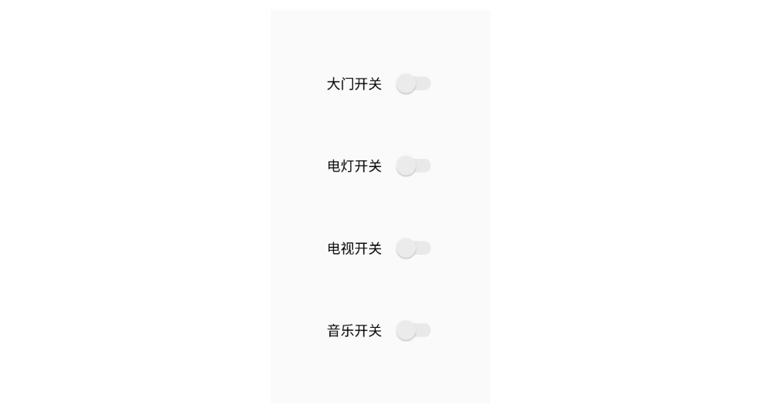
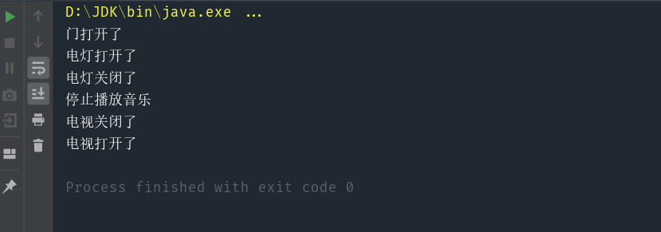

> 将一个请求封装为一个对象，从而使你可用不同的请求对客户进行参数化，对请求排队或记录请求日志，以及支持可撤销的操作，比如宏命令、undo。

#### 核心：封装“方法调用”，将行为请求者和行为实现者解耦

比如，近年来，智能家居越来越流行。躺在家中，只需要打开对应的 app，就可以随手控制家电开关。但随之而来一个问题，手机里的 app 实在是太多了，每一个家具公司都想要提供一个 app 给用户，以求增加用户粘性，推广他们的其他产品等。

站在用户的角度来看，有时我们只想打开一下电灯，却要先看到恼人的 “新式电灯上新” 的弹窗通知，让人烦不胜烦。如果能有一个万能遥控器将所有的智能家居开关综合起来，统一控制，一定会方便许多。 



# 1.模拟实现（v1）

实现代码：
```java
public class Door {
    public void openDoor() {
        System.out.println("门打开了");
    }

    public void closeDoor() {
        System.out.println("门关闭了");
    }
}

public class Light {
    public void lightOn() {
        System.out.println("电灯打开了");
    }
    
    public void lightOff() {
        System.out.println("电灯关闭了");
    }
}

public class Music {
    public void play() {
        System.out.println("开始播放音乐");
    }

    public void stop() {
        System.out.println("停止播放音乐");
    }
}

public class Tv {
    public void TurnOnTv() {
        System.out.println("电视打开了");
    }

    public void TurnOffTv() {
        System.out.println("电视关闭了");
    }
}

public class Observable {

    private List<Observer> observers=new ArrayList<>();

    public void addObserver(Observer observer){
        observers.add(observer);
    }

    public void addObserverList(List<Observer> list){
        observers.addAll(list);
    }

    public void deleteObserver(Observer observer){
        observers.remove(observer);
    }

    public void setOnCheckedChangeListener(String type,String event){
        for(Observer observer:observers){
            observer.doCommand(type,event);
        }
    }
}

public interface Observer {
    void doCommand(String type,String event);
}

public class DoorObserver implements Observer {
    @Override
    public void doCommand(String type, String event) {
        if(type.equals("大门")){
            Door door = new Door();
            if(event.equals("开门")){
                door.openDoor();
            }
            else if(event.equals("关门")){
                door.closeDoor();
            }
        }
    }
}

public class LightObserver implements Observer{
    @Override
    public void doCommand(String type, String event) {
        if(type.equals("电灯")){
            Light light = new Light();
            if(event.equals("开灯")){
                light.lightOn();
            }
            else if(event.equals("关灯")){
                light.lightOff();
            }
        }
    }
}

public class MusicObserver implements Observer{
    @Override
    public void doCommand(String type, String event) {
        if(type.equals("音乐")){
            Music music = new Music();
            if(event.equals("开音乐")){
                music.play();
            }
            else if(event.equals("关音乐")){
                music.stop();
            }
        }
    }
}

public class TvObserver implements Observer{
    @Override
    public void doCommand(String type, String event) {
        if(type.equals("电视")){
            Tv tv = new Tv();
            if(event.equals("开电视")){
                tv.TurnOnTv();
            }
            else if(event.equals("关电视")){
                tv.TurnOffTv();
            }
        }
    }
}

public class Switch extends Observable {

    private String type;

    Switch(String type){
        this.type = type;
    }

    public void addListenEvent(String event){
        setOnCheckedChangeListener(type,event);
    }
}


```

测试代码：

```java
public class User {
    public static void main(String[] args) {

        // 初始化智能家居
        Switch switchDoor = new Switch("大门");
        Switch switchLight = new Switch("电灯");
        Switch switchTv = new Switch("电视");
        Switch switchMusic = new Switch("音乐");

        // 大门开关遥控
        DoorObserver doorObserver = new DoorObserver();
        switchDoor.addObserver(doorObserver);
        // 电灯开关遥控
        LightObserver lightObserver = new LightObserver();
        switchLight.addObserver(lightObserver);
        // 电视开关遥控
        TvObserver tvObserver = new TvObserver();
        switchTv.addObserver(tvObserver);
        // 音乐开关遥控
        MusicObserver musicObserver = new MusicObserver();
        switchMusic.addObserver(musicObserver);

        // 模拟开门
        switchDoor.addListenEvent("开门");
        // 模拟开灯
        switchLight.addListenEvent("开灯");
        // 模拟关音乐
        switchMusic.addListenEvent("关音乐");
        // 模拟关电视
        switchTv.addListenEvent("关电视");

    }
}
```

可以看到，Aurora 对每一种食物做出了自己的选择，这就是一个最简单的访问者模式，它已经体现出了访问者模式的核心思想：将数据的结构和对数据的操作分离。

本例中，顾客需要选择餐厅的食物，由于每个顾客对食物的选择是不一样的，如果在餐厅类中处理每位顾客的需求，必然导致餐厅类职责过多。所以我们并没有在餐厅类中处理顾客的需求，而是将所有的食物通过接口暴露出去，欢迎每位顾客来访问。顾客只要实现访问者接口就能访问到所有的食物，然后在接口方法中做出自己的选择。

为什么很多书中说访问者模式是最复杂的设计模式呢？原因就在于《设计模式》一书中给访问者模式设计了一个“双重分派”的机制，而 Java 只支持单分派，用单分派语言强行模拟出双重分派才导致了访问者模式看起来比较复杂。

# 2.添加撤销模拟实现（v2）


实现代码：

```java
public class Door {
    private static Door door = new Door();

    private Door() {
    }

    public static Door getInstance() {
        return door;
    }

    public void openDoor() {
        System.out.println("门打开了");
    }

    public void closeDoor() {
        System.out.println("门关闭了");
    }
}

public class Light {
    private static Light light = new Light();

    private Light() {
    }

    public static Light getInstance() {
        return light;
    }

    public void lightOn() {
        System.out.println("电灯打开了");
    }

    public void lightOff() {
        System.out.println("电灯关闭了");
    }
}

public class Music {
    private static Music music = new Music();

    private Music() {
    }

    public static Music getInstance() {
        return music;
    }

    public void play() {
        System.out.println("开始播放音乐");
    }

    public void stop() {
        System.out.println("停止播放音乐");
    }
}

public class Tv {
    private static Tv tv = new Tv();

    private Tv() {
    }

    public static Tv getInstance() {
        return tv;
    }

    public void TurnOnTv() {
        System.out.println("电视打开了");
    }

    public void TurnOffTv() {
        System.out.println("电视关闭了");
    }
}

public class Observable {

    private List<Observer> observers=new ArrayList<>();

    public void addObserver(Observer observer){
        observers.add(observer);
    }

    public void addObserverList(List<Observer> list){
        observers.addAll(list);
    }

    public void deleteObserver(Observer observer){
        observers.remove(observer);
    }

    public void setOnCheckedChangeListener(Button button,String type,String event){
        for(Observer observer:observers){
            observer.doCommand(button,type,event);
        }
    }

    public void setOnCheckedChangeListener(Button button,String event){
        for(Observer observer:observers){
            observer.doCommand(button,event);
        }
    }

}

public interface Observer {
    void doCommand(Button button,String type, String event);

    void doCommand(Button button,String event);
}

public class DoorObserver implements Observer {

    @Override
    public void doCommand(Button button,String type, String event) {
        if(type.equals("大门")){
            Door door = Door.getInstance();
            if(event.equals("开门")){
                button.operations.push(Operation.DOOR_OPEN);
                door.openDoor();
            }
            else if(event.equals("关门")){
                button.operations.push(Operation.DOOR_CLOSE);
                door.closeDoor();
            }
        }
    }

    @Override
    public void doCommand(Button button,String event) {

    }
}

public class LightObserver implements Observer {

    @Override
    public void doCommand(Button button,String type, String event) {
        if(type.equals("电灯")){
            Light light = Light.getInstance();
            if(event.equals("开灯")){
                button.operations.push(Operation.LIGHT_ON);
                light.lightOn();
            }
            else if(event.equals("关灯")){
                button.operations.push(Operation.LIGHT_OFF);
                light.lightOff();
            }
        }
    }

    @Override
    public void doCommand(Button button,String event) {

    }
}

public class MusicObserver implements Observer {

    @Override
    public void doCommand(Button button,String type, String event) {
        if(type.equals("音乐")){
            Music music = Music.getInstance();
            if(event.equals("开音乐")){
                button.operations.push(Operation.MUSIC_PLAY);
                music.play();
            }
            else if(event.equals("关音乐")){
                button.operations.push(Operation.MUSIC_STOP);
                music.stop();
            }
        }
    }

    @Override
    public void doCommand(Button button,String event) {

    }
}

public class TvObserver implements Observer {

    @Override
    public void doCommand(Button button,String type, String event) {
        if(type.equals("电视")){
            Tv tv = Tv.getInstance();
            if(event.equals("开电视")){
                button.operations.push(Operation.TV_TURN_ON);
                tv.TurnOnTv();
            }
            else if(event.equals("关电视")){
                button.operations.push(Operation.TV_TURN_OFF);
                tv.TurnOffTv();
            }
        }
    }

    @Override
    public void doCommand(Button button,String event) {

    }
}

public class UndoObserver implements Observer {

    @Override
    public void doCommand(Button button,String type, String event) {

    }

    @Override
    public void doCommand(Button button,String event) {
        if(event.equals("撤销")){
            if (button.operations.isEmpty()) return;
            // 弹出栈顶的上一步操作
            Operation lastOperation = button.operations.pop();
            // 撤销上一步
            Door door = Door.getInstance();
            Light light = Light.getInstance();
            Music music = Music.getInstance();
            Tv tv = Tv.getInstance();
            switch (lastOperation) {
                case DOOR_OPEN:
                    door.closeDoor();
                    break;
                case DOOR_CLOSE:
                    door.openDoor();
                    break;
                case LIGHT_ON:
                    light.lightOff();
                    break;
                case LIGHT_OFF:
                    light.lightOn();
                    break;
                case MUSIC_PLAY:
                    music.stop();
                    break;
                case MUSIC_STOP:
                    music.play();
                    break;
                case TV_TURN_ON:
                    tv.TurnOffTv();
                    break;
                case TV_TURN_OFF:
                    tv.TurnOnTv();
                    break;
                default:
                    System.out.println("命令不存在！");
            }
        }
    }
}

public class Switch extends Observable {

    private String type;

    Switch(String type){
        this.type = type;
    }

    public void addListenEvent(Button button,String event){
        setOnCheckedChangeListener(button,type,event);
    }
}

public class Switch extends Observable {

    private String type;

    Switch(String type){
        this.type = type;
    }

    public void addListenEvent(Button button,String event){
        setOnCheckedChangeListener(button,type,event);
    }
}

public enum Operation {
    DOOR_OPEN,
    DOOR_CLOSE,
    LIGHT_ON,
    LIGHT_OFF,
    TV_TURN_ON,
    TV_TURN_OFF,
    MUSIC_PLAY,
    MUSIC_STOP
}

```

测试代码：

```java
public class User {
    public static void main(String[] args) {
        // 初始化智能家居
        Switch switchDoor = new Switch("大门");
        Switch switchLight = new Switch("电灯");
        Switch switchTv = new Switch("电视");
        Switch switchMusic = new Switch("音乐");
        Button button = new Button();

        // 大门开关遥控
        DoorObserver doorObserver = new DoorObserver();
        switchDoor.addObserver(doorObserver);
        // 电灯开关遥控
        LightObserver lightObserver = new LightObserver();
        switchLight.addObserver(lightObserver);
        // 电视开关遥控
        TvObserver tvObserver = new TvObserver();
        switchTv.addObserver(tvObserver);
        // 音乐开关遥控
        MusicObserver musicObserver = new MusicObserver();
        switchMusic.addObserver(musicObserver);
        // 撤销开关
        UndoObserver undoObserver = new UndoObserver();
        button.addObserver(undoObserver);

        // 模拟开门
        switchDoor.addListenEvent(button,"开门");
        // 模拟开灯
        switchLight.addListenEvent(button,"开灯");
        // 模拟撤销操作
        button.addListenEvent(button,"撤销");
        // 模拟关音乐
        switchMusic.addListenEvent(button,"关音乐");
        // 模拟关电视
        switchTv.addListenEvent(button,"关电视");
        // 模拟撤销操作
        button.addListenEvent(button,"撤销");

    }
}
```

# 3.命令模式实现（v3）

实现代码：

```java
public class Door {
    private static Door door = new Door();

    private Door() {
    }

    public static Door getInstance() {
        return door;
    }

    public void openDoor() {
        System.out.println("门打开了");
    }

    public void closeDoor() {
        System.out.println("门关闭了");
    }
}

public class Light {
    private static Light light = new Light();

    private Light() {
    }

    public static Light getInstance() {
        return light;
    }

    public void lightOn() {
        System.out.println("电灯打开了");
    }

    public void lightOff() {
        System.out.println("电灯关闭了");
    }
}

public class Music {
    private static Music music = new Music();

    private Music() {
    }

    public static Music getInstance() {
        return music;
    }

    public void play() {
        System.out.println("开始播放音乐");
    }

    public void stop() {
        System.out.println("停止播放音乐");
    }
}

public class Tv {
    private static Tv tv = new Tv();

    private Tv() {
    }

    public static Tv getInstance() {
        return tv;
    }

    public void TurnOnTv() {
        System.out.println("电视打开了");
    }

    public void TurnOffTv() {
        System.out.println("电视关闭了");
    }
}

public class Observable {

    private List<Observer> observers=new ArrayList<>();

    public void addObserver(Observer observer){
        observers.add(observer);
    }

    public void addObserverList(List<Observer> list){
        observers.addAll(list);
    }

    public void deleteObserver(Observer observer){
        observers.remove(observer);
    }

    public void setOnCheckedChangeListener(Button button, String type, String event){
        for(Observer observer:observers){
            observer.doCommand(button,type,event);
        }
    }

    public void setOnCheckedChangeListener(Button button, String event){
        for(Observer observer:observers){
            observer.doCommand(button,event);
        }
    }

}

public interface Observer {
    void doCommand(Button button, String type, String event);

    void doCommand(Button button, String event);
}

public class DoorObserver implements Observer {

    @Override
    public void doCommand(Button button, String type, String event) {
        if(type.equals("大门")){
            Door door = Door.getInstance();
            DoorOpenCommand doorOpenCommand = new DoorOpenCommand();
            DoorCloseCommand doorCloseCommand = new DoorCloseCommand();
            doorOpenCommand.setDoor(door);
            doorCloseCommand.setDoor(door);
            if(event.equals("开门")){
                button.operations.push(doorOpenCommand);
                doorOpenCommand.execute();
            }
            else if(event.equals("关门")){
                button.operations.push(doorCloseCommand);
                doorCloseCommand.execute();
            }
        }
    }

    @Override
    public void doCommand(Button button, String event) {

    }
}

public class LightObserver implements Observer {

    @Override
    public void doCommand(Button button, String type, String event) {
        if(type.equals("电灯")){
            Light light = Light.getInstance();
            LightOnCommand lightOnCommand = new LightOnCommand();
            LightOffCommand lightOffCommand = new LightOffCommand();
            lightOnCommand.setLight(light);
            lightOffCommand.setLight(light);

            if(event.equals("开灯")){
                button.operations.push(lightOnCommand);
                lightOnCommand.execute();
            }
            else if(event.equals("关灯")){
                button.operations.push(lightOffCommand);
                lightOffCommand.execute();
            }
        }
    }

    @Override
    public void doCommand(Button button, String event) {

    }
}

public class MusicObserver implements Observer {

    @Override
    public void doCommand(Button button, String type, String event) {
        if(type.equals("音乐")){
            Music music = Music.getInstance();
            MusicPlayCommand musicPlayCommand = new MusicPlayCommand();
            MusicStopCommand musicStopCommand = new MusicStopCommand();
            musicPlayCommand.setMusic(music);
            musicStopCommand.setMusic(music);
            if(event.equals("开音乐")){
                button.operations.push(musicPlayCommand);
                musicPlayCommand.execute();
            }
            else if(event.equals("关音乐")){
                button.operations.push(musicStopCommand);
                musicStopCommand.execute();
            }
        }
    }

    @Override
    public void doCommand(Button button, String event) {

    }
}

public class TvObserver implements Observer {

    @Override
    public void doCommand(Button button, String type, String event) {
        if(type.equals("电视")){
            Tv tv = Tv.getInstance();
            TvOnCommand tvOnCommand = new TvOnCommand();
            TvOffCommand tvOffCommand = new TvOffCommand();
            tvOnCommand.setTv(tv);
            tvOffCommand.setTv(tv);
            if(event.equals("开电视")){
                button.operations.push(tvOnCommand);
                tvOnCommand.execute();
            }
            else if(event.equals("关电视")){
                button.operations.push(tvOffCommand);
                tvOffCommand.execute();
            }
        }
    }

    @Override
    public void doCommand(Button button, String event) {

    }
}

public class UndoObserver implements Observer {

    @Override
    public void doCommand(Button button, String type, String event) {

    }

    @Override
    public void doCommand(Button button, String event) {
        if(event.equals("撤销")){
            if (button.operations.isEmpty()) return;
            // 弹出栈顶的上一步命令
            ICommand lastCommand = button.operations.pop();
            // 撤销上一步
            lastCommand.undo();
        }
    }
}

public class Switch extends Observable {

    private String type;

    Switch(String type){
        this.type = type;
    }

    public void addListenEvent(Button button, String event){
        setOnCheckedChangeListener(button,type,event);
    }
}

public class Button extends Observable {

    // 所有的操作
    Stack<ICommand> operations = new Stack<>();

    public void addListenEvent(Button button, String event){
        setOnCheckedChangeListener(button,event);
    }
}

public interface ICommand {
    void execute();
    void undo();
}

public class DoorOpenCommand implements ICommand {
    private Door door;

    public void setDoor(Door door) {
        this.door = door;
    }

    @Override
    public void execute() {
        door.openDoor();
    }

    @Override
    public void undo() {
        door.closeDoor();
    }
}

public class DoorCloseCommand implements ICommand {
    private Door door;

    public void setDoor(Door door) {
        this.door = door;
    }

    @Override
    public void execute() {
        door.closeDoor();
    }

    @Override
    public void undo() {
        door.openDoor();
    }
}

public class LightOnCommand implements ICommand {
    private Light light;

    public void setLight(Light light) {
        this.light = light;
    }

    @Override
    public void execute() {
        light.lightOn();
    }

    @Override
    public void undo() {
        light.lightOff();
    }
}

public class LightOffCommand implements ICommand {
    private Light light;

    public void setLight(Light light) {
        this.light = light;
    }

    @Override
    public void execute() {
        light.lightOff();
    }

    @Override
    public void undo() {
        light.lightOn();
    }
}

public class MusicPlayCommand implements ICommand{

    private Music music;

    public void setMusic(Music music) {
        this.music = music;
    }

    @Override
    public void execute() {
        music.play();
    }

    @Override
    public void undo() {
        music.stop();
    }
}

public class MusicStopCommand implements ICommand{

    private Music music;

    public void setMusic(Music music) {
        this.music = music;
    }

    @Override
    public void execute() {
        music.stop();
    }

    @Override
    public void undo() {
        music.play();
    }
}

public class TvOnCommand implements ICommand{

    private Tv tv;

    public void setTv(Tv tv) {
        this.tv = tv;
    }

    @Override
    public void execute() {
        tv.TurnOnTv();
    }

    @Override
    public void undo() {
        tv.TurnOffTv();
    }
}

public class TvOffCommand implements ICommand{

    private Tv tv;

    public void setTv(Tv tv) {
        this.tv = tv;
    }

    @Override
    public void execute() {
        tv.TurnOffTv();
    }

    @Override
    public void undo() {
        tv.TurnOnTv();
    }
}

public enum Operation {
    DOOR_OPEN,
    DOOR_CLOSE,
    LIGHT_ON,
    LIGHT_OFF,
    TV_TURN_ON,
    TV_TURN_OFF,
    MUSIC_PLAY,
    MUSIC_STOP
}

```

测试代码：

```java
public class User {
    public static void main(String[] args) {

        // 初始化智能家居
        Switch switchDoor = new Switch("大门");
        Switch switchLight = new Switch("电灯");
        Switch switchTv = new Switch("电视");
        Switch switchMusic = new Switch("音乐");
        Button button = new Button();

        // 大门开关遥控
        DoorObserver doorObserver = new DoorObserver();
        switchDoor.addObserver(doorObserver);
        // 电灯开关遥控
        LightObserver lightObserver = new LightObserver();
        switchLight.addObserver(lightObserver);
        // 电视开关遥控
        TvObserver tvObserver = new TvObserver();
        switchTv.addObserver(tvObserver);
        // 音乐开关遥控
        MusicObserver musicObserver = new MusicObserver();
        switchMusic.addObserver(musicObserver);
        // 撤销开关
        UndoObserver undoObserver = new UndoObserver();
        button.addObserver(undoObserver);

        // 模拟开门
        switchDoor.addListenEvent(button,"开门");
        // 模拟开灯
        switchLight.addListenEvent(button,"开灯");
        // 模拟撤销操作
        button.addListenEvent(button,"撤销");
        // 模拟关音乐
        switchMusic.addListenEvent(button,"关音乐");
        // 模拟关电视
        switchTv.addListenEvent(button,"关电视");
        // 模拟撤销操作
        button.addListenEvent(button,"撤销");

    }
}

```



我们使用了一个栈结构，用于存储所有的命令，在每次执行命令前，将命令压入栈中。撤销时，弹出栈顶的命令，执行其 undo 方法即可。

命令模式使得客户端的职责更加简洁、清晰了，命令执行、撤销的代码都被隐藏到了命令类中。唯一的缺点是 —— 多了很多的命令类，因为我们必须针对每一个命令都设计一个命令类，容易导致类爆炸。