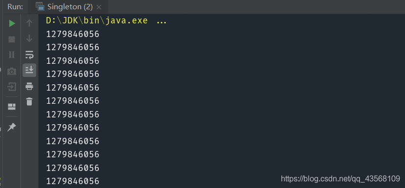
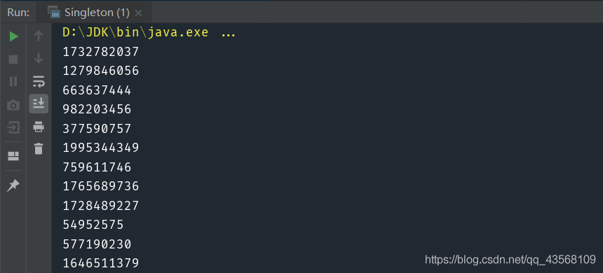
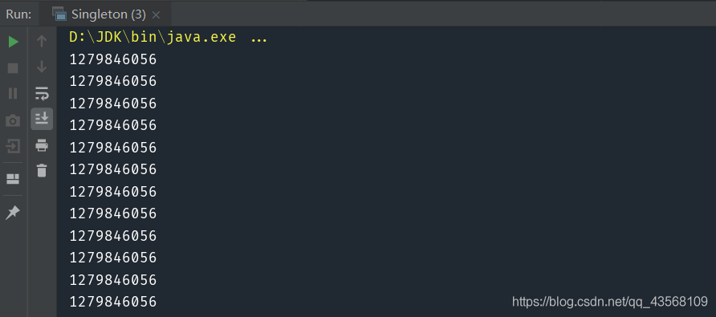
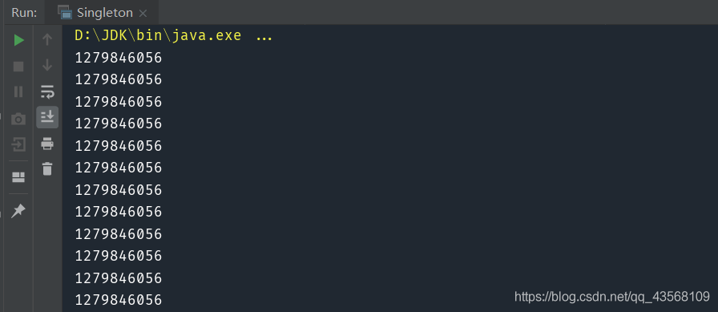
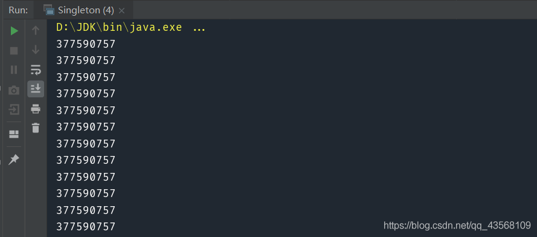
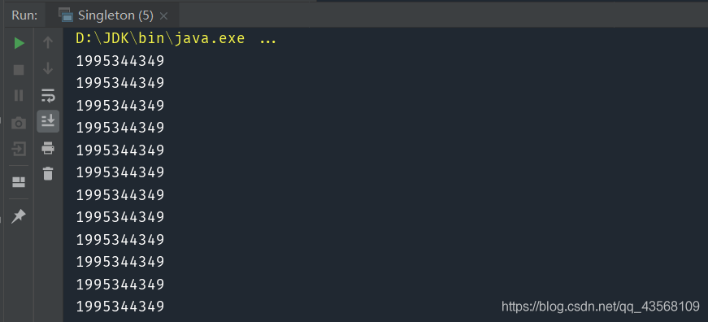

> 单例模式即一个类只有一个实例，并实现该实例的全局访问点

# 1.饿汉式
直接实例化，比如打开淘宝首页，会看到所有文字和图片都显示出来

实现代码：
```java
public class Singleton {
    private static Singleton instance=new Singleton();
    private Singleton(){}
    public static Singleton getInstance(){
        return instance;
    }
}
```
# 2.懒汉式
懒汉式可以延迟实例化，比如某些网站打开只看到图片的轮廓，过一会才能看到完整的信息，存在线程安全的问题

实现代码：
```java
public class Singleton {
    private static Singleton instance=null;
    private Singleton(){}
    public static Singleton getInstance(){
        if(instance==null){
            instance=new Singleton();
        }
        return instance;
    }
}
```
# 3.懒汉式线程安全
加同步关键字，保证线程安全，但是已经实例化的对象也会竞争资源，造成阻塞，性能低

实现代码：
```java
public class Singleton {
    private static Singleton instance=null;
    private Singleton(){}
    public static synchronized Singleton getInstance(){
        //synchronized(Singleton.class){
            if(instance==null){
                instance=new Singleton();
            }
            return instance;
        //}
    }
}
```
# 4.双重校验（DCL单例）
可以保证只对需要实例化的代码进行同步，需要加volatile关键字，禁止指令重排序

实现代码：
```java
public class Singleton {
    private static volatile Singleton instance=null;
    private Singleton(){}
    public static Singleton getInstance(){
        if(instance==null){
            synchronized(Singleton.class){
                if(instance==null){               
                    instance=new Singleton();
                }
            }
        }
        return instance;
    }
}
```
# 5.静态内部类
只有在调用实例化方法时，静态内部类才加载，并且jvm能保证静态内部类只加载一次

实现代码：
```java
public class Singleton {
    private static class SingletonHolder{
        private static final Singleton instance=new Singleton();
    }
    private Singleton(){}
    public static Singleton getInstance(){        
        return SingletonHolder.instance;
    }
}
```
# 6.枚举类
可以防止反射攻击

实现代码：
```java
public enum  Singleton {
    INSTANCE;
    public static Singleton getInstance(){
        return INSTANCE;
    }
}
```
# 7.测试
测试代码：

```java
public static void main(String[] args){
        for(int i=0;i<100;i++){
            new Thread(()->{
                System.out.println(Singleton.getInstance().hashCode());
            }).start();
        }
    }
```
测试的时候在获取实例方法里加个睡眠操作，更容易看到线程安全问题所带来的破坏
### 饿汉式测试结果：

### 懒汉式测试结果：

### 懒汉式线程安全测试结果：

### DCL测试结果：

### 静态内部类测试结果：

### 枚举类测试结果：
