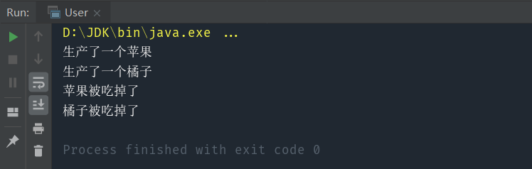

> 工厂模式分为简单工厂和工厂方法
>
> 简单工厂：创建一个工厂，需要什么产品就造什么，产品数过多，或添加新分支时会违背单一职责原则和开闭原则
>
> 工厂方法：创建多个工厂，每个工厂负责生产对应类型的产品

#### 核心：创建多个工厂，每个工厂负责生产对应类型的产品
举个例子，假设我们需要生产一批水果，当我们需要苹果的时候，可以new一个苹果，需要橘子的时候，可以new一个橘子，需要西瓜的时候，可以new一个西瓜，每生产一个水果，我们都需要一个对应的构造函数，如果有一个工厂来生产水果，那么我们只需要知道对应的苹果工厂、橘子工厂、西瓜工厂，而不需要知道具体的实现细节。

# 1.简单工厂

实现代码：
```java
public abstract class Fruit {
    abstract void print();
    abstract void eat();
}

class Apple extends Fruit {
    Apple(){
        this.print();
    }

    @Override
    void print() {
        System.out.println("生产了一个苹果");
    }

    @Override
    void eat() {
        System.out.println("苹果被吃掉了");
    }
}

class Orange extends Fruit {
    Orange(){
        this.print();
    }

    @Override
    void print() {
        System.out.println("生产了一个橘子");
    }

    @Override
    void eat() {
        System.out.println("橘子被吃掉了");
    }
}

class Watermelon extends Fruit {
    Watermelon(){
        this.print();
    }

    @Override
    void print() {
        System.out.println("生产了一个西瓜");
    }

    @Override
    void eat() {
        System.out.println("西瓜被吃掉了");
    }
}

public class FruitFactory {
    public Fruit create(String type){
        switch (type){
            case "苹果": return new Apple();
            case "橘子": return new Orange();
            case "西瓜": return new Watermelon();
            default: throw new IllegalArgumentException("暂时没有这种水果");
        }
    }
}
```
测试代码：

```java
public class User {
    public static void main(String[] args) {
        FruitFactory fruitFactory = new FruitFactory();
        Fruit apple = fruitFactory.create("苹果");
        Fruit watermelon = fruitFactory.create("西瓜");
        apple.eat();
        watermelon.eat();
    }
}
```

如果某一天苹果的构造函数变了，我们只需要在FruitFactory里修改，用户不需要关心具体的实现细节

# 2.工厂方法

实现代码：
```java
public abstract class Fruit {
    abstract void print();
    abstract void eat();
}

class Apple extends Fruit {
    Apple(){
        this.print();
    }

    @Override
    void print() {
        System.out.println("生产了一个苹果");
    }

    @Override
    void eat() {
        System.out.println("苹果被吃掉了");
    }
}

class Orange extends Fruit {
    Orange(){
        this.print();
    }

    @Override
    void print() {
        System.out.println("生产了一个橘子");
    }

    @Override
    void eat() {
        System.out.println("橘子被吃掉了");
    }
}

class Watermelon extends Fruit {
    Watermelon(){
        this.print();
    }

    @Override
    void print() {
        System.out.println("生产了一个西瓜");
    }

    @Override
    void eat() {
        System.out.println("西瓜被吃掉了");
    }
}

public class AppleFactory {
    public Fruit create(){
        return new Apple();
    }
}

public class OrangeFactory {
    public Fruit create(){
        return new Orange();
    }
}

public class WatermelonFactory {
    public Fruit create(){
        return new Watermelon();
    }
}

public class User {
    private void eat(){
        AppleFactory appleFactory = new AppleFactory();
        Fruit apple = appleFactory.create();
        OrangeFactory orangeFactory = new OrangeFactory();
        Fruit orange = orangeFactory.create();
        apple.eat();
        orange.eat();
    }
}

```

测试代码：

```java
public class User {
    public static void main(String[] args) {
        AppleFactory appleFactory = new AppleFactory();
        Fruit apple = appleFactory.create();
        OrangeFactory orangeFactory = new OrangeFactory();
        Fruit orange = orangeFactory.create();
        apple.eat();
        orange.eat();
    }
}
```



工厂方法相对于简单工厂，保留了简单工厂封装的特性，同时解决了简单工厂的两个弊端：

- 当生产的水果种类越来越多时，工厂类不会变成超级类。工厂类会越来越多，保持灵活。不会越来越大、变得臃肿。如果苹果的生产过程需要修改时，只需修改苹果工厂。西瓜的生产过程需要修改时，只需修改西瓜工厂。符合单一职责原则
- 当需要生产新的水果时，无需更改既有的工厂，只需要添加新的工厂即可。保持了面向对象的可扩展性，符合开闭原则 

