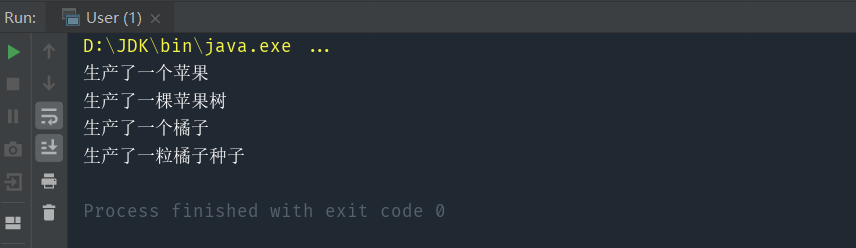

> 用于创建相关对象家族，从某种角度看，使用了组合，可以很方便的新增某个产品工厂，适用于横向扩展需求，不适用于增加功能的纵向扩展

#### 核心：为每一类工厂提取出抽象接口，使得新增和创建工厂非常容易
举个例子，假设我们需要生产水果相关的一系列产品，比如水果，水果种子，水果树，那么我们就可以抽象出对应的接口，用来生产这一系列产品，不仅可以生产苹果，苹果种子，还可以生产橘子，橘子树等等。简而言之，只要定义了对应的接口，就可以生产这一系列产品，很方便横向扩展。

# 1.抽象工厂

实现代码：
```java
interface FruitFactory {
    Fruit create();
    Seed createSeed();
    Tree createTree();
}

abstract class Fruit {
    abstract void print();
}

abstract class Seed {
    abstract void print();
}

abstract class Tree {
    abstract void print();
}

class Apple extends Fruit{

    Apple(){
        this.print();
    }

    @Override
    void print() {
        System.out.println("生产了一个苹果");
    }
}

class Orange extends Fruit{

    Orange(){
        this.print();
    }

    @Override
    void print() {
        System.out.println("生产了一个橘子");
    }
}

class AppleSeed extends Seed{

    AppleSeed(){
        this.print();
    }

    @Override
    void print() {
        System.out.println("生产了一粒苹果种子");
    }
}

class OrangeSeed extends Seed{

    OrangeSeed(){
        this.print();
    }

    @Override
    void print() {
        System.out.println("生产了一粒橘子种子");
    }
}

class AppleTree extends Tree{

    AppleTree(){
        this.print();
    }

    @Override
    void print() {
        System.out.println("生产了一棵苹果树");
    }
}

class OrangeTree extends Tree{

    OrangeTree(){
        this.print();
    }

    @Override
    void print() {
        System.out.println("生产了一棵橘子树");
    }
}


class AppleFactory implements FruitFactory{
    @Override
    public Fruit create() {
        return new Apple();
    }

    @Override
    public Seed createSeed() {
        return new AppleSeed();
    }

    @Override
    public Tree createTree() {
        return new AppleTree();
    }
}

class OrangeFactory implements FruitFactory{
    @Override
    public Fruit create() {
        return new Orange();
    }

    @Override
    public Seed createSeed() {
        return new OrangeSeed();
    }

    @Override
    public Tree createTree() {
        return new OrangeTree();
    }
}

```

测试代码：

```java
class User {

    public static void main(String[] args) {
        FruitFactory appleFactory = new AppleFactory();
        appleFactory.create();
        appleFactory.createTree();

        FruitFactory orangeFactory = new OrangeFactory();
        orangeFactory.create();
        orangeFactory.createSeed();
    }
}
```



抽象工厂模式主要用于替换一系列方法。例如将程序中的 Oracle 数据库整个替换为 Mysql数据库，使用抽象工厂模式的话，只需在抽象工厂接口中定义好增删改查四个方法，让 OracleFactory 和MysqlFactory 实现此接口，调用时直接使用抽象工厂中的抽象方法即可，调用者无需知道使用的什么数据库，我们就可以非常方便的整个替换程序的数据库，并且让客户端毫不知情。

抽象工厂模式很好的发挥了开闭原则、依赖倒置原则，但缺点是抽象工厂模式太重了，如果抽象工厂接口需要新增功能，则会影响到所有的具体工厂类。使用抽象工厂模式，替换具体工厂时只需更改一行代码，但要新增抽象方法则需要修改所有的具体工厂类。

