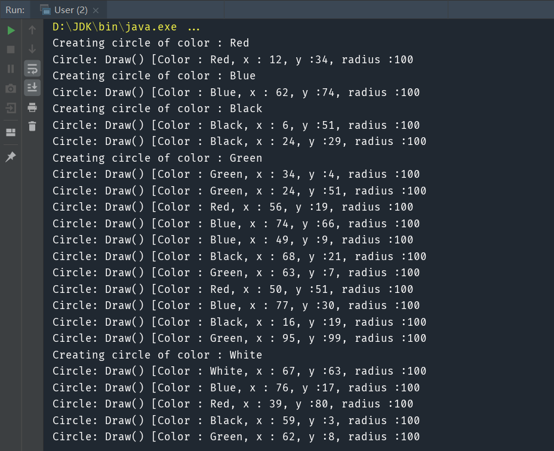

> 共享元数据，提高复用性

#### 核心：体现面向对象的可复用性

举个例子，比如我们要画一个带颜色的圆，这个过程有两步，一是创建Shape对象，二是画出一个圆。可以利用享元模式，将对象存放到Map中，如果同一个颜色的Shape已经存在了，不用重新创建，直接取出来。

# 1.模拟实现

实现代码：
```java
public interface Shape {

    void draw();
}

public class Circle implements Shape {
    private String color;
    private int x;
    private int y;
    private int radius;

    public Circle(String color){
        this.color = color;
    }

    public void setX(int x) {
        this.x = x;
    }

    public void setY(int y) {
        this.y = y;
    }

    public void setRadius(int radius) {
        this.radius = radius;
    }

    @Override
    public void draw() {
        System.out.println("Circle: Draw() [Color : " + color
                +", x : " + x +", y :" + y +", radius :" + radius);
    }
}

public class ShapeFactory {
    public static Shape getCircle(String color) {
        Circle circle = new Circle(color);
        System.out.println("Creating circle of color : " + color);
        return circle;
    }
}

public class CircleUtil {

    /**
     * 获取指定长度内的一个随机数
     * @param length
     * @return
     */
    public static int getRandomColor(int length) {
        return (int)(Math.random()*length);
    }

    /**
     * 获取半径内的一个随机X坐标
     * @param radius
     * @return
     */
    public static int getRandomX(int radius) {
        return (int)(Math.random()*radius );
    }

    /**
     * 获取半径内的一个随机Y坐标
     * @param radius
     * @return
     */
    public static int getRandomY(int radius) {
        return (int)(Math.random()*radius);
    }
}

```

测试代码：

```java
public class User {

    public static void main(String[] args) {
        String colors[] = { "Red", "Green", "Blue", "White", "Black" };
        int radium = 100;
        for(int i=0; i < 20; ++i) {
            Circle circle = (Circle)ShapeFactory.getCircle(colors[CircleUtil.getRandomColor(colors.length)]);
            circle.setRadius(radium);
            circle.setX(CircleUtil.getRandomX(radium));
            circle.setY(CircleUtil.getRandomY(radium));
            circle.draw();
        }

    }
}
```

#  2.使用享元模式实现

实现代码：

```java
public interface Shape {

    void draw();
}

public class Circle implements Shape {
    private String color;
    private int x;
    private int y;
    private int radius;

    public Circle(String color){
        this.color = color;
    }

    public void setX(int x) {
        this.x = x;
    }

    public void setY(int y) {
        this.y = y;
    }

    public void setRadius(int radius) {
        this.radius = radius;
    }

    @Override
    public void draw() {
        System.out.println("Circle: Draw() [Color : " + color
                +", x : " + x +", y :" + y +", radius :" + radius);
    }
}

public class ShapeFactory {
    private static final HashMap<String, Shape> circleMap = new HashMap<>();

    public static Shape getCircle(String color) {
        Circle circle = (Circle)circleMap.get(color);

        if(circle == null) {
            circle = new Circle(color);
            circleMap.put(color, circle);
            System.out.println("Creating circle of color : " + color);
        }
        return circle;
    }
}

public class CircleUtil {

    /**
     * 获取指定长度内的一个随机数
     * @param length
     * @return
     */
    public static int getRandomColor(int length) {
        return (int)(Math.random()*length);
    }

    /**
     * 获取半径内的一个随机X坐标
     * @param radius
     * @return
     */
    public static int getRandomX(int radius) {
        return (int)(Math.random()*radius );
    }

    /**
     * 获取半径内的一个随机Y坐标
     * @param radius
     * @return
     */
    public static int getRandomY(int radius) {
        return (int)(Math.random()*radius);
    }
}

```

测试代码：

```java
public class User {

    public static void main(String[] args) {
        String colors[] = { "Red", "Green", "Blue", "White", "Black" };
        int radium = 100;
        for(int i=0; i < 20; ++i) {
            Circle circle = (Circle) ShapeFactory.getCircle(colors[CircleUtil.getRandomColor(colors.length)]);
            circle.setRadius(radium);
            circle.setX(CircleUtil.getRandomX(radium));
            circle.setY(CircleUtil.getRandomY(radium));
            circle.draw();
        }

    }
}
```



可以看到，使用享元模式后，同一种颜色的Shape不会再重新new出来，而是直接从Map中取出来。

> 享受模式：运用共享技术有效地支持大量细粒度对象的复用。系统只使用少量的对象，而这些对象都很相似，状态变化很小，可以实现对象的多次复用。由于享元模式要求能够共享的对象必须是细粒度对象，因此它又称为轻量级模式。

有个细节值得注意：有些对象本身不一样，但通过一点点变化后就可以复用，我们编程时可能稍不注意就会忘记复用这些对象。比如说伟大的超级玛丽，谁能想到草和云更改一下颜色就可以实现复用呢？还有里面的三种乌龟，换一个颜色、加一个装饰就变成了不同的怪。