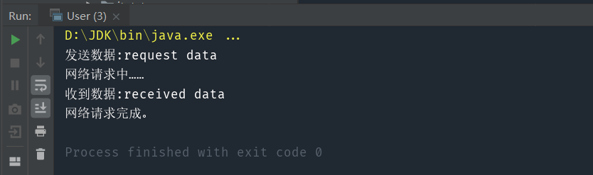

> 给某一个对象提供一个代理，并由代理对象控制对原对象的引用。代理模式分为静态代理和动态代理，静态代理和动态代理原理一模一样，只是动态代理需要把一个类传入，根据它正在调用的方法名来判断是否需要加以控制

#### 核心：主要用于对某个对象加以控制

考虑这样一个需求：在网络请求前后，分别打印将要发送的数据和接收到数据作为日志信息。此时我们就可以新建一个网络请求的代理类，让它代为处理网络请求，并在代理类中打印这些日志信息。

# 1.模拟实现

实现代码：
```java
public interface IHttp {
    void request(String sendData);
    void onSuccess(String receivedData);
}

public class HttpUtil implements IHttp {
    @Override
    public void request(String sendData) {
        System.out.println("发送数据:"+sendData);
        System.out.println("网络请求中……");
    }

    @Override
    public void onSuccess(String receivedData) {
        System.out.println("收到数据:"+receivedData);
        System.out.println("网络请求完成。");
    }
}
```

测试代码：

```java
public class User {
    public static void main(String[] args) {
        HttpUtil httpUtil=new HttpUtil();
        httpUtil.request("request data");
        httpUtil.onSuccess("received data");
    }
}
```

#  2.使用静态代理模式实现

实现代码：

```java
public interface IHttp {
    void request(String sendData);
    void onSuccess(String receivedData);
}

public class HttpUtil implements IHttp {
    @Override
    public void request(String sendData) {
        System.out.println("网络请求中……");
    }

    @Override
    public void onSuccess(String receivedData) {
        System.out.println("网络请求完成。");
    }
}

public class HttpProxy implements IHttp{
    private final HttpUtil httpUtil;

    HttpProxy(HttpUtil httpUtil){
        this.httpUtil=httpUtil;
    }

    @Override
    public void request(String sendData) {
        System.out.println("发送数据:"+sendData);
        httpUtil.request(sendData);
    }

    @Override
    public void onSuccess(String receivedData) {
        System.out.println("收到数据:"+receivedData);
        httpUtil.onSuccess(receivedData);
    }
}
```

测试代码：

```java
public class User {
    public static void main(String[] args) {
        HttpUtil httpUtil=new HttpUtil();
        HttpProxy httpProxy=new HttpProxy(httpUtil);
        httpProxy.request("request data");
        httpProxy.onSuccess("received data");
    }
}
```

# 3.使用动态代理模式实现

实现代码：

```java
public interface IHttp {
    void request(String sendData);
    void onSuccess(String receivedData);
}

public class HttpUtil implements IHttp {
    @Override
    public void request(String sendData) {
        System.out.println("网络请求中……");
    }

    @Override
    public void onSuccess(String receivedData) {
        System.out.println("网络请求完成。");
    }
}

public class HttpProxy implements InvocationHandler {

    private HttpUtil httpUtil;

    public IHttp getInstance(HttpUtil httpUtil){
        this.httpUtil=httpUtil;
        return (IHttp) Proxy.newProxyInstance(httpUtil.getClass().getClassLoader()
                            ,httpUtil.getClass().getInterfaces(),this);
    }
    @Override
    public Object invoke(Object proxy, Method method, Object[] args) throws Throwable {
        Object res=null;
        if(method.getName().equals("request")){
            System.out.println("发送数据:"+args[0]);
            res=method.invoke(httpUtil,args);
        }
        else if(method.getName().equals("onSuccess")){
            System.out.println("收到数据:"+args[0]);
            res=method.invoke(httpUtil,args);
        }
        return res;
    }
}
```

测试代码：

```java
public class User {
    public static void main(String[] args) {
        HttpUtil httpUtil=new HttpUtil();
        IHttp httpProxy=new HttpProxy().getInstance(httpUtil);
        httpProxy.request("request data");
        httpProxy.onSuccess("received data");
    }
}
```



动态代理本质上与静态代理没有区别，它的好处是节省代码量。比如被代理类有 20 个方法，而我们只需要控制其中的两个方法，就可以用动态代理通过方法名对被代理类进行动态的控制，而如果用静态方法，我们就需要将另外的 18 个方法也写出来，非常繁琐。这就是动态代理的优势所在。