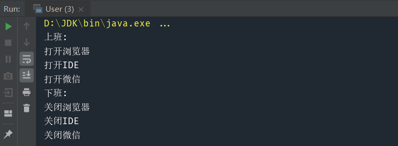

> 将多个子系统封装起来，提供一个简洁的接口供外部使用

#### 核心：体现了面向对象的封装

举个例子，比如我们每天打开电脑时，都需要做三件事：

- 打开浏览器

- 打开 IDE
- 打开微信

每天下班时，关机前需要做三件事：

- 关闭浏览器

- 关闭 IDE
- 关闭微信 

# 1.模拟实现

实现代码：
```java
public class Browser {

    public static void open(){
        System.out.println("打开浏览器");
    }

    public static void close(){
        System.out.println("关闭浏览器");
    }
}

public class IDE {
    public static void open(){
        System.out.println("打开IDE");
    }

    public static void close(){
        System.out.println("关闭IDE");
    }
}

public class Wechat {
    public static void open(){
        System.out.println("打开微信");
    }

    public static void close(){
        System.out.println("关闭微信");
    }
}
```

测试代码：

```java
public class User {
    public static void main(String[] args) {
        System.out.println("上班:");
        Browser.open();
        IDE.open();
        Wechat.open();

        System.out.println("下班:");
        Browser.close();
        IDE.close();
        Wechat.close();
    }
}

```

#  2.使用门面模式实现

实现代码：

```java
public class Facade {
    public void open(){
        Browser.open();
        IDE.open();
        Wechat.open();
    }

    public void close(){
        Browser.close();
        IDE.close();
        Wechat.close();
    }

}
```

测试代码：

```java
public class User {
    public static void main(String[] args) {
        Facade facade=new Facade();
        System.out.println("上班:");
        facade.open();
        
        System.out.println("下班:");
        facade.close();
    }
}
```



外观模式使得两种不同的类不用直接交互，而是通过一个中间件——也就是外观类——间接交互。外观类中只需要暴露简洁的接口，隐藏内部的细节，所以说白了就是封装的思想。

外观模式非常常用，尤其是在第三方库的设计中，我们应该提供尽量简洁的接口供别人调用。另外，在 MVC 架构中，C 层（Controller）就可以看作是外观类，Model 和 View 层通过 Controller 交互，减少了耦合。
