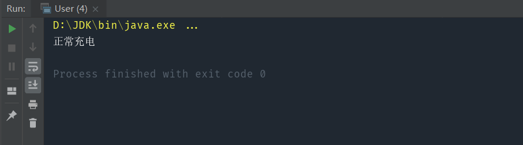

> 将一个类的接口转化为客户希望的另一个接口

#### 核心：用于有相关性但不兼容的接口

比如中国家用供电电压为220V，手机充电需要使用5V电压，充电器就担当了适配器的作用，将220V转化为5V 。让我们用程序来模拟一下这个过程。 

# 1.模拟实现

实现代码：
```java
public class HomeBattery {
    // 家用电源提供一个 220V 的输出电压
    int supply(){
        return 220;
    }
}

public class USBLine {
    void charge(int volt){
        if(volt!=5){
            throw new IllegalArgumentException("只能接受5V电压");
        }
        System.out.println("正常充电");
    }
}
```

测试代码：

```java
public class User {
    public static void main(String[] args) {
        HomeBattery homeBattery=new HomeBattery();
        int homeVolt=homeBattery.supply();
        USBLine usbLine=new USBLine();
        usbLine.charge(homeVolt);
    }
}
```

#  2.使用适配器模式实现

实现代码：

```java
public class Adapter {
    int convert(int homeVolt){
        //使用电阻、电容将电压降低为5V
        return homeVolt-215;
    }
}
```

测试代码：

```java
public class User {
    public static void main(String[] args) {
        HomeBattery homeBattery=new HomeBattery();
        int homeVolt=homeBattery.supply();
        Adapter adapter=new Adapter();
        int chargeVolt=adapter.convert(homeVolt);
        USBLine usbLine=new USBLine();
        usbLine.charge(chargeVolt);
    }
}
```



可以看到， 通过添加适配器，使得原本不兼容的两个接口能够正常工作了。适配器在其中的职责是包装了原有的接口，这样的适配器称为接口适配器。类似地，包装一个对象的适配器被称之为对象适配器。适配器模式的核心思想是添加一个中间件，包装原有的接口或对象，将其转换为另一个接口或对象，以适应新的业务场景。

