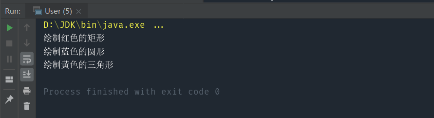

将抽象部分与实现部分分离，使他们可以独立地变化

#### 核心：用于同等级的接口互相组合

考虑这样一个需求：绘制矩形、圆形、三角形这三种图案。按照面向对象的理念，我们至少需要三个具体类，对应三种不同的图形。 

接下来我们有了新的需求，每种形状都需要有四种不同的颜色：红、蓝、黄、绿。

这时我们很容易想到两种设计方案：

- 为了复用形状类，将每种形状定义为父类，每种不同颜色的图形继承自其形状父类。此时一共有 12 个类。

- 为了复用颜色类，将每种颜色定义为父类，每种不同形状的图形继承自其颜色父类。此时一共有 12 个类。

一旦后续增加形状或者颜色，类会越来越多，很容易造成类爆炸。

形状和颜色，都是图形的两个属性。他们两者的关系是平等的，所以不属于继承关系。更好的的实现方式是：将形状和颜色分离，根据需要对形状和颜色进行组合，这就是桥接模式的思想。继承虽然是面向对象的三大特性之一，但继承会导致子类与父类有非常紧密的依赖关系，它会限制子类的灵活性和子类的复用性。而使用合成 / 聚合，也就是使用接口实现的方式，就不存在依赖问题，一个类可以实现多个接口，可以很方便地拓展功能。

# 1.模拟实现

实现代码：
```java
public interface IShape {
    void draw();
}

class Rectangle implements IShape {
    @Override
    public void draw() {
        System.out.println("绘制矩形");
    }
}

class Round implements IShape {
    @Override
    public void draw() {
        System.out.println("绘制圆形");
    }
}

class Triangle implements IShape {
    @Override
    public void draw() {
        System.out.println("绘制三角形");
    }
}
```

#  2.使用桥接模式实现

实现代码：

```java
public interface IColor {
    String getColor();
}

public class Red implements IColor {
    @Override
    public String getColor() {
        return "红色";
    }
}

public class Blue implements IColor {
    @Override
    public String getColor() {
        return "蓝色";
    }
}

public class Yellow implements IColor {
    @Override
    public String getColor() {
        return "黄色";
    }
}

public class Green implements IColor {
    @Override
    public String getColor() {
        return "绿色";
    }
}


class Rectangle implements IShape {

    private IColor color;

    void setColor(IColor color) {
        this.color = color;
    }

    @Override
    public void draw() {
        System.out.println("绘制" + color.getColor() + "的矩形");
    }
}


class Round implements IShape {

    private IColor color;

    void setColor(IColor color) {
        this.color = color;
    }

    @Override
    public void draw() {
        System.out.println("绘制" + color.getColor() + "的圆形");
    }
}


class Triangle implements IShape {

    private IColor color;

    void setColor(IColor color) {
        this.color = color;
    }

    @Override
    public void draw() {
        System.out.println("绘制" + color.getColor() + "的三角形");
    }
}
```

测试代码：

```java
public class User {
    public static void main(String[] args) {
        Rectangle rectangle = new Rectangle();
        rectangle.setColor(new Red());
        rectangle.draw();

        Round round = new Round();
        round.setColor(new Blue());
        round.draw();

        Triangle triangle = new Triangle();
        triangle.setColor(new Yellow());
        triangle.draw();
    }
}
```



桥接模式体现了合成 / 聚合复用原则：优先使用合成 / 聚合，而不是类继承。

