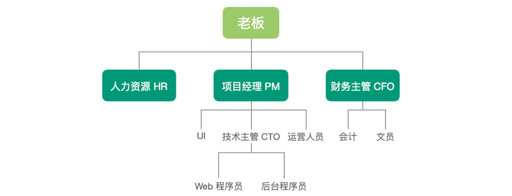
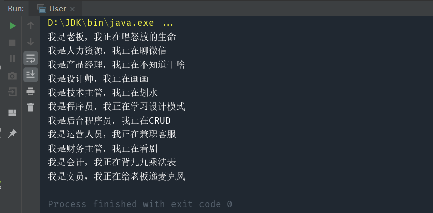

> 可以看成一个树形结构，用来表示整体与部分的层次

#### 核心：用于整体与部分的结构

考虑这样一个实际应用：设计一个公司的人员分布结构  ，如下图所示：



可以发现，人员结构中有两种结构，一是管理者，如老板，PM，CFO，CTO，二是职员。其中有的管理者不仅仅要管理职员，还会管理其他的管理者。这就是一个典型的整体与部分的结构。

# 1.模拟实现

实现代码：
```java
public class Manager {
    
    //职位
    private String position;
    //工作内容
    private String job;
    //管理的管理者
    private List<Manager> managers=new ArrayList<>();
    //管理的职员
    private List<Employee> employees=new ArrayList<>();

    public Manager(String position,String job){
        this.position=position;
        this.job=job;
    }
    
    public void addManager(Manager manager) {
        managers.add(manager);
    }

    public void removeManager(Manager manager) {
        managers.remove(manager);
    }

    public void addEmployee(Employee employee) {
        employees.add(employee);
    }

    public void removeEmployee(Employee employee) {
        employees.remove(employee);
    }

    //做自己本职工作
    public void work(){
        System.out.println("我是"+position+"，我正在"+job);
    }

    //检查下属
    public void check(){
        work();
        for(Manager manager:managers){
            manager.check();
        }
        for(Employee employee:employees){
            employee.work();
        }
    }
}

public class Employee {
    
    //职位
    private String position;
    //工作内容
    private String job;
    
    public Employee(String position,String job){
        this.position=position;
        this.job=job;
    }

    //做自己的本职工作
    public void work(){
        System.out.println("我是"+position+"，我正在"+job);
    }
}
```

测试代码：

```java
public class User {
    public static void main(String[] args) {
        Manager boss = new Manager("老板", "唱怒放的生命");
        Employee HR = new Employee("人力资源", "聊微信");
        Manager PM = new Manager("产品经理", "不知道干啥");
        Manager CFO = new Manager("财务主管", "看剧");
        Manager CTO = new Manager("技术主管", "划水");
        Employee UI = new Employee("设计师", "画画");
        Employee operator = new Employee("运营人员", "兼职客服");
        Employee webProgrammer = new Employee("程序员", "学习设计模式");
        Employee backgroundProgrammer = new Employee("后台程序员", "CRUD");
        Employee accountant = new Employee("会计", "背九九乘法表");
        Employee clerk = new Employee("文员", "给老板递麦克风");
        boss.addEmployee(HR);
        boss.addManager(PM);
        boss.addManager(CFO);
        PM.addEmployee(UI);
        PM.addManager(CTO);
        PM.addEmployee(operator);
        CTO.addEmployee(webProgrammer);
        CTO.addEmployee(backgroundProgrammer);
        CFO.addEmployee(accountant);
        CFO.addEmployee(clerk);

        boss.check();
    }
}

```

#  2.使用组合模式实现

实现代码：

```java
public abstract class Component {

    //职位
    private String position;
    //工作内容
    private String job;

    public Component(String position,String job){
        this.position=position;
        this.job=job;
    }

    //做自己本职工作
    public void work(){
        System.out.println("我是"+position+"，我正在"+job);
    }

    abstract void addComponent(Component component);

    abstract void removeComponent(Component component);

    abstract void check();
}

public class Manager extends Component{

    //管理的人
    private List<Component> components=new ArrayList<>();

    public Manager(String position, String job) {
        super(position, job);
    }

    @Override
    void addComponent(Component component) {
        components.add(component);
    }

    @Override
    void removeComponent(Component component) {
        components.remove(component);
    }

    @Override
    void check() {
        work();
        for(Component component:components){
            component.check();
        }
    }
}

public class Employee extends Component{

    public Employee(String position, String job) {
        super(position, job);
    }

    @Override
    void addComponent(Component component) {
        System.out.println("职员没有管理权限");
    }

    @Override
    void removeComponent(Component component) {
        System.out.println("职员没有管理权限");
    }

    @Override
    void check() {
        work();
    }
}
```

测试代码：

```java
public class User {
    public static void main(String[] args) {
        Component boss = new Manager("老板", "唱怒放的生命");
        Component HR = new Employee("人力资源", "聊微信");
        Component PM = new Manager("产品经理", "不知道干啥");
        Component CFO = new Manager("财务主管", "看剧");
        Component CTO = new Manager("技术主管", "划水");
        Component UI = new Employee("设计师", "画画");
        Component operator = new Employee("运营人员", "兼职客服");
        Component webProgrammer = new Employee("程序员", "学习设计模式");
        Component backgroundProgrammer = new Employee("后台程序员", "CRUD");
        Component accountant = new Employee("会计", "背九九乘法表");
        Component clerk = new Employee("文员", "给老板递麦克风");
        boss.addComponent(HR);
        boss.addComponent(PM);
        boss.addComponent(CFO);
        PM.addComponent(UI);
        PM.addComponent(CTO);
        PM.addComponent(operator);
        CTO.addComponent(webProgrammer);
        CTO.addComponent(backgroundProgrammer);
        CFO.addComponent(accountant);
        CFO.addComponent(clerk);

        boss.check();
    }
}
```



可以看到，使用组合模式后，我们解决了之前的两个弊端。一是将共有的字段与方法移到了父类中，消除了重复，并且在客户端中，可以一致对待 Manager 和 Employee 类：

- Manager 类和 Employee 类统一声明为 Component 对象

- 统一调用 Component 对象的 addComponent 方法添加子对象即可

