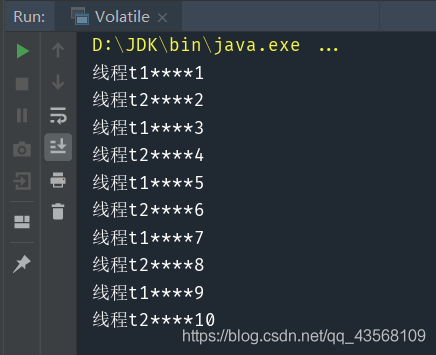
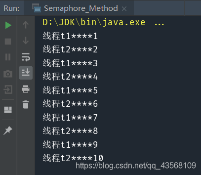
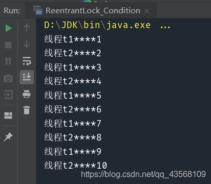
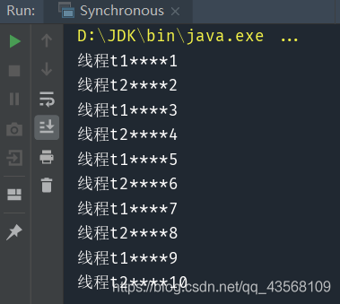

> 

# 问题描述
> 设计两个线程，打印1-10，一个线程打印奇数，另一个线程打印偶数，要求交替打印。 最后输出123……10
## 方法一(Synchronized+共享变量)
#### 1.解题思路
新建一个对象，并定义一个共享变量。只要flag不为1，线程t2就会阻塞，释放锁资源，所以t1线程先执行，此时flag为0，跳过while判断，然后修改flag为1，打印奇数，并唤醒t2，由于flag被改为1，下次循环，t1就会阻塞。t2被唤醒后，t1已经释放了锁资源，所以t2可以获取锁资源，并且flag为1，跳过while循环，修改flag为0，打印偶数，唤醒t1。
#### 2.代码实现
```java
public class Synchronized_Shared_Variable {

    static final Object obj = new Object();
    private static int flag = 0;

    public static void main(String[] args) {
        Thread t1 = new Thread(() -> {
            synchronized (obj) {
                for (int i = 1; i <= 10; i += 2) {
                    while (flag != 0) {
                        try {
                            obj.wait();
                        } catch (Exception e) {
                            e.printStackTrace();
                        }
                    }
                    flag = 1;
                    System.out.println(Thread.currentThread().getName() + "****" + i);
                    obj.notify();

                }
            }
        }, "线程t1");
        Thread t2 = new Thread(() -> {
            synchronized (obj) {
                for (int i = 2; i <= 10; i += 2) {
                    while (flag != 1) {
                        try {
                            obj.wait();
                        } catch (Exception e) {
                            e.printStackTrace();
                        }
                    }
                    flag = 0;
                    System.out.println(Thread.currentThread().getName() + "****" + i);
                    obj.notify();
                }
            }
        }, "线程t2");
        t1.start();
        t2.start();
    }
}

```
#### 3.测试

## 方法二(Volatile)
#### 1.解题思路
定义一个volatile修饰的共享变量flag，当flag为false时，t2线程让出系统资源，自己进入就绪状态，让t1先执行，t1获取资源后，首先跳过while判断，打印奇数，修改flag为true，下次循环时，就会让出资源，此时t2从就绪状态进入执行状态，跳过while判断，打印偶数，修改flag为false，下次循环时，就会让出资源。如此不断交替执行，直到打印完所有奇数偶数。
#### 2.代码实现
```java
public class Volatile {
    private static volatile boolean flag = false;

    public static void main(String[] args) {
        Thread t1 = new Thread(() -> {

            for (int i = 1; i <= 10; i += 2) {
                while (flag) {
                    Thread.yield();
                }
                System.out.println(Thread.currentThread().getName() + "****" + i);
                flag = true;
            }

        }, "线程t1");
        Thread t2 = new Thread(() -> {

            for (int i = 2; i <= 10; i += 2) {
                while (!flag) {
                    Thread.yield();
                }
                System.out.println(Thread.currentThread().getName() + "****" + i);
                flag = false;
            }
        }, "线程t2");

        t1.start();
        t2.start();
    }
}

```
#### 3.测试

## 方法三(Semaphore)
#### 1.解题思路
定义两个信号量，一个许可为1，一个许可为0。首先许可为0的会阻塞，所以t1线程先执行，通过s1.acquire()消耗许可，打印奇数，此时s1许可为0，t1阻塞，同时s2.release()获得一个许可，t2线程通过s2.acquire()消耗许可，打印偶数，此时s2许可又变为0，t2阻塞，同时s1.release()获得一个许可。如此反复执行，直到打印完所有的数。
#### 2.代码实现
```java
public class Semaphore_Method {

    public static void main(String[] args) {
        Semaphore s1 = new Semaphore(1);
        Semaphore s2 = new Semaphore(0);
        Thread t1 = new Thread(() -> {
            for (int i = 1; i <= 10; i += 2) {
                try {
                    s1.acquire();
                    System.out.println(Thread.currentThread().getName() + "****" + i);
                    s2.release();
                } catch (Exception e) {
                    e.printStackTrace();
                }

            }
        }, "线程t1");
        Thread t2 = new Thread(() -> {
            for (int i = 2; i <= 10; i += 2) {
                try {
                    s2.acquire();
                    System.out.println(Thread.currentThread().getName() + "****" + i);
                    s1.release();
                } catch (Exception e) {
                    e.printStackTrace();
                }
            }
        }, "线程t2");
        t1.start();
        t2.start();
    }
}

```
#### 3.测试


## 方法四(ReentrantLock)
#### 1.解题思路
首先定义一个lock和一个condition。当flag为false时，t2会阻塞，此时t1先执行，打印奇数，通过condition唤醒t2，修改flag为true，下次循环自己就会进入阻塞状态。t2被唤醒后，由于flag已经变为true，跳过while判断，打印偶数，唤醒t1，修改flag，自己阻塞，如此反复。
#### 2.代码实现
```java
public class ReentrantLock_Condition {
    private static Lock lock = new ReentrantLock();
    private static Condition condition = lock.newCondition();
    private static boolean flag = false;

    public static void main(String[] args) {
        Thread t1 = new Thread(() -> {

            for (int i = 1; i <= 10; i += 2) {
                lock.lock();
                while (flag) {
                    try {
                        condition.await();
                    } catch (Exception e) {

                    }
                }
                System.out.println(Thread.currentThread().getName() + "****" + i);
                condition.signal();
                flag = true;
                lock.unlock();
            }

        }, "线程t1");
        Thread t2 = new Thread(() -> {

            for (int i = 2; i <= 10; i += 2) {
                lock.lock();
                while (!flag) {
                    try {
                        condition.await();
                    } catch (Exception e) {

                    }
                }
                System.out.println(Thread.currentThread().getName() + "****" + i);
                condition.signal();
                flag = false;
                lock.unlock();
            }
        }, "线程t2");

        t1.start();
        t2.start();
    }
}

```
#### 3.测试

## 方法五(阻塞队列)
#### 1.解题思路
定义一个阻塞队列，t2线程调用put或tranfer往队列里放数据时，会阻塞，所以t1先执行，取走之前放进来的奇数，并打印，然后将偶数put或tranfer到队列，t1阻塞，t2继续执行，如此反复执行。
#### 2.代码实现
SynchronousQueue实现：
```java
public class Synchronous {

    public static void main(String[] args){
        int[] odd={1,3,5,7,9};
        int[] even={2,4,6,8,10};
        SynchronousQueue<Integer> queue=new SynchronousQueue<>();
        new Thread(()->{
            try{
                for(int i:even){
                    System.out.println(Thread.currentThread().getName() + "****"+queue.take());
                    queue.put(i);

                }
            }
            catch(Exception e){
                e.printStackTrace();
            }
        },"线程t1").start();
        new Thread(()->{
            try{
                for(int i:odd){
                    queue.put(i);
                    System.out.println(Thread.currentThread().getName() + "****"+queue.take());
                }
            }
            catch(Exception e){
                e.printStackTrace();
            }
        },"线程t2").start();
    }
}
```

TransferQueue实现：

```java
public class Transfer {

    public static void main(String[] args){
        int[] odd={1,3,5,7,9};
        int[] even={2,4,6,8,10};
        TransferQueue<Integer> queue=new LinkedTransferQueue<>();
        new Thread(()->{
            try{
                for(int i:even){
                    System.out.println(Thread.currentThread().getName() + "****"+queue.take());
                    queue.transfer(i);

                }
            }
            catch(Exception e){
                e.printStackTrace();
            }
        },"线程t1").start();
        new Thread(()->{
            try{
                for(int i:odd){
                    queue.transfer(i);
                    System.out.println(Thread.currentThread().getName() + "****"+queue.take());
                }
            }
            catch(Exception e){
                e.printStackTrace();
            }
        },"线程t2").start();
    }
}

```

#### 3.测试

