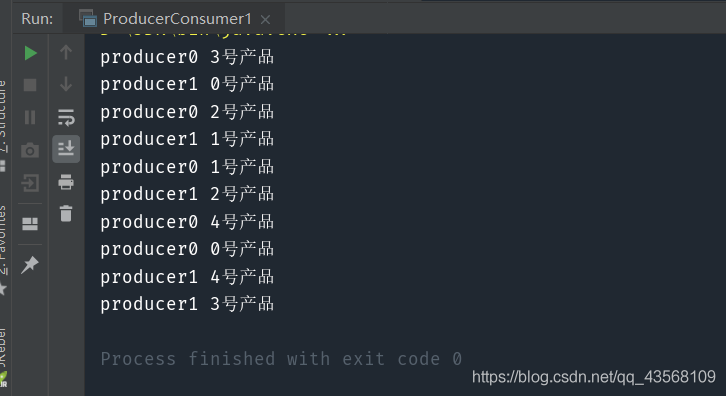

> 

# 问题描述
> 给定一个容器，设计两个线程，一个负责生产，一个负责消费，保证容器为空时，停止消费，容器满了之后，停止生产。

## 方法一(synchronized)
#### 1.解题思路
当容器满了之后，producer阻塞，唤醒consumer进行消费。当容器为空时，consumer阻塞，唤醒producer进行生产。
#### 2.代码实现
```java
public class ProducerConsumer1<T> {

    final private LinkedList<T> lists = new LinkedList<>();
    final private int MAX = 5;

	//生产者
    public synchronized void put(T t) {
        while (lists.size() == MAX) {
            try {
                this.wait();
            } catch (Exception e) {
                e.printStackTrace();
            }
        }
        lists.add(t);
        this.notifyAll();
    }

	//消费者
    public synchronized T get() {
        T t = null;
        while (lists.size() == 0) {
            try {
                this.wait();
            } catch (Exception e) {
                e.printStackTrace();
            }
        }
        t = lists.removeFirst();
        this.notifyAll();
        return t;
    }
    
}
```

## 方法二(阻塞队列)
#### 1.解题思路
阻塞队列提供了take() 和 put() 方法，当队列为空时， take() 将阻塞，直到队列中有内容；当队列容量已满时， put() 将阻塞，直到队列有空闲位置。
#### 2.代码实现
```java
public class ProducerConsumer2<T> {
    final private BlockingQueue<T> queue= new ArrayBlockingQueue<>(5);

	//生产者
    public void put(T t){
        try{
            queue.put(t);
        }
        catch(Exception e){
            e.printStackTrace();
        }
    }

	//消费者
    public T get(){
        T t=null;
        try{
           t=queue.take();
        }
        catch(Exception e){
            e.printStackTrace();
        }
        return t;
    }
    
}
```

## 方法三(ReentrantLock)
#### 1.解题思路
当容器满了之后，producer阻塞，唤醒consumer进行消费。当容器为空时，consumer阻塞，唤醒producer进行生产。
#### 2.代码实现

```java
public class ProducerConsumer3<T> {

    final private LinkedList<T> lists = new LinkedList<>();
    final private int MAX = 5;

    private Lock lock = new ReentrantLock();
    private Condition producer = lock.newCondition();
    private Condition consumer = lock.newCondition();

	//生产者
    public void put(T t) {
        try {
            lock.lock();
            while (lists.size() == MAX) {
                producer.await();
            }
            lists.add(t);
            consumer.signal();
        } catch (Exception e) {
            e.printStackTrace();
        } finally {
            lock.unlock();
        }

    }

	//消费者
    public T get() {
        T t = null;
        try {
            lock.lock();
            while (lists.size() == 0) {
                consumer.await();
            }
            t = lists.removeFirst();
            producer.signal();
        } catch (Exception e) {
            e.printStackTrace();
        } finally {
            lock.unlock();
        }
        return t;
    }    
}

```
# 测试
代码：

```java
public static void main(String[] args) {
        ProducerConsumer1<String> producerConsumer = new ProducerConsumer1<>();

        //5个消费者进行消费
        for (int i = 0; i < 5; i++) {
        	//每个消费两次
            new Thread(() -> {
                for (int j = 0; j < 2; j++) {
                    System.out.println(producerConsumer.get());
                }
            }, "consumer" + i).start();
        }

        //2个生产者进行生产
        for (int i = 0; i < 2; i++) {
        	//每个生产五种产品
            new Thread(() -> {
                for (int j = 0; j < 5; j++) {
                    producerConsumer.put(Thread.currentThread().getName() + " " + j + "号产品");
                }
            }, "producer" + i).start();
        }
    }
```
结果：
