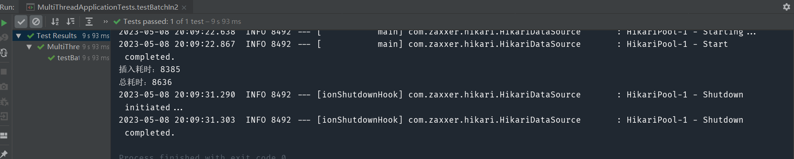
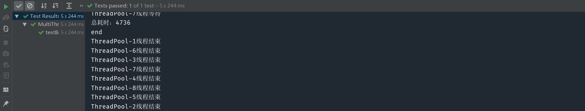

# 问题描述
> 假设有一个带事务的数据库批量操作，使用多线程技术实现这个批量操作提高性能
## 准备工作
#### 1.新建数据库

```mysql
CREATE TABLE `batch_in_table` (
    `id` bigint NOT NULL AUTO_INCREMENT COMMENT '主键ID',
    `str` varchar(64) DEFAULT NULL COMMENT '插入内容',
    PRIMARY KEY (`id`)
) ENGINE=InnoDB AUTO_INCREMENT=1 DEFAULT CHARSET=utf8mb4 COMMENT='批量插入表';

CREATE TABLE `batch_in_table2` (
     `id` bigint NOT NULL AUTO_INCREMENT COMMENT '主键ID',
     `str` varchar(64) DEFAULT NULL COMMENT '插入内容',
     PRIMARY KEY (`id`)
) ENGINE=InnoDB AUTO_INCREMENT=1 DEFAULT CHARSET=utf8mb4 COMMENT='批量插入表2';
```

batch_in_table2表作为对照使用普通方式插入数据，batch_in_table表使用多线程方式插入数据

#### 2.准备数据

```java
@Test
    public void createDataFile() throws IOException {
        List<String> list = new ArrayList<>();
        for (int i = 1; i <= 1000000; i ++) {
            list.add("测试" + i);
        }
        JacksonUtil.objectToFile(list, "testBatch/test.json");
    }
```

通过for循环，写入100W条数据到json文件

## 方法一(直接实现)
#### 1.思路
首先从json文件读取数据，然后按每2000条一组拆分数据，依次插入到数据库
#### 2.代码实现
```java
@Test
@SuppressWarnings("unchecked")
public void testBatchIn2() throws IOException {
    // 读取造的数据
    List<String> list = JacksonUtil.fileToObject("testBatch/test.json", List.class);
    long allStart = System.currentTimeMillis();
    // 事务
    DefaultTransactionDefinition def = new DefaultTransactionDefinition();
    def.setPropagationBehavior(TransactionDefinition.PROPAGATION_REQUIRES_NEW);
    TransactionStatus status = transactionManager.getTransaction(def);
    try {
        long start = System.currentTimeMillis();

        List<List<String>> listList = ListUtils.partition(list, 2000);
        listList.forEach(item->{
            batchInTableDao.batchIn2(item);
        });
        System.out.println("插入耗时：" + (System.currentTimeMillis() - start));
        transactionManager.commit(status);
    } catch (Exception e) {
        e.printStackTrace();
        transactionManager.rollback(status);
    }
    System.out.println("总耗时：" + (System.currentTimeMillis() - allStart));
}
```
#### 3.测试结果



直接实现的方式插入数据耗时8.6s

## 方法二(多线程方式实现)

#### 1.思路
首先获取数据，然后将数据总量除以插入的最大线程数的商作为拆分基数，拆分为多少个任务就用多少个线程。利用CountDownLatch控制线程之间的通信，当计数阀清零表示所有事务业务已经结束，主线程可以继续向下走，子线程可以开始判断是否回滚。利用AtomicBoolean原子类来判断是否需要回滚事务。

#### 2.代码实现
```java
@Test
@SuppressWarnings("unchecked")
public void testBatchIn() throws IOException, InterruptedException {
    List<String> list = JacksonUtil.fileToObject("testBatch/test.json", List.class);
    // 数据总量
    int dataNum = list.size();
    long allStart = System.currentTimeMillis();
    // 默认每次插入数据量
    int eachInsertSize = 2000;
    // 线程池用于插入的最大线程数
    int maxInsertPoolSize = threadPool.getMaxInsertPoolSize();
    if (dataNum > eachInsertSize * maxInsertPoolSize)  {
        eachInsertSize = dataNum / maxInsertPoolSize;
    }
    // 数据拆分
    List<List<String>> listList = ListUtils.partition(list, eachInsertSize);
    // 分配线作业线程数
    int threadNum = listList.size();

    // 回滚标志，线程安全
    AtomicBoolean rollbackFlag = new AtomicBoolean(false);
    // 事务计数阀，wait用于子线程内。计数阀清零表示所有事务业务已经结束，主线程可以继续向下走，子线程可以开始判断是否回滚
    CountDownLatch transactionLatch = new CountDownLatch(threadNum);

    listList.forEach(item -> executeInsert(item, rollbackFlag, transactionLatch));
    transactionLatch.await();

    if (rollbackFlag.get()) {
        System.out.println("回滚");
    }
    System.out.println("总耗时：" + (System.currentTimeMillis() - allStart));
    System.out.println("end");
}

private void executeInsert(List<String> list, AtomicBoolean rollbackFlag,
                           CountDownLatch transactionLatch) {
    threadPool.getExecutor().execute(new Runnable() {
        @Override
        public void run() {
            System.out.println(Thread.currentThread().getName() + "线程启动");

            // 后进线程获取到回滚标志，直接返回
            if (rollbackFlag.get())
                return;

            DefaultTransactionDefinition def = new DefaultTransactionDefinition();
            def.setPropagationBehavior(TransactionDefinition.PROPAGATION_REQUIRES_NEW); // 事物隔离级别，开启新事务，这样会比较安全些。
            TransactionStatus status = transactionManager.getTransaction(def); // 获得事务状态

            try {
                List<List<String>> listList = ListUtils.partition(list, 2000);
                listList.forEach(item -> batchInTableDao.batchIn(item));
                // 事务结束，计数阀计数减1
                transactionLatch.countDown();

                System.out.println(Thread.currentThread().getName() + "线程等待");
                // 等待其他事务
                transactionLatch.await();

                // 判断回滚
                if (rollbackFlag.get()) {
                    transactionManager.rollback(status);
                } else {
                    transactionManager.commit(status);
                }
            } catch (Exception e) {
                log.error("", e);
                rollbackFlag.set(true);
                // 事务结束，计数阀计数减1
                transactionLatch.countDown();
                transactionManager.rollback(status);
            }
            System.out.println(Thread.currentThread().getName() + "线程结束");
        }
    });
}
```

#### 3.测试结果



多线程方式插入数据耗时4.7s，节省了约一半的时间