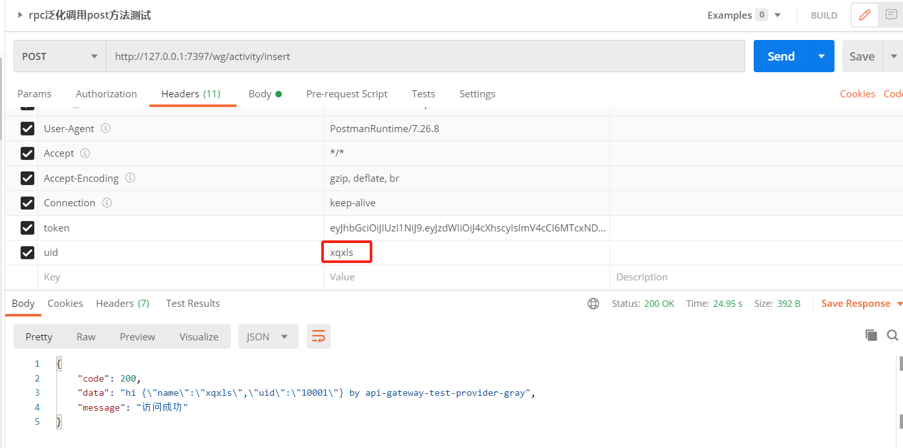
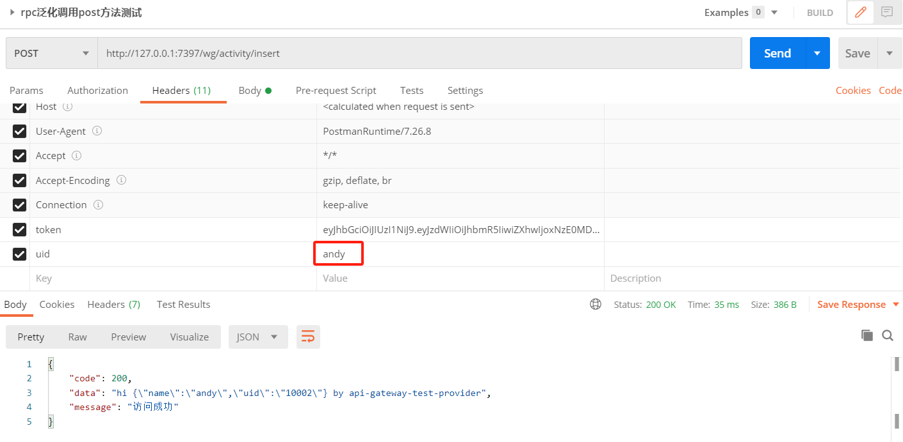

## 网关灰度组件

#### 1.需求目标

- 网关支持灰度功能，可选择按用户灰度、按IP灰度、按权重灰度等多种策略。
- 网关灰度路由，支持灰度到指定服务，灰度到指定接口

#### 2.设计

- 灰度的核心是路由，路由拆分为解析入参、判断是否进行灰度、路由到目标接口三部分。
- 新增按用户灰度、按IP灰度、按权重灰度等多种策略，每个策略都可以自定义解析入参、判断灰度、路由到目标接口。
- 对于RPC生产者服务，可以在yml配置文件全局配置group、version标识，也可以在指定接口配置。网关根据配置获取目标group、version之后，执行刷新referenceConfig操作，每次重新构建一个新的reference。

#### 3.架构图

#### 4.测试

设置andy是普通用户，xqxls是灰度用户：

xqxls用户调用接口：

andy用户调用接口：

