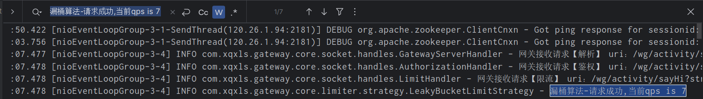

## 网关限流组件

#### 1.需求目标

- 网关支持限流功能，可选择计数器限流算法、漏桶限流算法、令牌桶限流算法等多种策略。

#### 2.设计

- 新增计数器限流算法、漏桶限流算法、令牌桶限流算法等实现限流功能的策略。
- 在应用服务信息采集SDK的方法注解，新增限流开关、限流策略类型、限流QPS等属性。
- 新增LimitHandler 类，读取配置信息，执行对应的限流算法。

#### 3.架构图

#### 4.压测

测试一（1秒执行20次请求）：

可以看到，在qps限定为7的情况下，有7条请求被放行了

测试二（1秒执行50次请求）：

可以看到，在qps限定为7的情况下，同样只有7条请求被放行了

测试三（5秒执行100次请求）：

可以看到，在qps限定为7的情况下，5秒内有35条请求被放行了