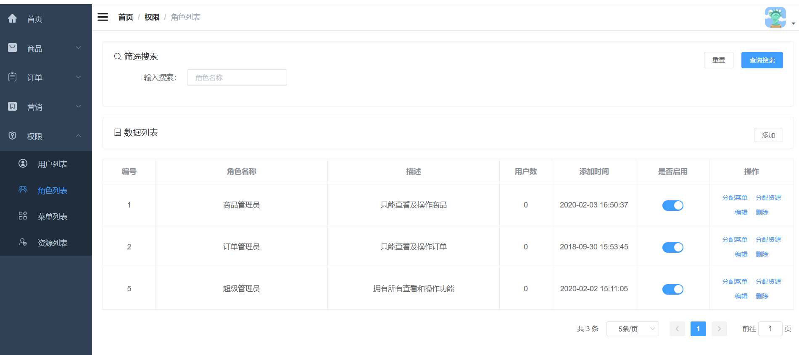

### 1.需求分析

这部分主要是后台角色管理的需求。有一个角色列表的界面，可以对角色进行增删改查，以及给角色分配资源，给角色分配菜单。

### 2.界面展示



### 3.方案设计

根据需求，需要设计八个接口，分别是：

- 新增角色

- 分页查询角色列表
- 编辑角色信息
- 删除角色
- 获取角色资源
- 给角色分配资源
- 获取角色菜单
- 给角色分配菜单

### 4.数据库表设计

需要设计后台用户角色表、后台资源表、后台角色资源关系表、后台菜单表、后台角色菜单关系表

```sql
CREATE TABLE `ums_role` (
  `id` bigint(20) NOT NULL AUTO_INCREMENT,
  `name` varchar(100) DEFAULT NULL COMMENT '名称',
  `description` varchar(500) DEFAULT NULL COMMENT '描述',
  `admin_count` int(11) DEFAULT NULL COMMENT '后台用户数量',
  `create_time` datetime DEFAULT NULL COMMENT '创建时间',
  `status` int(1) DEFAULT '1' COMMENT '启用状态：0->禁用；1->启用',
  `sort` int(11) DEFAULT '0',
  PRIMARY KEY (`id`) USING BTREE
) ENGINE=InnoDB AUTO_INCREMENT=6 DEFAULT CHARSET=utf8 ROW_FORMAT=DYNAMIC COMMENT='后台用户角色表';

CREATE TABLE `ums_resource` (
  `id` bigint(20) NOT NULL AUTO_INCREMENT,
  `create_time` datetime DEFAULT NULL COMMENT '创建时间',
  `name` varchar(200) DEFAULT NULL COMMENT '资源名称',
  `url` varchar(200) DEFAULT NULL COMMENT '资源URL',
  `description` varchar(500) DEFAULT NULL COMMENT '描述',
  `category_id` bigint(20) DEFAULT NULL COMMENT '资源分类ID',
  PRIMARY KEY (`id`) USING BTREE
) ENGINE=InnoDB AUTO_INCREMENT=33 DEFAULT CHARSET=utf8 ROW_FORMAT=DYNAMIC COMMENT='后台资源表';

CREATE TABLE `ums_role_resource_relation` (
  `id` bigint(20) NOT NULL AUTO_INCREMENT,
  `role_id` bigint(20) DEFAULT NULL COMMENT '角色ID',
  `resource_id` bigint(20) DEFAULT NULL COMMENT '资源ID',
  PRIMARY KEY (`id`) USING BTREE
) ENGINE=InnoDB AUTO_INCREMENT=249 DEFAULT CHARSET=utf8 ROW_FORMAT=DYNAMIC COMMENT='后台角色资源关系表';

CREATE TABLE `ums_menu` (
  `id` bigint(20) NOT NULL AUTO_INCREMENT,
  `parent_id` bigint(20) DEFAULT NULL COMMENT '父级ID',
  `create_time` datetime DEFAULT NULL COMMENT '创建时间',
  `title` varchar(100) DEFAULT NULL COMMENT '菜单名称',
  `level` int(4) DEFAULT NULL COMMENT '菜单级数',
  `sort` int(4) DEFAULT NULL COMMENT '菜单排序',
  `name` varchar(100) DEFAULT NULL COMMENT '前端名称',
  `icon` varchar(200) DEFAULT NULL COMMENT '前端图标',
  `hidden` int(1) DEFAULT NULL COMMENT '前端隐藏',
  PRIMARY KEY (`id`) USING BTREE
) ENGINE=InnoDB AUTO_INCREMENT=26 DEFAULT CHARSET=utf8 ROW_FORMAT=DYNAMIC COMMENT='后台菜单表';

CREATE TABLE `ums_role_menu_relation` (
  `id` bigint(20) NOT NULL AUTO_INCREMENT,
  `role_id` bigint(20) DEFAULT NULL COMMENT '角色ID',
  `menu_id` bigint(20) DEFAULT NULL COMMENT '菜单ID',
  PRIMARY KEY (`id`) USING BTREE
) ENGINE=InnoDB AUTO_INCREMENT=127 DEFAULT CHARSET=utf8 ROW_FORMAT=DYNAMIC COMMENT='后台角色菜单关系表';

```

### 5.核心代码

1.新增角色

```java
@Service
public class UmsRoleServiceImpl implements UmsRoleService {
    @Override
    public int create(UmsRole role) {
        role.setCreateTime(new Date());
        role.setAdminCount(0);
        role.setSort(0);
        return roleMapper.insert(role);
    }
}
```

直接将传参赋给角色，然后添加到数据库

2.分页查询角色列表

```java
@Service
public class UmsRoleServiceImpl implements UmsRoleService {
    @Override
    public List<UmsRole> list(String keyword, Integer pageSize, Integer pageNum) {
        PageHelper.startPage(pageNum, pageSize);
        UmsRoleExample example = new UmsRoleExample();
        if (!StrUtil.isEmpty(keyword)) {
            example.createCriteria().andNameLike("%" + keyword + "%");
        }
        return roleMapper.selectByExample(example);
    }
}
```

- 通过PageHelper插件开启分页
- 根据筛选条件从数据库查角色信息

3.编辑角色信息

```java
@Service
public class UmsRoleServiceImpl implements UmsRoleService {
    @Override
    public int update(Long id, UmsRole role) {
        role.setId(id);
        return roleMapper.updateByPrimaryKeySelective(role);
    }
}
```

4.删除角色

```java
@Service
public class UmsRoleServiceImpl implements UmsRoleService {
    
    @Override
    public int delete(List<Long> ids) {
        UmsRoleExample example = new UmsRoleExample();
        example.createCriteria().andIdIn(ids);
        int count = roleMapper.deleteByExample(example);
        adminCacheService.delResourceListByRoleIds(ids);
        return count;
    }
}
```

- 先从数据库删除
- 然后删除角色缓存

5.获取角色资源

```java
@Service
public class UmsRoleServiceImpl implements UmsRoleService {
    
    @Override
    public List<UmsResource> listResource(Long roleId) {
        return roleDao.getResourceListByRoleId(roleId);
    }
}
```

联合资源表、角色资源关系表获取角色对应资源

6.给角色分配资源

```java
@Service
public class UmsRoleServiceImpl implements UmsRoleService {
    
    @Override
    public int allocResource(Long roleId, List<Long> resourceIds) {
        //先删除原有关系
        UmsRoleResourceRelationExample example=new UmsRoleResourceRelationExample();
        example.createCriteria().andRoleIdEqualTo(roleId);
        roleResourceRelationMapper.deleteByExample(example);
        //批量插入新关系
        for (Long resourceId : resourceIds) {
            UmsRoleResourceRelation relation = new UmsRoleResourceRelation();
            relation.setRoleId(roleId);
            relation.setResourceId(resourceId);
            roleResourceRelationMapper.insert(relation);
        }
        adminCacheService.delResourceListByRole(roleId);
        return resourceIds.size();
    }
}
```

- 先删除原有关系
- 批量插入新关系
- 最后删除角色对应资源缓存

7.获取角色菜单

```java
@Service
public class UmsRoleServiceImpl implements UmsRoleService {
    
    @Override
    public List<UmsMenu> listMenu(Long roleId) {
        return roleDao.getMenuListByRoleId(roleId);
    }
}
```

联合菜单表、角色菜单关系表获取角色对应菜单

8.给角色分配菜单

```java
@Service
public class UmsRoleServiceImpl implements UmsRoleService {
    
    @Override
    public int allocMenu(Long roleId, List<Long> menuIds) {
        //先删除原有关系
        UmsRoleMenuRelationExample example=new UmsRoleMenuRelationExample();
        example.createCriteria().andRoleIdEqualTo(roleId);
        roleMenuRelationMapper.deleteByExample(example);
        //批量插入新关系
        for (Long menuId : menuIds) {
            UmsRoleMenuRelation relation = new UmsRoleMenuRelation();
            relation.setRoleId(roleId);
            relation.setMenuId(menuId);
            roleMenuRelationMapper.insert(relation);
        }
        return menuIds.size();
    }
}
```

- 先删除原有关系
- 批量插入新关系

