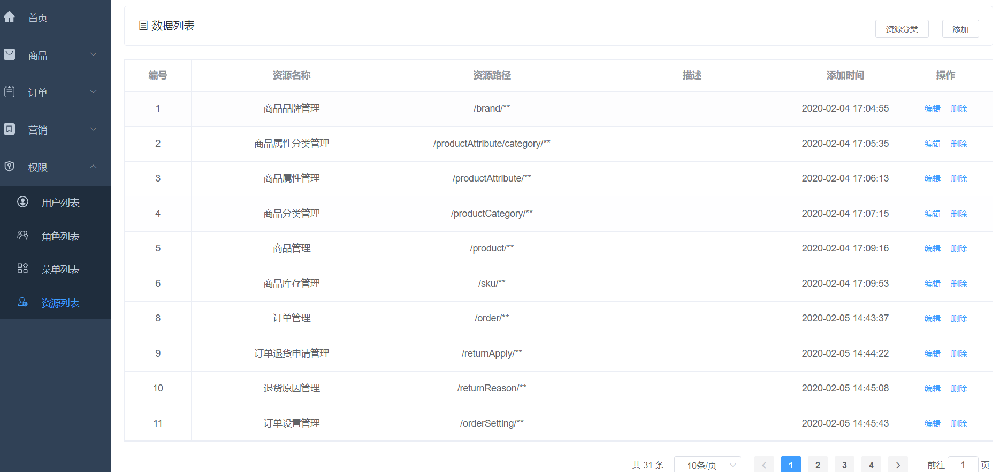

### 1.需求分析

资源列表界面的增删改查。

### 2.界面展示



### 3.方案设计

根据需求，需要设计四个接口，分别是：

- 新增资源
- 分页查询资源
- 编辑资源
- 删除资源

### 4.数据库表设计

需要设计一个后台资源表

```sql
CREATE TABLE `ums_resource` (
  `id` bigint(20) NOT NULL AUTO_INCREMENT,
  `create_time` datetime DEFAULT NULL COMMENT '创建时间',
  `name` varchar(200) DEFAULT NULL COMMENT '资源名称',
  `url` varchar(200) DEFAULT NULL COMMENT '资源URL',
  `description` varchar(500) DEFAULT NULL COMMENT '描述',
  `category_id` bigint(20) DEFAULT NULL COMMENT '资源分类ID',
  PRIMARY KEY (`id`) USING BTREE
) ENGINE=InnoDB AUTO_INCREMENT=33 DEFAULT CHARSET=utf8 ROW_FORMAT=DYNAMIC COMMENT='后台资源表';
```

### 5.核心代码

1.新增资源

```java
@Service
public class UmsResourceServiceImpl implements UmsResourceService {
    @Override
    public int create(UmsResource umsResource) {
        umsResource.setCreateTime(new Date());
        return resourceMapper.insert(umsResource);
    }
}
```

直接将传参赋给资源，然后添加到数据库

2.分页查询资源

```java
@Service
public class UmsResourceServiceImpl implements UmsResourceService {
    @Override
    public List<UmsResource> list(Long categoryId, String nameKeyword, String urlKeyword, Integer pageSize, Integer pageNum) {
        PageHelper.startPage(pageNum,pageSize);
        UmsResourceExample example = new UmsResourceExample();
        UmsResourceExample.Criteria criteria = example.createCriteria();
        if(categoryId!=null){
            criteria.andCategoryIdEqualTo(categoryId);
        }
        if(StrUtil.isNotEmpty(nameKeyword)){
            criteria.andNameLike('%'+nameKeyword+'%');
        }
        if(StrUtil.isNotEmpty(urlKeyword)){
            criteria.andUrlLike('%'+urlKeyword+'%');
        }
        return resourceMapper.selectByExample(example);
    }
}
```

根据筛选条件从数据库查资源信息

3.编辑资源

```java
@Service
public class UmsResourceServiceImpl implements UmsResourceService {
    @Override
    public int update(Long id, UmsResource umsResource) {
        umsResource.setId(id);
        int count = resourceMapper.updateByPrimaryKeySelective(umsResource);
        adminCacheService.delResourceListByResource(id);
        return count;
    }
}
```

4.删除资源

```java
@Service
public class UmsResourceServiceImpl implements UmsResourceService {
    @Override
    public int delete(Long id) {
        int count = resourceMapper.deleteByPrimaryKey(id);
        adminCacheService.delResourceListByResource(id);
        return count;
    }
}
```