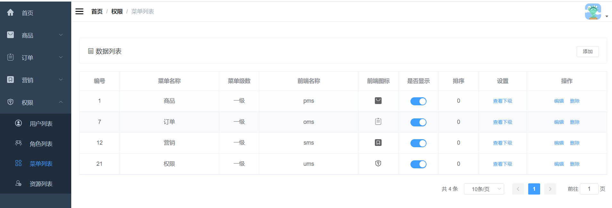

### 1.需求分析

菜单列表界面的增删改查，另外需要在左侧栏将菜单按树形结构展示。

### 2.界面展示



### 3.方案设计

根据需求，需要设计五个接口，分别是：

- 新增菜单
- 分页查询菜单
- 编辑菜单
- 删除菜单
- 获取菜单树形结构

### 4.数据库表设计

需要设计一个后台菜单表

```sql
CREATE TABLE `ums_menu` (
  `id` bigint(20) NOT NULL AUTO_INCREMENT,
  `parent_id` bigint(20) DEFAULT NULL COMMENT '父级ID',
  `create_time` datetime DEFAULT NULL COMMENT '创建时间',
  `title` varchar(100) DEFAULT NULL COMMENT '菜单名称',
  `level` int(4) DEFAULT NULL COMMENT '菜单级数',
  `sort` int(4) DEFAULT NULL COMMENT '菜单排序',
  `name` varchar(100) DEFAULT NULL COMMENT '前端名称',
  `icon` varchar(200) DEFAULT NULL COMMENT '前端图标',
  `hidden` int(1) DEFAULT NULL COMMENT '前端隐藏',
  PRIMARY KEY (`id`) USING BTREE
) ENGINE=InnoDB AUTO_INCREMENT=26 DEFAULT CHARSET=utf8 ROW_FORMAT=DYNAMIC COMMENT='后台菜单表';
```

### 5.核心代码

1.新增菜单

```java
@Service
public class UmsMenuServiceImpl implements UmsMenuService {
    @Override
    public int create(UmsMenu umsMenu) {
        umsMenu.setCreateTime(new Date());
        updateLevel(umsMenu);
        return menuMapper.insert(umsMenu);
    }
}
```

直接将传参赋给菜单，然后添加到数据库

2.分页查询菜单

```java
@Service
public class UmsMenuServiceImpl implements UmsMenuService {
    @Override
    public List<UmsMenu> list(Long parentId, Integer pageSize, Integer pageNum) {
        PageHelper.startPage(pageNum, pageSize);
        UmsMenuExample example = new UmsMenuExample();
        example.setOrderByClause("sort desc");
        example.createCriteria().andParentIdEqualTo(parentId);
        return menuMapper.selectByExample(example);
    }
}
```

根据筛选条件从数据库查菜单信息

3.编辑菜单

```java
@Service
public class UmsMenuServiceImpl implements UmsMenuService {
    @Override
    public int update(Long id, UmsMenu umsMenu) {
        umsMenu.setId(id);
        updateLevel(umsMenu);
        return menuMapper.updateByPrimaryKeySelective(umsMenu);
    }
}
```

4.删除菜单

```java
@Service
public class UmsMenuServiceImpl implements UmsMenuService {
    @Override
    public int delete(Long id) {
        return menuMapper.deleteByPrimaryKey(id);
    }
}
```
5.查询菜单树形结构

```java
@Service
public class UmsMenuServiceImpl implements UmsMenuService {
    @Override
    public List<UmsMenuNode> treeList() {
        List<UmsMenu> menuList = menuMapper.selectByExample(new UmsMenuExample());
        List<UmsMenuNode> result = menuList.stream()
                .filter(menu -> menu.getParentId().equals(0L))
                .map(menu -> covertMenuNode(menu, menuList))
                .collect(Collectors.toList());
        return result;
    }
    
    /**
     * 将UmsMenu转化为UmsMenuNode并设置children属性
     */
    private UmsMenuNode covertMenuNode(UmsMenu menu, List<UmsMenu> menuList) {
        UmsMenuNode node = new UmsMenuNode();
        BeanUtils.copyProperties(menu, node);
        List<UmsMenuNode> children = menuList.stream()
                .filter(subMenu -> subMenu.getParentId().equals(menu.getId()))
                .map(subMenu -> covertMenuNode(subMenu, menuList)).collect(Collectors.toList());
        node.setChildren(children);
        return node;
    }
}
```

