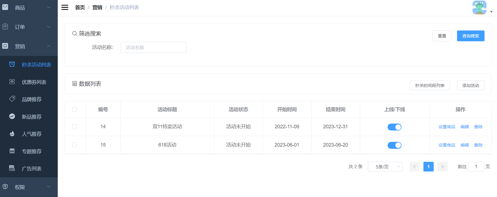

### 1.需求分析

秒杀活动列表界面的增删改查。

### 2.界面展示



### 3.方案设计

根据需求，需要设计十八个接口，分别是：

- 新增秒杀活动
- 分页查询秒杀活动
- 根据ID获取秒杀活动详情
- 编辑秒杀活动
- 编辑秒杀活动状态
- 删除秒杀活动
- 新增秒杀场次
- 查询秒杀场次
- 查询秒杀场次及商品数量
- 根据ID获取秒杀场次详情
- 编辑秒杀场次
- 编辑秒杀场次状态
- 删除秒杀场次
- 新增秒杀商品
- 分页查询秒杀商品
- 根据ID获取秒杀商品详情
- 编辑秒杀商品
- 删除秒杀商品

### 4.数据库表设计

需要设计限时购表、限时购场次表、商品限时购与商品关系表

```sql
CREATE TABLE `sms_flash_promotion` (
  `id` bigint(20) NOT NULL AUTO_INCREMENT,
  `title` varchar(200) DEFAULT NULL COMMENT '秒杀时间段名称',
  `start_date` date DEFAULT NULL COMMENT '开始日期',
  `end_date` date DEFAULT NULL COMMENT '结束日期',
  `status` int(1) DEFAULT NULL COMMENT '上下线状态',
  `create_time` datetime DEFAULT NULL COMMENT '创建时间',
  PRIMARY KEY (`id`) USING BTREE
) ENGINE=InnoDB AUTO_INCREMENT=16 DEFAULT CHARSET=utf8 ROW_FORMAT=DYNAMIC COMMENT='限时购表';

CREATE TABLE `sms_flash_promotion_session` (
  `id` bigint(20) NOT NULL AUTO_INCREMENT COMMENT '编号',
  `name` varchar(200) DEFAULT NULL COMMENT '场次名称',
  `start_time` time DEFAULT NULL COMMENT '每日开始时间',
  `end_time` time DEFAULT NULL COMMENT '每日结束时间',
  `status` int(1) DEFAULT NULL COMMENT '启用状态：0->不启用；1->启用',
  `create_time` datetime DEFAULT NULL COMMENT '创建时间',
  PRIMARY KEY (`id`) USING BTREE
) ENGINE=InnoDB AUTO_INCREMENT=8 DEFAULT CHARSET=utf8 ROW_FORMAT=DYNAMIC COMMENT='限时购场次表';

CREATE TABLE `sms_flash_promotion_product_relation` (
  `id` bigint(20) NOT NULL AUTO_INCREMENT COMMENT '编号',
  `flash_promotion_id` bigint(20) DEFAULT NULL,
  `flash_promotion_session_id` bigint(20) DEFAULT NULL COMMENT '编号',
  `product_id` bigint(20) DEFAULT NULL,
  `flash_promotion_price` decimal(10,2) DEFAULT NULL COMMENT '限时购价格',
  `flash_promotion_count` int(11) DEFAULT NULL COMMENT '限时购数量',
  `flash_promotion_limit` int(11) DEFAULT NULL COMMENT '每人限购数量',
  `sort` int(11) DEFAULT NULL COMMENT '排序',
  PRIMARY KEY (`id`) USING BTREE
) ENGINE=InnoDB AUTO_INCREMENT=54 DEFAULT CHARSET=utf8 ROW_FORMAT=DYNAMIC COMMENT='商品限时购与商品关系表';
```

### 5.核心代码

1.新增秒杀活动

```java
@Service
public class SmsFlashPromotionServiceImpl implements SmsFlashPromotionService {
    @Override
    public int create(SmsFlashPromotion flashPromotion) {
        flashPromotion.setCreateTime(new Date());
        return flashPromotionMapper.insert(flashPromotion);
    }
}
```

2.分页查询秒杀活动

```java
@Service
public class SmsFlashPromotionServiceImpl implements SmsFlashPromotionService {
    @Override
    public List<SmsFlashPromotion> list(String keyword, Integer pageSize, Integer pageNum) {
        PageHelper.startPage(pageNum, pageSize);
        SmsFlashPromotionExample example = new SmsFlashPromotionExample();
        if (!StrUtil.isEmpty(keyword)) {
            example.createCriteria().andTitleLike("%" + keyword + "%");
        }
        return flashPromotionMapper.selectByExample(example);
    }
}
```

根据筛选条件从数据库查秒杀活动

3.根据ID获取秒杀活动详情

```java
@Service
public class SmsFlashPromotionServiceImpl implements SmsFlashPromotionService {
    
    @Override
    public SmsFlashPromotion getItem(Long id) {
        return flashPromotionMapper.selectByPrimaryKey(id);
    }
}
```

4.编辑秒杀活动

```java
@Service
public class SmsFlashPromotionServiceImpl implements SmsFlashPromotionService {
    @Override
    public int update(Long id, SmsFlashPromotion flashPromotion) {
        flashPromotion.setId(id);
        return flashPromotionMapper.updateByPrimaryKey(flashPromotion);
    }
}    
```

5.编辑秒杀活动状态

```java
@Service
public class SmsFlashPromotionServiceImpl implements SmsFlashPromotionService {
    @Override
    public int updateStatus(Long id, Integer status) {
        SmsFlashPromotion flashPromotion = new SmsFlashPromotion();
        flashPromotion.setId(id);
        flashPromotion.setStatus(status);
        return flashPromotionMapper.updateByPrimaryKeySelective(flashPromotion);
    }
}
```

6.删除秒杀活动

```java
@Service
public class SmsFlashPromotionServiceImpl implements SmsFlashPromotionService {
    @Override
    public int delete(Long id) {
        return flashPromotionMapper.deleteByPrimaryKey(id);
    }
}
```

7.新增秒杀场次

```java
@Service
public class SmsFlashPromotionSessionServiceImpl implements SmsFlashPromotionSessionService {
    @Override
    public int create(SmsFlashPromotionSession promotionSession) {
        promotionSession.setCreateTime(new Date());
        return promotionSessionMapper.insert(promotionSession);
    }
}
```

8.查询秒杀场次

```java
@Service
public class SmsFlashPromotionSessionServiceImpl implements SmsFlashPromotionSessionService {
    @Override
    public List<SmsFlashPromotionSession> list() {
        SmsFlashPromotionSessionExample example = new SmsFlashPromotionSessionExample();
        return promotionSessionMapper.selectByExample(example);
    }
}
```

9.查询秒杀场次及商品数量

```java
@Service
public class SmsFlashPromotionSessionServiceImpl implements SmsFlashPromotionSessionService {
    
    @Override
    public List<SmsFlashPromotionSessionDetail> selectList(Long flashPromotionId) {
        List<SmsFlashPromotionSessionDetail> result = new ArrayList<>();
        SmsFlashPromotionSessionExample example = new SmsFlashPromotionSessionExample();
        example.createCriteria().andStatusEqualTo(1);
        List<SmsFlashPromotionSession> list = promotionSessionMapper.selectByExample(example);
        for (SmsFlashPromotionSession promotionSession : list) {
            SmsFlashPromotionSessionDetail detail = new SmsFlashPromotionSessionDetail();
            BeanUtils.copyProperties(promotionSession, detail);
            long count = relationService.getCount(flashPromotionId, promotionSession.getId());
            detail.setProductCount(count);
            result.add(detail);
        }
        return result;
    }
}
```

- 先查所有秒杀场次
- 然后根据秒杀活动ID+场次ID从商品限时购与商品关系表查商品数量
- 包装结果

10.根据ID获取秒杀场次详情

```java
@Service
public class SmsFlashPromotionSessionServiceImpl implements SmsFlashPromotionSessionService {
    @Override
    public SmsFlashPromotionSession getItem(Long id) {
        return promotionSessionMapper.selectByPrimaryKey(id);
    }
}    
```

11.编辑秒杀场次状态

```java
@Service
public class SmsFlashPromotionSessionServiceImpl implements SmsFlashPromotionSessionService {
    @Override
    public int updateStatus(Long id, Integer status) {
        SmsFlashPromotionSession promotionSession = new SmsFlashPromotionSession();
        promotionSession.setId(id);
        promotionSession.setStatus(status);
        return promotionSessionMapper.updateByPrimaryKeySelective(promotionSession);
    }
}
```

12.编辑秒杀场次

```java
@Service
public class SmsFlashPromotionSessionServiceImpl implements SmsFlashPromotionSessionService {
    @Override
    public int update(Long id, SmsFlashPromotionSession promotionSession) {
        promotionSession.setId(id);
        return promotionSessionMapper.updateByPrimaryKey(promotionSession);
    }
}
```

13.删除秒杀场次

```java
@Service
public class SmsFlashPromotionSessionServiceImpl implements SmsFlashPromotionSessionService {
    @Override
    public int delete(Long id) {
        return promotionSessionMapper.deleteByPrimaryKey(id);
    }
}
```

14.新增秒杀商品

```java
@Service
public class SmsFlashPromotionProductRelationServiceImpl implements SmsFlashPromotionProductRelationService {
    @Override
    public int create(List<SmsFlashPromotionProductRelation> relationList) {
        for (SmsFlashPromotionProductRelation relation : relationList) {
            relationMapper.insert(relation);
        }
        return relationList.size();
    }
}
```

根据筛选条件从数据库查广告

15.分页查询秒杀商品

```java
@Service
public class SmsFlashPromotionProductRelationServiceImpl implements SmsFlashPromotionProductRelationService {
    
    @Override
    public List<SmsFlashPromotionProduct> list(Long flashPromotionId, Long flashPromotionSessionId, Integer pageSize, Integer pageNum) {
        PageHelper.startPage(pageNum,pageSize);
        return relationDao.getList(flashPromotionId,flashPromotionSessionId);
    }
}
```

16.根据ID获取秒杀商品详情

```java
@Service
public class SmsFlashPromotionProductRelationServiceImpl implements SmsFlashPromotionProductRelationService {
    @Override
    public SmsFlashPromotionProductRelation getItem(Long id) {
        return relationMapper.selectByPrimaryKey(id);
    }
}    
```

17.编辑秒杀商品

```java
@Service
public class SmsFlashPromotionProductRelationServiceImpl implements SmsFlashPromotionProductRelationService {
    @Override
    public int update(Long id, SmsFlashPromotionProductRelation relation) {
        relation.setId(id);
        return relationMapper.updateByPrimaryKey(relation);
    }
}
```

18.删除秒杀商品

```java
@Service
public class SmsFlashPromotionProductRelationServiceImpl implements SmsFlashPromotionProductRelationService {
    @Override
    public int delete(Long id) {
        return relationMapper.deleteByPrimaryKey(id);
    }
}
```