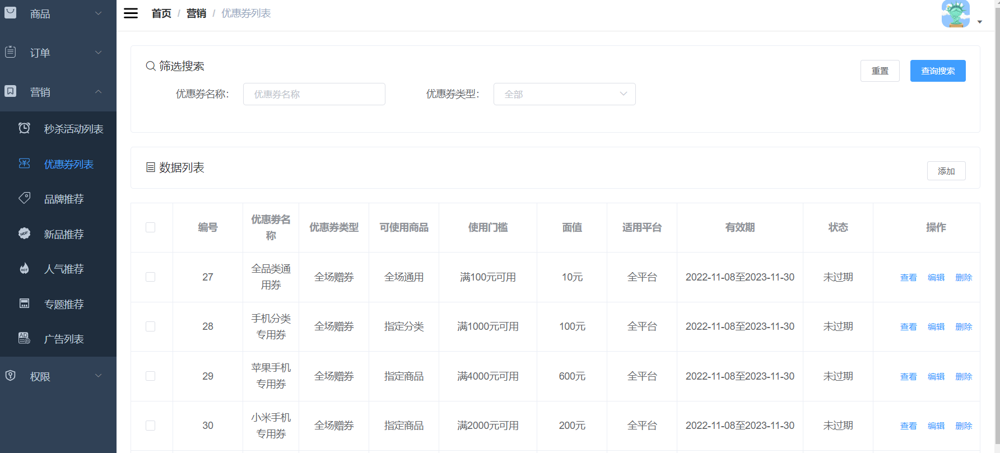

### 1.需求分析

优惠券列表界面的增删改查。

### 2.界面展示



### 3.方案设计

根据需求，需要设计六个接口，分别是：

- 新增优惠券
- 分页查询优惠券
- 根据ID获取优惠券
- 编辑优惠券
- 删除优惠券
- 分页查询优惠券领取记录

### 4.数据库表设计

需要设计一个优惠券表、优惠券和商品的关系表、优惠券和商品分类关系表、优惠券历史表

```sql
CREATE TABLE `sms_coupon` (
  `id` bigint(20) NOT NULL AUTO_INCREMENT,
  `type` int(1) DEFAULT NULL COMMENT '优惠券类型；0->全场赠券；1->会员赠券；2->购物赠券；3->注册赠券',
  `name` varchar(100) DEFAULT NULL,
  `platform` int(1) DEFAULT NULL COMMENT '使用平台：0->全部；1->移动；2->PC',
  `count` int(11) DEFAULT NULL COMMENT '数量',
  `amount` decimal(10,2) DEFAULT NULL COMMENT '金额',
  `per_limit` int(11) DEFAULT NULL COMMENT '每人限领张数',
  `min_point` decimal(10,2) DEFAULT NULL COMMENT '使用门槛；0表示无门槛',
  `start_time` datetime DEFAULT NULL,
  `end_time` datetime DEFAULT NULL,
  `use_type` int(1) DEFAULT NULL COMMENT '使用类型：0->全场通用；1->指定分类；2->指定商品',
  `note` varchar(200) DEFAULT NULL COMMENT '备注',
  `publish_count` int(11) DEFAULT NULL COMMENT '发行数量',
  `use_count` int(11) DEFAULT NULL COMMENT '已使用数量',
  `receive_count` int(11) DEFAULT NULL COMMENT '领取数量',
  `enable_time` datetime DEFAULT NULL COMMENT '可以领取的日期',
  `code` varchar(64) DEFAULT NULL COMMENT '优惠码',
  `member_level` int(1) DEFAULT NULL COMMENT '可领取的会员类型：0->无限时',
  PRIMARY KEY (`id`) USING BTREE
) ENGINE=InnoDB AUTO_INCREMENT=32 DEFAULT CHARSET=utf8 ROW_FORMAT=DYNAMIC COMMENT='优惠券表';

CREATE TABLE `sms_coupon_product_relation` (
  `id` bigint(20) NOT NULL AUTO_INCREMENT,
  `coupon_id` bigint(20) DEFAULT NULL,
  `product_id` bigint(20) DEFAULT NULL,
  `product_name` varchar(500) DEFAULT NULL COMMENT '商品名称',
  `product_sn` varchar(200) DEFAULT NULL COMMENT '商品编码',
  PRIMARY KEY (`id`) USING BTREE
) ENGINE=InnoDB AUTO_INCREMENT=23 DEFAULT CHARSET=utf8 ROW_FORMAT=DYNAMIC COMMENT='优惠券和商品的关系表';

CREATE TABLE `sms_coupon_product_category_relation` (
  `id` bigint(20) NOT NULL AUTO_INCREMENT,
  `coupon_id` bigint(20) DEFAULT NULL,
  `product_category_id` bigint(20) DEFAULT NULL,
  `product_category_name` varchar(200) DEFAULT NULL COMMENT '产品分类名称',
  `parent_category_name` varchar(200) DEFAULT NULL COMMENT '父分类名称',
  PRIMARY KEY (`id`) USING BTREE
) ENGINE=InnoDB AUTO_INCREMENT=12 DEFAULT CHARSET=utf8 ROW_FORMAT=DYNAMIC COMMENT='优惠券和商品分类关系表';

CREATE TABLE `sms_coupon_history` (
  `id` bigint(20) NOT NULL AUTO_INCREMENT,
  `coupon_id` bigint(20) DEFAULT NULL,
  `member_id` bigint(20) DEFAULT NULL,
  `coupon_code` varchar(64) DEFAULT NULL,
  `member_nickname` varchar(64) DEFAULT NULL COMMENT '领取人昵称',
  `get_type` int(1) DEFAULT NULL COMMENT '获取类型：0->后台赠送；1->主动获取',
  `create_time` datetime DEFAULT NULL,
  `use_status` int(1) DEFAULT NULL COMMENT '使用状态：0->未使用；1->已使用；2->已过期',
  `use_time` datetime DEFAULT NULL COMMENT '使用时间',
  `order_id` bigint(20) DEFAULT NULL COMMENT '订单编号',
  `order_sn` varchar(100) DEFAULT NULL COMMENT '订单号码',
  PRIMARY KEY (`id`) USING BTREE,
  KEY `idx_member_id` (`member_id`) USING BTREE,
  KEY `idx_coupon_id` (`coupon_id`) USING BTREE
) ENGINE=InnoDB AUTO_INCREMENT=54 DEFAULT CHARSET=utf8 ROW_FORMAT=DYNAMIC COMMENT='优惠券历史表';

```

### 5.核心代码

1.新增优惠券

```java
@Service
public class SmsCouponServiceImpl implements SmsCouponService {
    @Override
    public int create(SmsCouponParam couponParam) {
        couponParam.setCount(couponParam.getPublishCount());
        couponParam.setUseCount(0);
        couponParam.setReceiveCount(0);
        //插入优惠券表
        int count = couponMapper.insert(couponParam);
        //插入优惠券和商品关系表
        if(couponParam.getUseType().equals(2)){
            for(SmsCouponProductRelation productRelation:couponParam.getProductRelationList()){
                productRelation.setCouponId(couponParam.getId());
            }
            productRelationDao.insertList(couponParam.getProductRelationList());
        }
        //插入优惠券和商品分类关系表
        if(couponParam.getUseType().equals(1)){
            for (SmsCouponProductCategoryRelation couponProductCategoryRelation : couponParam.getProductCategoryRelationList()) {
                couponProductCategoryRelation.setCouponId(couponParam.getId());
            }
            productCategoryRelationDao.insertList(couponParam.getProductCategoryRelationList());
        }
        return count;
    }
}
```

- 将传参赋给优惠券，添加到数据库。
- 如果是指定商品，则绑定优惠券和商品关系。
- 如果是指定商品分类，则绑定优惠券和商品分类关系。

2.分页查询优惠券

```java
@Service
public class SmsCouponServiceImpl implements SmsCouponService {
    @Override
    public List<SmsCoupon> list(String name, Integer type, Integer pageSize, Integer pageNum) {
        SmsCouponExample example = new SmsCouponExample();
        SmsCouponExample.Criteria criteria = example.createCriteria();
        if(!StrUtil.isEmpty(name)){
            criteria.andNameLike("%"+name+"%");
        }
        if(type!=null){
            criteria.andTypeEqualTo(type);
        }
        PageHelper.startPage(pageNum,pageSize);
        return couponMapper.selectByExample(example);
    }
}
```

根据筛选条件从数据库查优惠券

3.根据ID获取优惠券

```java
@Service
public class SmsCouponServiceImpl implements SmsCouponService {
    
    @Override
    public SmsCouponParam getItem(Long id) {
        return couponDao.getItem(id);
    }
}
```

联合优惠券表、优惠券和商品的关系表、优惠券和商品分类关系表获取优惠券详情信息

4.编辑优惠券

```java
@Service
public class SmsCouponServiceImpl implements SmsCouponService {
    @Override
    public int update(Long id, SmsCouponParam couponParam) {
        couponParam.setId(id);
        int count =couponMapper.updateByPrimaryKey(couponParam);
        //删除后插入优惠券和商品关系表
        if(couponParam.getUseType().equals(2)){
            for(SmsCouponProductRelation productRelation:couponParam.getProductRelationList()){
                productRelation.setCouponId(couponParam.getId());
            }
            deleteProductRelation(id);
            productRelationDao.insertList(couponParam.getProductRelationList());
        }
        //删除后插入优惠券和商品分类关系表
        if(couponParam.getUseType().equals(1)){
            for (SmsCouponProductCategoryRelation couponProductCategoryRelation : couponParam.getProductCategoryRelationList()) {
                couponProductCategoryRelation.setCouponId(couponParam.getId());
            }
            deleteProductCategoryRelation(id);
            productCategoryRelationDao.insertList(couponParam.getProductCategoryRelationList());
        }
        return count;
    }
}    
```

- 将传参赋给优惠券，更新到数据库。
- 如果是指定商品，则删除后插入优惠券和商品关系表。
- 如果是指定商品分类，则删除后插入优惠券和商品分类关系表。

5.删除优惠券

```java
@Service
public class SmsCouponServiceImpl implements SmsCouponService {
    @Override
    public int delete(Long id) {
        //删除优惠券
        int count = couponMapper.deleteByPrimaryKey(id);
        //删除商品关联
        deleteProductRelation(id);
        //删除商品分类关联
        deleteProductCategoryRelation(id);
        return count;
    }
}
```
- 删除优惠券。
- 删除商品关联。
- 删除商品分类关联。

6.分页查询优惠券领取记录

```java
@Service
public class SmsCouponHistoryServiceImpl implements SmsCouponHistoryService {
    @Override
    public List<SmsCouponHistory> list(Long couponId, Integer useStatus, String orderSn, Integer pageSize, Integer pageNum) {
        PageHelper.startPage(pageNum,pageSize);
        SmsCouponHistoryExample example = new SmsCouponHistoryExample();
        SmsCouponHistoryExample.Criteria criteria = example.createCriteria();
        if(couponId!=null){
            criteria.andCouponIdEqualTo(couponId);
        }
        if(useStatus!=null){
            criteria.andUseStatusEqualTo(useStatus);
        }
        if(!StrUtil.isEmpty(orderSn)){
            criteria.andOrderSnEqualTo(orderSn);
        }
        return historyMapper.selectByExample(example);
    }
}
```

根据筛选条件从数据库查优惠券领取记录