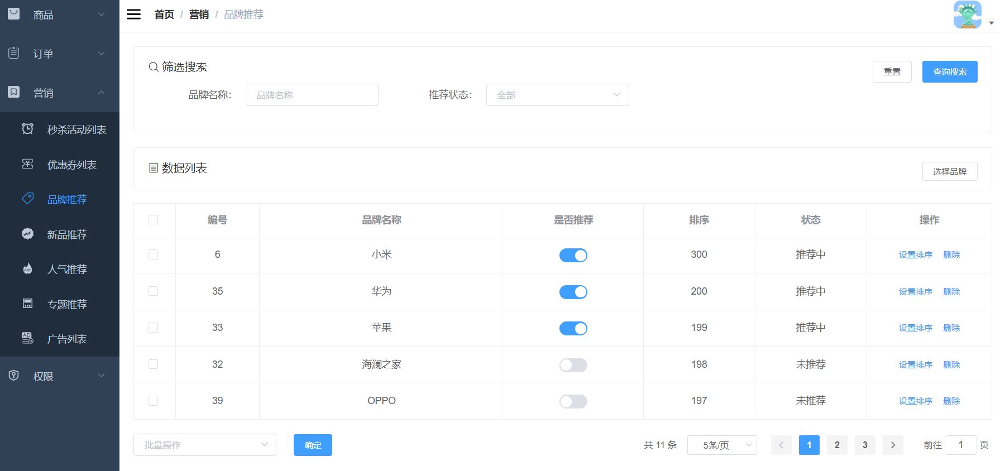

### 1.需求分析

品牌推荐界面的增删改查。

### 2.界面展示



### 3.方案设计

根据需求，需要设计五个接口，分别是：

- 新增品牌推荐
- 分页查询品牌推荐
- 编辑品牌推荐顺序
- 编辑推荐状态
- 删除品牌推荐

### 4.数据库表设计

需要设计一个品牌推荐表

```sql
CREATE TABLE `sms_home_brand` (
  `id` bigint(20) NOT NULL AUTO_INCREMENT,
  `brand_id` bigint(20) DEFAULT NULL,
  `brand_name` varchar(64) DEFAULT NULL,
  `recommend_status` int(1) DEFAULT NULL,
  `sort` int(11) DEFAULT NULL,
  PRIMARY KEY (`id`) USING BTREE
) ENGINE=InnoDB AUTO_INCREMENT=50 DEFAULT CHARSET=utf8 ROW_FORMAT=DYNAMIC COMMENT='首页推荐品牌表';
```

### 5.核心代码

1.新增品牌推荐

```java
@Service
public class SmsHomeBrandServiceImpl implements SmsHomeBrandService {
    @Override
    public int create(List<SmsHomeBrand> homeBrandList) {
        List<Long> ids = homeBrandList.stream().map(SmsHomeBrand::getBrandId).collect(Collectors.toList());
        assertRepeat(ids);
        for (SmsHomeBrand smsHomeBrand : homeBrandList) {
            smsHomeBrand.setRecommendStatus(1);
            smsHomeBrand.setSort(0);
            homeBrandMapper.insert(smsHomeBrand);
        }
        return homeBrandList.size();
    }
}
```

- 校验唯一性。
- 添加到数据库。

2.分页查询品牌推荐

```java
@Service
public class SmsHomeBrandServiceImpl implements SmsHomeBrandService {
    @Override
    public List<SmsHomeBrand> list(String brandName, Integer recommendStatus, Integer pageSize, Integer pageNum) {
        PageHelper.startPage(pageNum,pageSize);
        SmsHomeBrandExample example = new SmsHomeBrandExample();
        SmsHomeBrandExample.Criteria criteria = example.createCriteria();
        if(!StrUtil.isEmpty(brandName)){
            criteria.andBrandNameLike("%"+brandName+"%");
        }
        if(recommendStatus!=null){
            criteria.andRecommendStatusEqualTo(recommendStatus);
        }
        example.setOrderByClause("sort desc");
        return homeBrandMapper.selectByExample(example);
    }
}
```

根据筛选条件从数据库查优惠券

3.编辑品牌推荐顺序

```java
@Service
public class SmsHomeBrandServiceImpl implements SmsHomeBrandService {
    
    @Override
    public int updateSort(Long id, Integer sort) {
        SmsHomeBrand homeBrand = new SmsHomeBrand();
        homeBrand.setId(id);
        homeBrand.setSort(sort);
        return homeBrandMapper.updateByPrimaryKeySelective(homeBrand);
    }
}
```

4.编辑推荐状态

```java
@Service
public class SmsHomeBrandServiceImpl implements SmsHomeBrandService {
    @Override
    public int updateRecommendStatus(List<Long> ids, Integer recommendStatus) {
        SmsHomeBrandExample example = new SmsHomeBrandExample();
        example.createCriteria().andIdIn(ids);
        SmsHomeBrand record = new SmsHomeBrand();
        record.setRecommendStatus(recommendStatus);
        return homeBrandMapper.updateByExampleSelective(record,example);
    }
}    
```

5.删除品牌推荐

```java
@Service
public class SmsHomeBrandServiceImpl implements SmsHomeBrandService {
    @Override
    public int delete(List<Long> ids) {
        SmsHomeBrandExample example = new SmsHomeBrandExample();
        example.createCriteria().andIdIn(ids);
        return homeBrandMapper.deleteByExample(example);
    }
}
```