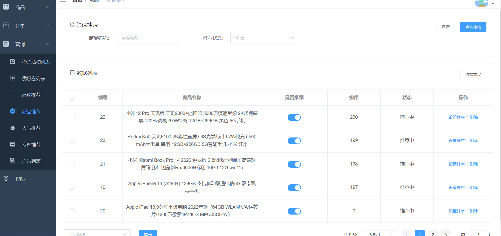

### 1.需求分析

新品推荐界面的增删改查。

### 2.界面展示



### 3.方案设计

根据需求，需要设计五个接口，分别是：

- 新增新品推荐
- 分页查询新品推荐
- 编辑新品推荐顺序
- 编辑推荐状态
- 删除新品推荐

### 4.数据库表设计

需要设计一个新鲜好物表

```sql
CREATE TABLE `sms_home_new_product` (
  `id` bigint(20) NOT NULL AUTO_INCREMENT,
  `product_id` bigint(20) DEFAULT NULL,
  `product_name` varchar(500) DEFAULT NULL,
  `recommend_status` int(1) DEFAULT NULL,
  `sort` int(1) DEFAULT NULL,
  PRIMARY KEY (`id`) USING BTREE
) ENGINE=InnoDB AUTO_INCREMENT=28 DEFAULT CHARSET=utf8 ROW_FORMAT=DYNAMIC COMMENT='新鲜好物表';
```

### 5.核心代码

1.新增新品推荐

```java
@Service
public class SmsHomeNewProductServiceImpl implements SmsHomeNewProductService {
    @Override
    public int create(List<SmsHomeNewProduct> homeNewProductList) {
        List<Long> ids = homeNewProductList.stream().map(SmsHomeNewProduct::getProductId).collect(Collectors.toList());
        assertRepeat(ids);
        for (SmsHomeNewProduct SmsHomeNewProduct : homeNewProductList) {
            SmsHomeNewProduct.setRecommendStatus(1);
            SmsHomeNewProduct.setSort(0);
            homeNewProductMapper.insert(SmsHomeNewProduct);
        }
        return homeNewProductList.size();
    }
}
```

- 校验唯一性。
- 添加到数据库。

2.分页查询新品推荐

```java
@Service
public class SmsHomeNewProductServiceImpl implements SmsHomeNewProductService {
    @Override
    public List<SmsHomeNewProduct> list(String productName, Integer recommendStatus, Integer pageSize, Integer pageNum) {
        PageHelper.startPage(pageNum,pageSize);
        SmsHomeNewProductExample example = new SmsHomeNewProductExample();
        SmsHomeNewProductExample.Criteria criteria = example.createCriteria();
        if(!StrUtil.isEmpty(productName)){
            criteria.andProductNameLike("%"+productName+"%");
        }
        if(recommendStatus!=null){
            criteria.andRecommendStatusEqualTo(recommendStatus);
        }
        example.setOrderByClause("sort desc");
        return homeNewProductMapper.selectByExample(example);
    }
}
```

根据筛选条件从数据库查新品推荐

3.编辑新品推荐顺序

```java
@Service
public class SmsHomeNewProductServiceImpl implements SmsHomeNewProductService {
    
    @Override
    public int updateSort(Long id, Integer sort) {
        SmsHomeNewProduct homeNewProduct = new SmsHomeNewProduct();
        homeNewProduct.setId(id);
        homeNewProduct.setSort(sort);
        return homeNewProductMapper.updateByPrimaryKeySelective(homeNewProduct);
    }
}
```

4.编辑推荐状态

```java
@Service
public class SmsHomeNewProductServiceImpl implements SmsHomeNewProductService {
    @Override
    public int updateRecommendStatus(List<Long> ids, Integer recommendStatus) {
        SmsHomeNewProductExample example = new SmsHomeNewProductExample();
        example.createCriteria().andIdIn(ids);
        SmsHomeNewProduct record = new SmsHomeNewProduct();
        record.setRecommendStatus(recommendStatus);
        return homeNewProductMapper.updateByExampleSelective(record,example);
    }
}    
```

5.删除新品推荐

```java
@Service
public class SmsHomeNewProductServiceImpl implements SmsHomeNewProductService {
    @Override
    public int delete(List<Long> ids) {
        SmsHomeNewProductExample example = new SmsHomeNewProductExample();
        example.createCriteria().andIdIn(ids);
        return homeNewProductMapper.deleteByExample(example);
    }
}
```