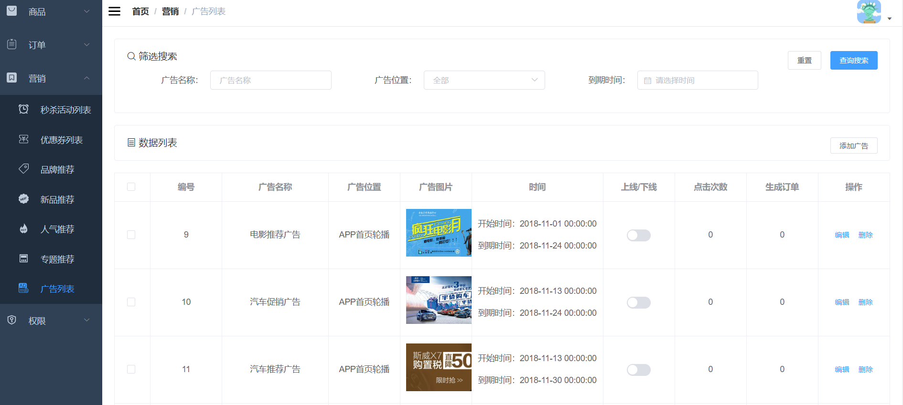

### 1.需求分析

广告列表界面的增删改查。

### 2.界面展示



### 3.方案设计

根据需求，需要设计六个接口，分别是：

- 新增广告
- 分页查询广告
- 根据ID获取广告详情
- 编辑广告
- 编辑广告状态
- 删除广告

### 4.数据库表设计

需要设计一个首页轮播广告表

```sql
CREATE TABLE `sms_home_advertise` (
  `id` bigint(20) NOT NULL AUTO_INCREMENT,
  `name` varchar(100) DEFAULT NULL,
  `type` int(1) DEFAULT NULL COMMENT '轮播位置：0->PC首页轮播；1->app首页轮播',
  `pic` varchar(500) DEFAULT NULL,
  `start_time` datetime DEFAULT NULL,
  `end_time` datetime DEFAULT NULL,
  `status` int(1) DEFAULT NULL COMMENT '上下线状态：0->下线；1->上线',
  `click_count` int(11) DEFAULT NULL COMMENT '点击数',
  `order_count` int(11) DEFAULT NULL COMMENT '下单数',
  `url` varchar(500) DEFAULT NULL COMMENT '链接地址',
  `note` varchar(500) DEFAULT NULL COMMENT '备注',
  `sort` int(11) DEFAULT '0' COMMENT '排序',
  PRIMARY KEY (`id`) USING BTREE
) ENGINE=InnoDB AUTO_INCREMENT=17 DEFAULT CHARSET=utf8 ROW_FORMAT=DYNAMIC COMMENT='首页轮播广告表';
```

### 5.核心代码

1.新增广告

```java
@Service
public class SmsHomeAdvertiseServiceImpl implements SmsHomeAdvertiseService {
    @Override
    public int create(SmsHomeAdvertise advertise) {
        advertise.setClickCount(0);
        advertise.setOrderCount(0);
        return advertiseMapper.insert(advertise);
    }
}
```

2.分页查询广告

```java
@Service
public class SmsHomeAdvertiseServiceImpl implements SmsHomeAdvertiseService {
    @Override
    public List<SmsHomeAdvertise> list(String name, Integer type, String endTime, Integer pageSize, Integer pageNum) {
        PageHelper.startPage(pageNum, pageSize);
        SmsHomeAdvertiseExample example = new SmsHomeAdvertiseExample();
        SmsHomeAdvertiseExample.Criteria criteria = example.createCriteria();
        if (!StrUtil.isEmpty(name)) {
            criteria.andNameLike("%" + name + "%");
        }
        if (type != null) {
            criteria.andTypeEqualTo(type);
        }
        if (!StrUtil.isEmpty(endTime)) {
            String startStr = endTime + " 00:00:00";
            String endStr = endTime + " 23:59:59";
            SimpleDateFormat sdf = new SimpleDateFormat("yyyy-MM-dd HH:mm:ss");
            Date start = null;
            try {
                start = sdf.parse(startStr);
            } catch (ParseException e) {
                e.printStackTrace();
            }
            Date end = null;
            try {
                end = sdf.parse(endStr);
            } catch (ParseException e) {
                e.printStackTrace();
            }
            if (start != null && end != null) {
                criteria.andEndTimeBetween(start, end);
            }
        }
        example.setOrderByClause("sort desc");
        return advertiseMapper.selectByExample(example);
    }
}
```

根据筛选条件从数据库查广告

3.根据ID获取广告详情

```java
@Service
public class SmsHomeAdvertiseServiceImpl implements SmsHomeAdvertiseService {
    
    @Override
    public SmsHomeAdvertise getItem(Long id) {
        return advertiseMapper.selectByPrimaryKey(id);
    }
}
```

4.编辑广告

```java
@Service
public class SmsHomeAdvertiseServiceImpl implements SmsHomeAdvertiseService {
    @Override
    public int update(Long id, SmsHomeAdvertise advertise) {
        advertise.setId(id);
        return advertiseMapper.updateByPrimaryKeySelective(advertise);
    }
}    
```

5.编辑广告状态

```java
@Service
public class SmsHomeAdvertiseServiceImpl implements SmsHomeAdvertiseService {
    @Override
    public int updateStatus(Long id, Integer status) {
        SmsHomeAdvertise record = new SmsHomeAdvertise();
        record.setId(id);
        record.setStatus(status);
        return advertiseMapper.updateByPrimaryKeySelective(record);
    }
}
```

6.删除广告

```java
@Service
public class SmsHomeAdvertiseServiceImpl implements SmsHomeAdvertiseService {
    @Override
    public int delete(List<Long> ids) {
        SmsHomeAdvertiseExample example = new SmsHomeAdvertiseExample();
        example.createCriteria().andIdIn(ids);
        return advertiseMapper.deleteByExample(example);
    }
}
```