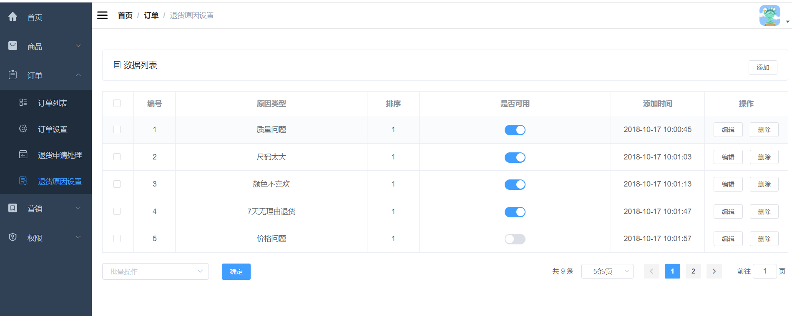

### 1.需求分析

退货原因设置界面的增删改查。

### 2.界面展示



### 3.方案设计

根据需求，需要设计五个接口，分别是：

- 新增退货原因
- 分页查询退货原因
- 根据ID获取退货原因
- 编辑退货原因
- 删除退货原因

### 4.数据库表设计

需要设计一个退货原因表

```sql
CREATE TABLE `oms_order_return_reason` (
  `id` bigint(20) NOT NULL AUTO_INCREMENT,
  `name` varchar(100) DEFAULT NULL COMMENT '退货类型',
  `sort` int(11) DEFAULT NULL,
  `status` int(1) DEFAULT NULL COMMENT '状态：0->不启用；1->启用',
  `create_time` datetime DEFAULT NULL COMMENT '添加时间',
  PRIMARY KEY (`id`) USING BTREE
) ENGINE=InnoDB AUTO_INCREMENT=16 DEFAULT CHARSET=utf8 ROW_FORMAT=DYNAMIC COMMENT='退货原因表';
```

### 5.核心代码

1.新增退货原因

```java
@Service
public class OmsOrderReturnReasonServiceImpl implements OmsOrderReturnReasonService {
    @Override
    public int create(OmsOrderReturnReason returnReason) {
        returnReason.setCreateTime(new Date());
        return returnReasonMapper.insert(returnReason);
    }
}
```

直接将传参赋给退货原因，然后添加到数据库。

2.分页查询退货原因

```java
@Service
public class OmsOrderReturnReasonServiceImpl implements OmsOrderReturnReasonService {
    @Override
    public List<OmsOrderReturnReason> list(Integer pageSize, Integer pageNum) {
        PageHelper.startPage(pageNum,pageSize);
        OmsOrderReturnReasonExample example = new OmsOrderReturnReasonExample();
        example.setOrderByClause("sort desc");
        return returnReasonMapper.selectByExample(example);
    }
}
```

根据筛选条件从数据库查退货原因

3.根据ID获取退货原因

```java
@Service
public class OmsOrderReturnReasonServiceImpl implements OmsOrderReturnReasonService {
    
    @Override
    public OmsOrderReturnReason getItem(Long id) {
        return returnReasonMapper.selectByPrimaryKey(id);
    }
}
```

4.编辑退货原因

```java
@Service
public class OmsOrderReturnReasonServiceImpl implements OmsOrderReturnReasonService {
    @Override
    public int update(Long id, OmsOrderReturnReason returnReason) {
        returnReason.setId(id);
        return returnReasonMapper.updateByPrimaryKey(returnReason);
    }
}    
```

5.删除退货原因

```java
@Service
public class OmsOrderReturnReasonServiceImpl implements OmsOrderReturnReasonService {
    @Override
    public int delete(List<Long> ids) {
        OmsOrderReturnReasonExample example = new OmsOrderReturnReasonExample();
        example.createCriteria().andIdIn(ids);
        return returnReasonMapper.deleteByExample(example);
    }
}
```