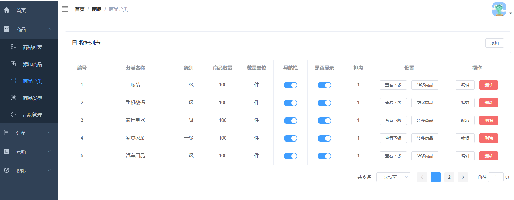

### 1.需求分析

商品分类界面的增删改查。

### 2.界面展示



### 3.方案设计

根据需求，需要设计五个接口，分别是：

- 新增商品分类
- 分页查询商品分类
- 获取商品分类信息
- 编辑商品分类
- 删除商品分类

### 4.数据库表设计

需要设计商品分类表、商品属性参数表、商品的分类和属性关系表、商品属性分类表

```sql
CREATE TABLE `pms_product_category` (
  `id` bigint(20) NOT NULL AUTO_INCREMENT,
  `parent_id` bigint(20) DEFAULT NULL COMMENT '上机分类的编号：0表示一级分类',
  `name` varchar(64) DEFAULT NULL,
  `level` int(1) DEFAULT NULL COMMENT '分类级别：0->1级；1->2级',
  `product_count` int(11) DEFAULT NULL,
  `product_unit` varchar(64) DEFAULT NULL,
  `nav_status` int(1) DEFAULT NULL COMMENT '是否显示在导航栏：0->不显示；1->显示',
  `show_status` int(1) DEFAULT NULL COMMENT '显示状态：0->不显示；1->显示',
  `sort` int(11) DEFAULT NULL,
  `icon` varchar(255) DEFAULT NULL COMMENT '图标',
  `keywords` varchar(255) DEFAULT NULL,
  `description` text COMMENT '描述',
  PRIMARY KEY (`id`) USING BTREE
) ENGINE=InnoDB AUTO_INCREMENT=56 DEFAULT CHARSET=utf8 ROW_FORMAT=DYNAMIC COMMENT='商品分类表';

CREATE TABLE `pms_product_attribute` (
  `id` bigint(20) NOT NULL AUTO_INCREMENT,
  `product_attribute_category_id` bigint(20) DEFAULT NULL,
  `name` varchar(64) DEFAULT NULL,
  `select_type` int(1) DEFAULT NULL COMMENT '属性选择类型：0->唯一；1->单选；2->多选',
  `input_type` int(1) DEFAULT NULL COMMENT '属性录入方式：0->手工录入；1->从列表中选取',
  `input_list` varchar(255) DEFAULT NULL COMMENT '可选值列表，以逗号隔开',
  `sort` int(11) DEFAULT NULL COMMENT '排序字段：最高的可以单独上传图片',
  `filter_type` int(1) DEFAULT NULL COMMENT '分类筛选样式：1->普通；1->颜色',
  `search_type` int(1) DEFAULT NULL COMMENT '检索类型；0->不需要进行检索；1->关键字检索；2->范围检索',
  `related_status` int(1) DEFAULT NULL COMMENT '相同属性产品是否关联；0->不关联；1->关联',
  `hand_add_status` int(1) DEFAULT NULL COMMENT '是否支持手动新增；0->不支持；1->支持',
  `type` int(1) DEFAULT NULL COMMENT '属性的类型；0->规格；1->参数',
  PRIMARY KEY (`id`) USING BTREE
) ENGINE=InnoDB AUTO_INCREMENT=74 DEFAULT CHARSET=utf8 ROW_FORMAT=DYNAMIC COMMENT='商品属性参数表';

CREATE TABLE `pms_product_category_attribute_relation` (
  `id` bigint(20) NOT NULL AUTO_INCREMENT,
  `product_category_id` bigint(20) DEFAULT NULL,
  `product_attribute_id` bigint(20) DEFAULT NULL,
  PRIMARY KEY (`id`) USING BTREE
) ENGINE=InnoDB AUTO_INCREMENT=13 DEFAULT CHARSET=utf8 ROW_FORMAT=DYNAMIC COMMENT='商品的分类和属性的关系表，用于设置分类筛选条件（只支持一级分类）';

CREATE TABLE `pms_product_attribute_category` (
  `id` bigint(20) NOT NULL AUTO_INCREMENT,
  `name` varchar(64) DEFAULT NULL,
  `attribute_count` int(11) DEFAULT '0' COMMENT '属性数量',
  `param_count` int(11) DEFAULT '0' COMMENT '参数数量',
  PRIMARY KEY (`id`) USING BTREE
) ENGINE=InnoDB AUTO_INCREMENT=16 DEFAULT CHARSET=utf8 ROW_FORMAT=DYNAMIC COMMENT='商品属性分类表';
```

### 5.核心代码

1.新增商品分类

```java
@Service
public class PmsProductCategoryServiceImpl implements PmsProductCategoryService {
    @Override
    public int create(PmsProductCategoryParam pmsProductCategoryParam) {
        PmsProductCategory productCategory = new PmsProductCategory();
        productCategory.setProductCount(0);
        BeanUtils.copyProperties(pmsProductCategoryParam, productCategory);
        //没有父分类时为一级分类
        setCategoryLevel(productCategory);
        int count = productCategoryMapper.insertSelective(productCategory);
        //创建筛选属性关联
        List<Long> productAttributeIdList = pmsProductCategoryParam.getProductAttributeIdList();
        if(!CollectionUtils.isEmpty(productAttributeIdList)){
            insertRelationList(productCategory.getId(), productAttributeIdList);
        }
        return count;
    }
    
    /**
     * 根据分类的parentId设置分类的level
     */
    private void setCategoryLevel(PmsProductCategory productCategory) {
        //没有父分类时为一级分类
        if (productCategory.getParentId() == 0) {
            productCategory.setLevel(0);
        } else {
            //有父分类时选择根据父分类level设置
            PmsProductCategory parentCategory = productCategoryMapper.selectByPrimaryKey(productCategory.getParentId());
            if (parentCategory != null) {
                productCategory.setLevel(parentCategory.getLevel() + 1);
            } else {
                productCategory.setLevel(0);
            }
        }
    }
}
```

新增商品分类，如果属性不为空，将商品分类和对应的属性关联，插入到商品分类和属性关联表。

2.分页查询商品分类

```java
@Service
public class PmsProductCategoryServiceImpl implements PmsProductCategoryService {
    @Override
    public List<PmsProductCategory> getList(Long parentId, Integer pageSize, Integer pageNum) {
        PageHelper.startPage(pageNum, pageSize);
        PmsProductCategoryExample example = new PmsProductCategoryExample();
        example.setOrderByClause("sort desc");
        example.createCriteria().andParentIdEqualTo(parentId);
        return productCategoryMapper.selectByExample(example);
    }
}
```

根据筛选条件从数据库查商品分类，如果parentId为0，查的是一级分类，如果为1，查的是二级分类。

3.获取商品分类信息

根据商品分类ID获取商品分类信息：

```java
@Service
public class PmsProductCategoryServiceImpl implements PmsProductCategoryService {
    @Override
    public PmsProductCategory getItem(Long id) {
        return productCategoryMapper.selectByPrimaryKey(id);
    }
}
```

根据商品分类ID获取商品属性信息、属性分类：

```java
@Service
public class PmsProductAttributeServiceImpl implements PmsProductAttributeService {
    @Override
    public List<ProductAttrInfo> getProductAttrInfo(Long productCategoryId) {
        return productAttributeDao.getProductAttrInfo(productCategoryId);
    }
}
```

联合商品属性参数表、商品的分类和属性关系表、商品属性分类表获取商品属性信息ID、属性分类ID

获取所有商品属性分类及其下属性：

```java
@Service
public class PmsProductAttributeCategoryServiceImpl implements PmsProductAttributeCategoryService {
    @Override
    public List<PmsProductAttributeCategoryItem> getListWithAttr() {
        return productAttributeCategoryDao.getListWithAttr();
    }
}
```

联合商品属性参数表和商品属性分类表获取商品属性分类及其下属性

4.编辑商品分类

```java
@Service
public class PmsProductCategoryServiceImpl implements PmsProductCategoryService {
    @Override
    public int update(Long id, PmsProductCategoryParam pmsProductCategoryParam) {
        PmsProductCategory productCategory = new PmsProductCategory();
        productCategory.setId(id);
        BeanUtils.copyProperties(pmsProductCategoryParam, productCategory);
        setCategoryLevel(productCategory);
        //更新商品分类时要更新商品中的名称
        PmsProduct product = new PmsProduct();
        product.setProductCategoryName(productCategory.getName());
        PmsProductExample example = new PmsProductExample();
        example.createCriteria().andProductCategoryIdEqualTo(id);
        productMapper.updateByExampleSelective(product,example);
        //同时更新筛选属性的信息
        if(!CollectionUtils.isEmpty(pmsProductCategoryParam.getProductAttributeIdList())){
            PmsProductCategoryAttributeRelationExample relationExample = new PmsProductCategoryAttributeRelationExample();
            relationExample.createCriteria().andProductCategoryIdEqualTo(id);
            productCategoryAttributeRelationMapper.deleteByExample(relationExample);
            insertRelationList(id,pmsProductCategoryParam.getProductAttributeIdList());
        }else{
            PmsProductCategoryAttributeRelationExample relationExample = new PmsProductCategoryAttributeRelationExample();
            relationExample.createCriteria().andProductCategoryIdEqualTo(id);
            productCategoryAttributeRelationMapper.deleteByExample(relationExample);
        }
        return productCategoryMapper.updateByPrimaryKeySelective(productCategory);
    }
}
```

- 更新商品分类时要更新商品中的名称
- 同时更新筛选属性的信息，如果属性不为空，先删除原有关系，再插入新关系；如果为空，直接删除原有关系。
- 更新商品分类

5.删除商品分类

```java
@Service
public class PmsProductCategoryServiceImpl implements PmsProductCategoryService {
    @Override
    public int delete(Long id) {
        return productCategoryMapper.deleteByPrimaryKey(id);
    }
}
```