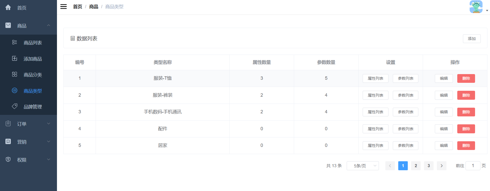

### 1.需求分析

商品类型分类界面的增删改查。

### 2.界面展示



### 3.方案设计

根据需求，需要设计五个接口，分别是：

- 新增商品类型分类
- 分页查询商品类型分类
- 编辑商品类型分类
- 删除商品类型分类
- 按商品类型分类查询属性列表或参数列表

### 4.数据库表设计

需要设计商品属性分类表、商品属性参数表

```sql
CREATE TABLE `pms_product_attribute_category` (
  `id` bigint(20) NOT NULL AUTO_INCREMENT,
  `name` varchar(64) DEFAULT NULL,
  `attribute_count` int(11) DEFAULT '0' COMMENT '属性数量',
  `param_count` int(11) DEFAULT '0' COMMENT '参数数量',
  PRIMARY KEY (`id`) USING BTREE
) ENGINE=InnoDB AUTO_INCREMENT=16 DEFAULT CHARSET=utf8 ROW_FORMAT=DYNAMIC COMMENT='商品属性分类表';

CREATE TABLE `pms_product_attribute` (
  `id` bigint(20) NOT NULL AUTO_INCREMENT,
  `product_attribute_category_id` bigint(20) DEFAULT NULL,
  `name` varchar(64) DEFAULT NULL,
  `select_type` int(1) DEFAULT NULL COMMENT '属性选择类型：0->唯一；1->单选；2->多选',
  `input_type` int(1) DEFAULT NULL COMMENT '属性录入方式：0->手工录入；1->从列表中选取',
  `input_list` varchar(255) DEFAULT NULL COMMENT '可选值列表，以逗号隔开',
  `sort` int(11) DEFAULT NULL COMMENT '排序字段：最高的可以单独上传图片',
  `filter_type` int(1) DEFAULT NULL COMMENT '分类筛选样式：1->普通；1->颜色',
  `search_type` int(1) DEFAULT NULL COMMENT '检索类型；0->不需要进行检索；1->关键字检索；2->范围检索',
  `related_status` int(1) DEFAULT NULL COMMENT '相同属性产品是否关联；0->不关联；1->关联',
  `hand_add_status` int(1) DEFAULT NULL COMMENT '是否支持手动新增；0->不支持；1->支持',
  `type` int(1) DEFAULT NULL COMMENT '属性的类型；0->规格；1->参数',
  PRIMARY KEY (`id`) USING BTREE
) ENGINE=InnoDB AUTO_INCREMENT=78 DEFAULT CHARSET=utf8 ROW_FORMAT=DYNAMIC COMMENT='商品属性参数表';
```

### 5.核心代码

1.新增商品类型分类

```java
@Service
public class PmsProductAttributeCategoryServiceImpl implements PmsProductAttributeCategoryService {
    @Override
    public int create(String name) {
        PmsProductAttributeCategory productAttributeCategory = new PmsProductAttributeCategory();
        productAttributeCategory.setName(name);
        return productAttributeCategoryMapper.insertSelective(productAttributeCategory);
    }
}
```

2.分页查询商品类型分类

```java
@Service
public class PmsProductAttributeCategoryServiceImpl implements PmsProductAttributeCategoryService {
    @Override
    public List<PmsProductAttributeCategory> getList(Integer pageSize, Integer pageNum) {
        PageHelper.startPage(pageNum,pageSize);
        return productAttributeCategoryMapper.selectByExample(new PmsProductAttributeCategoryExample());
    }
}
```

3.编辑商品类型分类

```java
@Service
public class PmsProductAttributeCategoryServiceImpl implements PmsProductAttributeCategoryService {
    @Override
    public int update(Long id, String name) {
        PmsProductAttributeCategory productAttributeCategory = new PmsProductAttributeCategory();
        productAttributeCategory.setName(name);
        productAttributeCategory.setId(id);
        return productAttributeCategoryMapper.updateByPrimaryKeySelective(productAttributeCategory);
    }
}
```

4.删除商品类型分类

```java
@Service
public class PmsProductAttributeCategoryServiceImpl implements PmsProductAttributeCategoryService {
    @Override
    public int delete(Long id) {
        return productAttributeCategoryMapper.deleteByPrimaryKey(id);
    }
}
```
5.按商品类型分类查询属性列表或参数列表

```java
@Service
public class PmsProductAttributeServiceImpl implements PmsProductAttributeService {
    @Override
    public List<PmsProductAttribute> getList(Long cid, Integer type, Integer pageSize, Integer pageNum) {
        PageHelper.startPage(pageNum, pageSize);
        PmsProductAttributeExample example = new PmsProductAttributeExample();
        example.setOrderByClause("sort desc");
        example.createCriteria().andProductAttributeCategoryIdEqualTo(cid).andTypeEqualTo(type);
        return productAttributeMapper.selectByExample(example);
    }
}
```

如果type为0查属性列表，如果type为1查参数列表。