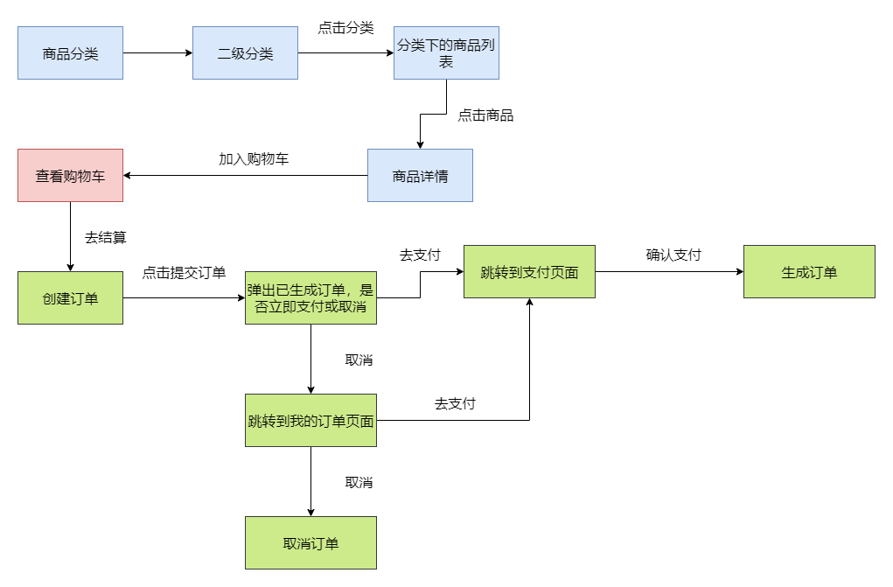

### 1.需求分析

这部分是根据购物车生成订单相关的需求。首先在购物车清单界面，我们可以点击去结算，生成确认单进入到创建订单界面，在创建订单界面，可以选择优惠券，或者编辑备注信息。点击提交订单之后，会生成正式的订单。这时候会弹出一个界面，可以选择取消订单或者支付订单。点击支付订单，会跳转到支付页面，可以选择微信支付或支付宝支付。支付之后，会修改订单的状态为待发货。

### 2.流程图

订单是整个系统的核心，串联了商品部分和购物车部分，以下是商品+购物车+订单的流程图：



### 3.方案设计

根据需求，需要设计六个接口，分别是：

- 根据购物车信息生成确认单
- 根据购物车信息生成正式订单
- 支付订单
- 取消订单
- 查看订单
- 删除订单

### 4.数据库表设计

需要设计购物车表、商品sku库存表、商品阶梯价格表、商品满减表、会员收货地址表、优惠券历史表、优惠券表、优惠券和商品分类关系表、优惠券和商品关系表、积分消费设置表、下单商品信息表、订单表、订单设置表

```sql
CREATE TABLE `oms_cart_item` (
  `id` bigint(20) NOT NULL AUTO_INCREMENT,
  `product_id` bigint(20) DEFAULT NULL,
  `product_sku_id` bigint(20) DEFAULT NULL,
  `member_id` bigint(20) DEFAULT NULL,
  `quantity` int(11) DEFAULT NULL COMMENT '购买数量',
  `price` decimal(10,2) DEFAULT NULL COMMENT '添加到购物车的价格',
  `product_pic` varchar(1000) DEFAULT NULL COMMENT '商品主图',
  `product_name` varchar(500) DEFAULT NULL COMMENT '商品名称',
  `product_sub_title` varchar(500) DEFAULT NULL COMMENT '商品副标题（卖点）',
  `product_sku_code` varchar(200) DEFAULT NULL COMMENT '商品sku条码',
  `member_nickname` varchar(500) DEFAULT NULL COMMENT '会员昵称',
  `create_date` datetime DEFAULT NULL COMMENT '创建时间',
  `modify_date` datetime DEFAULT NULL COMMENT '修改时间',
  `delete_status` int(1) DEFAULT '0' COMMENT '是否删除',
  `product_category_id` bigint(20) DEFAULT NULL COMMENT '商品分类',
  `product_brand` varchar(200) DEFAULT NULL,
  `product_sn` varchar(200) DEFAULT NULL,
  `product_attr` varchar(500) DEFAULT NULL COMMENT '商品销售属性:[{"key":"颜色","value":"颜色"},{"key":"容量","value":"4G"}]',
  PRIMARY KEY (`id`) USING BTREE
) ENGINE=InnoDB AUTO_INCREMENT=126 DEFAULT CHARSET=utf8 ROW_FORMAT=DYNAMIC COMMENT='购物车表';

CREATE TABLE `pms_sku_stock` (
  `id` bigint(20) NOT NULL AUTO_INCREMENT,
  `product_id` bigint(20) DEFAULT NULL,
  `sku_code` varchar(64) NOT NULL COMMENT 'sku编码',
  `price` decimal(10,2) DEFAULT NULL,
  `stock` int(11) DEFAULT '0' COMMENT '库存',
  `low_stock` int(11) DEFAULT NULL COMMENT '预警库存',
  `pic` varchar(255) DEFAULT NULL COMMENT '展示图片',
  `sale` int(11) DEFAULT NULL COMMENT '销量',
  `promotion_price` decimal(10,2) DEFAULT NULL COMMENT '单品促销价格',
  `lock_stock` int(11) DEFAULT '0' COMMENT '锁定库存',
  `sp_data` varchar(500) DEFAULT NULL COMMENT '商品销售属性，json格式',
  PRIMARY KEY (`id`) USING BTREE
) ENGINE=InnoDB AUTO_INCREMENT=243 DEFAULT CHARSET=utf8 ROW_FORMAT=DYNAMIC COMMENT='商品sku库存表';

CREATE TABLE `pms_product_ladder` (
  `id` bigint(20) NOT NULL AUTO_INCREMENT,
  `product_id` bigint(20) DEFAULT NULL,
  `count` int(11) DEFAULT NULL COMMENT '满足的商品数量',
  `discount` decimal(10,2) DEFAULT NULL COMMENT '折扣',
  `price` decimal(10,2) DEFAULT NULL COMMENT '折后价格',
  PRIMARY KEY (`id`) USING BTREE
) ENGINE=InnoDB AUTO_INCREMENT=148 DEFAULT CHARSET=utf8 ROW_FORMAT=DYNAMIC COMMENT='商品阶梯价格表(只针对同商品)';

CREATE TABLE `pms_product_full_reduction` (
  `id` bigint(11) NOT NULL AUTO_INCREMENT,
  `product_id` bigint(20) DEFAULT NULL,
  `full_price` decimal(10,2) DEFAULT NULL,
  `reduce_price` decimal(10,2) DEFAULT NULL,
  PRIMARY KEY (`id`) USING BTREE
) ENGINE=InnoDB AUTO_INCREMENT=148 DEFAULT CHARSET=utf8 ROW_FORMAT=DYNAMIC COMMENT='商品满减表(只针对同商品)';

CREATE TABLE `ums_member_receive_address` (
  `id` bigint(20) NOT NULL AUTO_INCREMENT,
  `member_id` bigint(20) DEFAULT NULL,
  `name` varchar(100) DEFAULT NULL COMMENT '收货人名称',
  `phone_number` varchar(64) DEFAULT NULL,
  `default_status` int(1) DEFAULT NULL COMMENT '是否为默认',
  `post_code` varchar(100) DEFAULT NULL COMMENT '邮政编码',
  `province` varchar(100) DEFAULT NULL COMMENT '省份/直辖市',
  `city` varchar(100) DEFAULT NULL COMMENT '城市',
  `region` varchar(100) DEFAULT NULL COMMENT '区',
  `detail_address` varchar(128) DEFAULT NULL COMMENT '详细地址(街道)',
  PRIMARY KEY (`id`) USING BTREE
) ENGINE=InnoDB AUTO_INCREMENT=7 DEFAULT CHARSET=utf8 ROW_FORMAT=DYNAMIC COMMENT='会员收货地址表';

CREATE TABLE `sms_coupon_history` (
  `id` bigint(20) NOT NULL AUTO_INCREMENT,
  `coupon_id` bigint(20) DEFAULT NULL,
  `member_id` bigint(20) DEFAULT NULL,
  `coupon_code` varchar(64) DEFAULT NULL,
  `member_nickname` varchar(64) DEFAULT NULL COMMENT '领取人昵称',
  `get_type` int(1) DEFAULT NULL COMMENT '获取类型：0->后台赠送；1->主动获取',
  `create_time` datetime DEFAULT NULL,
  `use_status` int(1) DEFAULT NULL COMMENT '使用状态：0->未使用；1->已使用；2->已过期',
  `use_time` datetime DEFAULT NULL COMMENT '使用时间',
  `order_id` bigint(20) DEFAULT NULL COMMENT '订单编号',
  `order_sn` varchar(100) DEFAULT NULL COMMENT '订单号码',
  PRIMARY KEY (`id`) USING BTREE,
  KEY `idx_member_id` (`member_id`) USING BTREE,
  KEY `idx_coupon_id` (`coupon_id`) USING BTREE
) ENGINE=InnoDB AUTO_INCREMENT=54 DEFAULT CHARSET=utf8 ROW_FORMAT=DYNAMIC COMMENT='优惠券历史表';

CREATE TABLE `sms_coupon` (
  `id` bigint(20) NOT NULL AUTO_INCREMENT,
  `type` int(1) DEFAULT NULL COMMENT '优惠券类型；0->全场赠券；1->会员赠券；2->购物赠券；3->注册赠券',
  `name` varchar(100) DEFAULT NULL,
  `platform` int(1) DEFAULT NULL COMMENT '使用平台：0->全部；1->移动；2->PC',
  `count` int(11) DEFAULT NULL COMMENT '数量',
  `amount` decimal(10,2) DEFAULT NULL COMMENT '金额',
  `per_limit` int(11) DEFAULT NULL COMMENT '每人限领张数',
  `min_point` decimal(10,2) DEFAULT NULL COMMENT '使用门槛；0表示无门槛',
  `start_time` datetime DEFAULT NULL,
  `end_time` datetime DEFAULT NULL,
  `use_type` int(1) DEFAULT NULL COMMENT '使用类型：0->全场通用；1->指定分类；2->指定商品',
  `note` varchar(200) DEFAULT NULL COMMENT '备注',
  `publish_count` int(11) DEFAULT NULL COMMENT '发行数量',
  `use_count` int(11) DEFAULT NULL COMMENT '已使用数量',
  `receive_count` int(11) DEFAULT NULL COMMENT '领取数量',
  `enable_time` datetime DEFAULT NULL COMMENT '可以领取的日期',
  `code` varchar(64) DEFAULT NULL COMMENT '优惠码',
  `member_level` int(1) DEFAULT NULL COMMENT '可领取的会员类型：0->无限时',
  PRIMARY KEY (`id`) USING BTREE
) ENGINE=InnoDB AUTO_INCREMENT=32 DEFAULT CHARSET=utf8 ROW_FORMAT=DYNAMIC COMMENT='优惠券表';

CREATE TABLE `sms_coupon_product_category_relation` (
  `id` bigint(20) NOT NULL AUTO_INCREMENT,
  `coupon_id` bigint(20) DEFAULT NULL,
  `product_category_id` bigint(20) DEFAULT NULL,
  `product_category_name` varchar(200) DEFAULT NULL COMMENT '产品分类名称',
  `parent_category_name` varchar(200) DEFAULT NULL COMMENT '父分类名称',
  PRIMARY KEY (`id`) USING BTREE
) ENGINE=InnoDB AUTO_INCREMENT=12 DEFAULT CHARSET=utf8 ROW_FORMAT=DYNAMIC COMMENT='优惠券和商品分类关系表';

CREATE TABLE `sms_coupon_product_relation` (
  `id` bigint(20) NOT NULL AUTO_INCREMENT,
  `coupon_id` bigint(20) DEFAULT NULL,
  `product_id` bigint(20) DEFAULT NULL,
  `product_name` varchar(500) DEFAULT NULL COMMENT '商品名称',
  `product_sn` varchar(200) DEFAULT NULL COMMENT '商品编码',
  PRIMARY KEY (`id`) USING BTREE
) ENGINE=InnoDB AUTO_INCREMENT=23 DEFAULT CHARSET=utf8 ROW_FORMAT=DYNAMIC COMMENT='优惠券和商品关系表';

CREATE TABLE `ums_integration_consume_setting` (
  `id` bigint(20) NOT NULL AUTO_INCREMENT,
  `deduction_per_amount` int(11) DEFAULT NULL COMMENT '每一元需要抵扣的积分数量',
  `max_percent_per_order` int(11) DEFAULT NULL COMMENT '每笔订单最高抵用百分比',
  `use_unit` int(11) DEFAULT NULL COMMENT '每次使用积分最小单位100',
  `coupon_status` int(1) DEFAULT NULL COMMENT '是否可以和优惠券同用；0->不可以；1->可以',
  PRIMARY KEY (`id`) USING BTREE
) ENGINE=InnoDB AUTO_INCREMENT=2 DEFAULT CHARSET=utf8 ROW_FORMAT=DYNAMIC COMMENT='积分消费设置表';

CREATE TABLE `oms_order_item` (
  `id` bigint(20) NOT NULL AUTO_INCREMENT,
  `order_id` bigint(20) DEFAULT NULL COMMENT '订单id',
  `order_sn` varchar(64) DEFAULT NULL COMMENT '订单编号',
  `product_id` bigint(20) DEFAULT NULL,
  `product_pic` varchar(500) DEFAULT NULL,
  `product_name` varchar(200) DEFAULT NULL,
  `product_brand` varchar(200) DEFAULT NULL,
  `product_sn` varchar(64) DEFAULT NULL,
  `product_price` decimal(10,2) DEFAULT NULL COMMENT '销售价格',
  `product_quantity` int(11) DEFAULT NULL COMMENT '购买数量',
  `product_sku_id` bigint(20) DEFAULT NULL COMMENT '商品sku编号',
  `product_sku_code` varchar(50) DEFAULT NULL COMMENT '商品sku条码',
  `product_category_id` bigint(20) DEFAULT NULL COMMENT '商品分类id',
  `promotion_name` varchar(200) DEFAULT NULL COMMENT '商品促销名称',
  `promotion_amount` decimal(10,2) DEFAULT NULL COMMENT '商品促销分解金额',
  `coupon_amount` decimal(10,2) DEFAULT NULL COMMENT '优惠券优惠分解金额',
  `integration_amount` decimal(10,2) DEFAULT NULL COMMENT '积分优惠分解金额',
  `real_amount` decimal(10,2) DEFAULT NULL COMMENT '该商品经过优惠后的分解金额',
  `gift_integration` int(11) DEFAULT '0',
  `gift_growth` int(11) DEFAULT '0',
  `product_attr` varchar(500) DEFAULT NULL COMMENT '商品销售属性:[{"key":"颜色","value":"颜色"},{"key":"容量","value":"4G"}]',
  PRIMARY KEY (`id`) USING BTREE
) ENGINE=InnoDB AUTO_INCREMENT=126 DEFAULT CHARSET=utf8 ROW_FORMAT=DYNAMIC COMMENT='下单商品信息表';

CREATE TABLE `oms_order` (
  `id` bigint(20) NOT NULL AUTO_INCREMENT COMMENT '订单id',
  `member_id` bigint(20) NOT NULL,
  `coupon_id` bigint(20) DEFAULT NULL,
  `order_sn` varchar(64) DEFAULT NULL COMMENT '订单编号',
  `create_time` datetime DEFAULT NULL COMMENT '提交时间',
  `member_username` varchar(64) DEFAULT NULL COMMENT '用户帐号',
  `total_amount` decimal(10,2) DEFAULT NULL COMMENT '订单总金额',
  `pay_amount` decimal(10,2) DEFAULT NULL COMMENT '应付金额（实际支付金额）',
  `freight_amount` decimal(10,2) DEFAULT NULL COMMENT '运费金额',
  `promotion_amount` decimal(10,2) DEFAULT NULL COMMENT '促销优化金额（促销价、满减、阶梯价）',
  `integration_amount` decimal(10,2) DEFAULT NULL COMMENT '积分抵扣金额',
  `coupon_amount` decimal(10,2) DEFAULT NULL COMMENT '优惠券抵扣金额',
  `discount_amount` decimal(10,2) DEFAULT NULL COMMENT '管理员后台调整订单使用的折扣金额',
  `pay_type` int(1) DEFAULT NULL COMMENT '支付方式：0->未支付；1->支付宝；2->微信',
  `source_type` int(1) DEFAULT NULL COMMENT '订单来源：0->PC订单；1->app订单',
  `status` int(1) DEFAULT NULL COMMENT '订单状态：0->待付款；1->待发货；2->已发货；3->已完成；4->已关闭；5->无效订单',
  `order_type` int(1) DEFAULT NULL COMMENT '订单类型：0->正常订单；1->秒杀订单',
  `delivery_company` varchar(64) DEFAULT NULL COMMENT '物流公司(配送方式)',
  `delivery_sn` varchar(64) DEFAULT NULL COMMENT '物流单号',
  `auto_confirm_day` int(11) DEFAULT NULL COMMENT '自动确认时间（天）',
  `integration` int(11) DEFAULT NULL COMMENT '可以获得的积分',
  `growth` int(11) DEFAULT NULL COMMENT '可以活动的成长值',
  `promotion_info` varchar(100) DEFAULT NULL COMMENT '活动信息',
  `bill_type` int(1) DEFAULT NULL COMMENT '发票类型：0->不开发票；1->电子发票；2->纸质发票',
  `bill_header` varchar(200) DEFAULT NULL COMMENT '发票抬头',
  `bill_content` varchar(200) DEFAULT NULL COMMENT '发票内容',
  `bill_receiver_phone` varchar(32) DEFAULT NULL COMMENT '收票人电话',
  `bill_receiver_email` varchar(64) DEFAULT NULL COMMENT '收票人邮箱',
  `receiver_name` varchar(100) NOT NULL COMMENT '收货人姓名',
  `receiver_phone` varchar(32) NOT NULL COMMENT '收货人电话',
  `receiver_post_code` varchar(32) DEFAULT NULL COMMENT '收货人邮编',
  `receiver_province` varchar(32) DEFAULT NULL COMMENT '省份/直辖市',
  `receiver_city` varchar(32) DEFAULT NULL COMMENT '城市',
  `receiver_region` varchar(32) DEFAULT NULL COMMENT '区',
  `receiver_detail_address` varchar(200) DEFAULT NULL COMMENT '详细地址',
  `note` varchar(500) DEFAULT NULL COMMENT '订单备注',
  `confirm_status` int(1) DEFAULT NULL COMMENT '确认收货状态：0->未确认；1->已确认',
  `delete_status` int(1) NOT NULL DEFAULT '0' COMMENT '删除状态：0->未删除；1->已删除',
  `use_integration` int(11) DEFAULT NULL COMMENT '下单时使用的积分',
  `payment_time` datetime DEFAULT NULL COMMENT '支付时间',
  `delivery_time` datetime DEFAULT NULL COMMENT '发货时间',
  `receive_time` datetime DEFAULT NULL COMMENT '确认收货时间',
  `comment_time` datetime DEFAULT NULL COMMENT '评价时间',
  `modify_time` datetime DEFAULT NULL COMMENT '修改时间',
  PRIMARY KEY (`id`) USING BTREE
) ENGINE=InnoDB AUTO_INCREMENT=83 DEFAULT CHARSET=utf8 ROW_FORMAT=DYNAMIC COMMENT='订单表';

CREATE TABLE `oms_order_setting` (
  `id` bigint(20) NOT NULL AUTO_INCREMENT,
  `flash_order_overtime` int(11) DEFAULT NULL COMMENT '秒杀订单超时关闭时间(分)',
  `normal_order_overtime` int(11) DEFAULT NULL COMMENT '正常订单超时时间(分)',
  `confirm_overtime` int(11) DEFAULT NULL COMMENT '发货后自动确认收货时间（天）',
  `finish_overtime` int(11) DEFAULT NULL COMMENT '自动完成交易时间，不能申请售后（天）',
  `comment_overtime` int(11) DEFAULT NULL COMMENT '订单完成后自动好评时间（天）',
  PRIMARY KEY (`id`) USING BTREE
) ENGINE=InnoDB AUTO_INCREMENT=2 DEFAULT CHARSET=utf8 ROW_FORMAT=DYNAMIC COMMENT='订单设置表';

```

### 5.核心代码

1.生成确认单

```java
@Service
public class OmsPortalOrderServiceImpl implements OmsPortalOrderService {
    @Override
    public ConfirmOrderResult generateConfirmOrder(List<Long> cartIds) {
        ConfirmOrderResult result = new ConfirmOrderResult();
        //获取购物车信息
        UmsMember currentMember = memberService.getCurrentMember();
        List<CartPromotionItem> cartPromotionItemList = cartItemService.listPromotion(currentMember.getId(),cartIds);
        result.setCartPromotionItemList(cartPromotionItemList);
        //获取用户收货地址列表
        List<UmsMemberReceiveAddress> memberReceiveAddressList = memberReceiveAddressService.list();
        result.setMemberReceiveAddressList(memberReceiveAddressList);
        //获取用户可用优惠券列表
        List<SmsCouponHistoryDetail> couponHistoryDetailList = memberCouponService.listCart(cartPromotionItemList, 1);
        result.setCouponHistoryDetailList(couponHistoryDetailList);
        //获取用户积分
        result.setMemberIntegration(currentMember.getIntegration());
        //获取积分使用规则
        UmsIntegrationConsumeSetting integrationConsumeSetting = integrationConsumeSettingMapper.selectByPrimaryKey(1L);
        result.setIntegrationConsumeSetting(integrationConsumeSetting);
        //计算总金额、活动优惠、应付金额
        ConfirmOrderResult.CalcAmount calcAmount = calcCartAmount(cartPromotionItemList);
        result.setCalcAmount(calcAmount);
        return result;
    }
}
```

生成确认单操作：

- 根据会员ID和购物车ID列表获取含优惠信息的购物车清单
  1. 首先按商品对购物车列表分组
  2. 联合商品表、商品sku库存表、商品阶梯价格表、商品满减表获取购物车内所有商品的优惠信息
  3. 遍历按商品分组的购物车，获取对应商品的优惠信息，按优惠类型单件促销、打折、满减分别计算每件商品促销活动减去的金额（针对每个商品，需要根据优惠进行平均）、促销活动信息、锁定库存、积分、成长值等
- 根据会员ID从会员收货地址表获取会员收货地址列表
- 联合优惠券历史表、优惠券表、优惠券和商品分类关系表、优惠券和商品关系表获取用户的所有可用优惠券
- 根据当前会员信息获取会员积分
- 根据积分消费设置表获取积分使用规则
- 计算订单内所有商品金额信息，包括总金额、活动优惠金额、应付金额、运费等

2.生成正式订单

```java
@Service
public class OmsPortalOrderServiceImpl implements OmsPortalOrderService {
    @Override
    public Map<String, Object> generateOrder(OrderParam orderParam) {
        List<OmsOrderItem> orderItemList = new ArrayList<>();
        //校验收货地址
        if(orderParam.getMemberReceiveAddressId()==null){
            Asserts.fail("请选择收货地址！");
        }
        //获取购物车及优惠信息
        UmsMember currentMember = memberService.getCurrentMember();
        List<CartPromotionItem> cartPromotionItemList = cartItemService.listPromotion(currentMember.getId(), orderParam.getCartIds());
        for (CartPromotionItem cartPromotionItem : cartPromotionItemList) {
            //生成下单商品信息
            OmsOrderItem orderItem = new OmsOrderItem();
            orderItem.setProductId(cartPromotionItem.getProductId());
            orderItem.setProductName(cartPromotionItem.getProductName());
            orderItem.setProductPic(cartPromotionItem.getProductPic());
            orderItem.setProductAttr(cartPromotionItem.getProductAttr());
            orderItem.setProductBrand(cartPromotionItem.getProductBrand());
            orderItem.setProductSn(cartPromotionItem.getProductSn());
            orderItem.setProductPrice(cartPromotionItem.getPrice());
            orderItem.setProductQuantity(cartPromotionItem.getQuantity());
            orderItem.setProductSkuId(cartPromotionItem.getProductSkuId());
            orderItem.setProductSkuCode(cartPromotionItem.getProductSkuCode());
            orderItem.setProductCategoryId(cartPromotionItem.getProductCategoryId());
            orderItem.setPromotionAmount(cartPromotionItem.getReduceAmount());
            orderItem.setPromotionName(cartPromotionItem.getPromotionMessage());
            orderItem.setGiftIntegration(cartPromotionItem.getIntegration());
            orderItem.setGiftGrowth(cartPromotionItem.getGrowth());
            orderItemList.add(orderItem);
        }
        //判断购物车中商品是否都有库存
        if (!hasStock(cartPromotionItemList)) {
            Asserts.fail("库存不足，无法下单");
        }
        //判断是否使用了优惠券
        if (orderParam.getCouponId() == null) {
            //不用优惠券
            for (OmsOrderItem orderItem : orderItemList) {
                orderItem.setCouponAmount(new BigDecimal(0));
            }
        } else {
            //使用优惠券
            SmsCouponHistoryDetail couponHistoryDetail = getUseCoupon(cartPromotionItemList, orderParam.getCouponId());
            if (couponHistoryDetail == null) {
                Asserts.fail("该优惠券不可用");
            }
            //对下单商品的优惠券进行处理
            handleCouponAmount(orderItemList, couponHistoryDetail);
        }
        //判断是否使用积分
        if (orderParam.getUseIntegration() == null||orderParam.getUseIntegration().equals(0)) {
            //不使用积分
            for (OmsOrderItem orderItem : orderItemList) {
                orderItem.setIntegrationAmount(new BigDecimal(0));
            }
        } else {
            //使用积分
            BigDecimal totalAmount = calcTotalAmount(orderItemList);
            BigDecimal integrationAmount = getUseIntegrationAmount(orderParam.getUseIntegration(), totalAmount, currentMember, orderParam.getCouponId() != null);
            if (integrationAmount.compareTo(new BigDecimal(0)) == 0) {
                Asserts.fail("积分不可用");
            } else {
                //可用情况下分摊到可用商品中
                for (OmsOrderItem orderItem : orderItemList) {
                    BigDecimal perAmount = orderItem.getProductPrice().divide(totalAmount, 3, RoundingMode.HALF_EVEN).multiply(integrationAmount);
                    orderItem.setIntegrationAmount(perAmount);
                }
            }
        }
        //计算order_item的实付金额
        handleRealAmount(orderItemList);
        //进行库存锁定
        lockStock(cartPromotionItemList);
        //根据商品合计、运费、活动优惠、优惠券、积分计算应付金额
        OmsOrder order = new OmsOrder();
        order.setDiscountAmount(new BigDecimal(0));
        order.setTotalAmount(calcTotalAmount(orderItemList));
        order.setFreightAmount(new BigDecimal(0));
        order.setPromotionAmount(calcPromotionAmount(orderItemList));
        order.setPromotionInfo(getOrderPromotionInfo(orderItemList));
        if (orderParam.getCouponId() == null) {
            order.setCouponAmount(new BigDecimal(0));
        } else {
            order.setCouponId(orderParam.getCouponId());
            order.setCouponAmount(calcCouponAmount(orderItemList));
        }
        if (orderParam.getUseIntegration() == null) {
            order.setIntegration(0);
            order.setIntegrationAmount(new BigDecimal(0));
        } else {
            order.setIntegration(orderParam.getUseIntegration());
            order.setIntegrationAmount(calcIntegrationAmount(orderItemList));
        }
        order.setPayAmount(calcPayAmount(order));
        //转化为订单信息并插入数据库
        order.setMemberId(currentMember.getId());
        order.setCreateTime(new Date());
        order.setMemberUsername(currentMember.getUsername());
        //支付方式：0->未支付；1->支付宝；2->微信
        order.setPayType(orderParam.getPayType());
        //订单来源：0->PC订单；1->app订单
        order.setSourceType(1);
        //订单状态：0->待付款；1->待发货；2->已发货；3->已完成；4->已关闭；5->无效订单
        order.setStatus(0);
        //订单类型：0->正常订单；1->秒杀订单
        order.setOrderType(0);
        //收货人信息：姓名、电话、邮编、地址
        UmsMemberReceiveAddress address = memberReceiveAddressService.getItem(orderParam.getMemberReceiveAddressId());
        order.setReceiverName(address.getName());
        order.setReceiverPhone(address.getPhoneNumber());
        order.setReceiverPostCode(address.getPostCode());
        order.setReceiverProvince(address.getProvince());
        order.setReceiverCity(address.getCity());
        order.setReceiverRegion(address.getRegion());
        order.setReceiverDetailAddress(address.getDetailAddress());
        //0->未确认；1->已确认
        order.setConfirmStatus(0);
        order.setDeleteStatus(0);
        //计算赠送积分
        order.setIntegration(calcGifIntegration(orderItemList));
        //计算赠送成长值
        order.setGrowth(calcGiftGrowth(orderItemList));
        //生成订单号
        order.setOrderSn(generateOrderSn(order));
        //设置自动收货天数
        List<OmsOrderSetting> orderSettings = orderSettingMapper.selectByExample(new OmsOrderSettingExample());
        if(CollUtil.isNotEmpty(orderSettings)){
            order.setAutoConfirmDay(orderSettings.get(0).getConfirmOvertime());
        }
        // TODO: 2018/9/3 bill_*,delivery_*
        //插入order表和order_item表
        orderMapper.insert(order);
        for (OmsOrderItem orderItem : orderItemList) {
            orderItem.setOrderId(order.getId());
            orderItem.setOrderSn(order.getOrderSn());
        }
        orderItemDao.insertList(orderItemList);
        //如使用优惠券更新优惠券使用状态
        if (orderParam.getCouponId() != null) {
            updateCouponStatus(orderParam.getCouponId(), currentMember.getId(), 1);
        }
        //如使用积分需要扣除积分
        if (orderParam.getUseIntegration() != null) {
            order.setUseIntegration(orderParam.getUseIntegration());
            if(currentMember.getIntegration()==null){
                currentMember.setIntegration(0);
            }
            memberService.updateIntegration(currentMember.getId(), currentMember.getIntegration() - orderParam.getUseIntegration());
        }
        //删除购物车中的下单商品
        deleteCartItemList(cartPromotionItemList, currentMember);
        //发送延迟消息取消订单
        sendDelayMessageCancelOrder(order.getId());
        Map<String, Object> result = new HashMap<>();
        result.put("order", order);
        result.put("orderItemList", orderItemList);
        return result;
    }
}
```

生成正式订单操作：

- 校验收货地址信息
- 获取带优惠信息的购物车列表，根据购物车商品信息生成下单商品信息
- 校验购物车商品的库存信息
- 根据优惠券信息、积分信息计算优惠券额度、积分抵扣额度
- 计算下单商品实付金额，总金额 - 活动优惠 - 优惠券额度 - 积分抵扣额度
- 进行库存锁定，主要是更新锁定库存字段为购买商品数量+之前的锁定库存值
- 根据下单商品信息计算订单信息，主要是下单商品信息的合计，包括总金额、活动优惠金额、优惠券额度、积分抵扣额度，然后计算最终实付金额
- 设置订单的一些基本信息，包括会员信息、支付时间、支付方式、订单状态、收货人信息、订单号、自动收货天数
- 将下单商品信息和订单信息落库
- 更新其他相关联的表，如果使用优惠券，则更新优惠券状态，如果使用积分，则扣除积分，删除购物车商品信息
- 发送延迟消息取消订单

3.支付订单

```java
@Service
public class OmsPortalOrderServiceImpl implements OmsPortalOrderService {
    @Override
    public Integer paySuccess(Long orderId, Integer payType) {
        //修改订单支付状态
        OmsOrder order = new OmsOrder();
        order.setId(orderId);
        order.setStatus(1);
        order.setPaymentTime(new Date());
        order.setPayType(payType);
        orderMapper.updateByPrimaryKeySelective(order);
        //恢复所有下单商品的锁定库存，扣减真实库存
        OmsOrderDetail orderDetail = portalOrderDao.getDetail(orderId);
        int count = portalOrderDao.updateSkuStock(orderDetail.getOrderItemList());
        return count;
    }
}
```

支付订单操作：

- 调用微信/支付宝支付的回调接口
- 修改订单状态
- 恢复下单商品的锁定库存，扣减真实库存

4.取消订单

```java
@Service
public class OmsPortalOrderServiceImpl implements OmsPortalOrderService {
    @Override
    public void cancelOrder(Long orderId) {
        //查询未付款的取消订单
        OmsOrderExample example = new OmsOrderExample();
        example.createCriteria().andIdEqualTo(orderId).andStatusEqualTo(0).andDeleteStatusEqualTo(0);
        List<OmsOrder> cancelOrderList = orderMapper.selectByExample(example);
        if (CollectionUtils.isEmpty(cancelOrderList)) {
            return;
        }
        OmsOrder cancelOrder = cancelOrderList.get(0);
        if (cancelOrder != null) {
            //修改订单状态为取消
            cancelOrder.setStatus(4);
            orderMapper.updateByPrimaryKeySelective(cancelOrder);
            OmsOrderItemExample orderItemExample = new OmsOrderItemExample();
            orderItemExample.createCriteria().andOrderIdEqualTo(orderId);
            List<OmsOrderItem> orderItemList = orderItemMapper.selectByExample(orderItemExample);
            //解除订单商品库存锁定
            if (!CollectionUtils.isEmpty(orderItemList)) {
                portalOrderDao.releaseSkuStockLock(orderItemList);
            }
            //修改优惠券使用状态
            updateCouponStatus(cancelOrder.getCouponId(), cancelOrder.getMemberId(), 0);
            //返还使用积分
            if (cancelOrder.getUseIntegration() != null) {
                UmsMember member = memberService.getById(cancelOrder.getMemberId());
                memberService.updateIntegration(cancelOrder.getMemberId(), member.getIntegration() + cancelOrder.getUseIntegration());
            }
        }
    }
}
```

取消订单操作：

- 查询未付款的取消订单
- 修改订单状态为取消状态
- 找到该订单下的所有下单商品信息
  1. 解除下单商品的库存锁定
  2. 修改对应优惠券的使用状态
  3. 返还使用的积分

5.查看订单

```java
@Service
public class OmsPortalOrderServiceImpl implements OmsPortalOrderService {
    @Override
    public CommonPage<OmsOrderDetail> list(Integer status, Integer pageNum, Integer pageSize) {
        if(status==-1){
            status = null;
        }
        UmsMember member = memberService.getCurrentMember();
        PageHelper.startPage(pageNum,pageSize);
        OmsOrderExample orderExample = new OmsOrderExample();
        OmsOrderExample.Criteria criteria = orderExample.createCriteria();
        criteria.andDeleteStatusEqualTo(0)
                .andMemberIdEqualTo(member.getId());
        if(status!=null){
            criteria.andStatusEqualTo(status);
        }
        orderExample.setOrderByClause("create_time desc");
        List<OmsOrder> orderList = orderMapper.selectByExample(orderExample);
        CommonPage<OmsOrder> orderPage = CommonPage.restPage(orderList);
        //设置分页信息
        CommonPage<OmsOrderDetail> resultPage = new CommonPage<>();
        resultPage.setPageNum(orderPage.getPageNum());
        resultPage.setPageSize(orderPage.getPageSize());
        resultPage.setTotal(orderPage.getTotal());
        resultPage.setTotalPage(orderPage.getTotalPage());
        if(CollUtil.isEmpty(orderList)){
            return resultPage;
        }
        //设置数据信息
        List<Long> orderIds = orderList.stream().map(OmsOrder::getId).collect(Collectors.toList());
        OmsOrderItemExample orderItemExample = new OmsOrderItemExample();
        orderItemExample.createCriteria().andOrderIdIn(orderIds);
        List<OmsOrderItem> orderItemList = orderItemMapper.selectByExample(orderItemExample);
        List<OmsOrderDetail> orderDetailList = new ArrayList<>();
        for (OmsOrder omsOrder : orderList) {
            OmsOrderDetail orderDetail = new OmsOrderDetail();
            BeanUtil.copyProperties(omsOrder,orderDetail);
            List<OmsOrderItem> relatedItemList = orderItemList.stream().filter(item -> item.getOrderId().equals(orderDetail.getId())).collect(Collectors.toList());
            orderDetail.setOrderItemList(relatedItemList);
            orderDetailList.add(orderDetail);
        }
        resultPage.setList(orderDetailList);
        return resultPage;
    }
}
```

首先根据状态条件从订单表找到对应的订单列表，根据订单ID找到所有的下单商品列表。遍历订单列表，从下单商品列表中筛选出订单ID为当前元素订单ID的项，将对应的下单商品列表赋给当前结果，添加到结果集。

6.删除订单

```java
@Service
public class OmsPortalOrderServiceImpl implements OmsPortalOrderService {
    @Override
    public void deleteOrder(Long orderId) {
        UmsMember member = memberService.getCurrentMember();
        OmsOrder order = orderMapper.selectByPrimaryKey(orderId);
        if(!member.getId().equals(order.getMemberId())){
            Asserts.fail("不能删除他人订单！");
        }
        if(order.getStatus()==3||order.getStatus()==4){
            order.setDeleteStatus(1);
            orderMapper.updateByPrimaryKey(order);
        }else{
            Asserts.fail("只能删除已完成或已关闭的订单！");
        }
    }
}
```

首先根据订单ID获取订单信息，然后校验订单，不能删除他人订单、不能删除已完成或已关闭之外的订单。最后更新订单状态并落库。