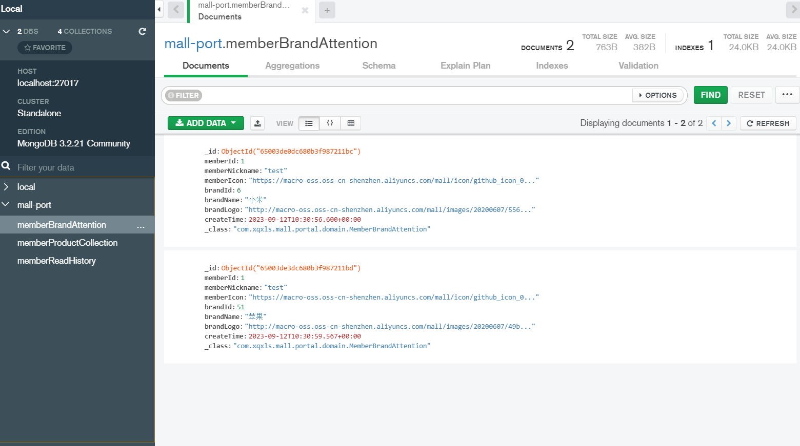

### 1.需求分析

当我们找到对应的品牌页面，点击关注，可以对品牌进行关注。点击取消，则从关注的品牌列表移除。点击清空，会清除掉当前会员的所有关注的品牌。点击我的关注，会展示所有关注的品牌。点击某一个具体品牌，会进入到品牌详情页面。

### 2.方案设计

根据需求，需要设计五个接口，分别是：

- 添加关注品牌
- 删除关注品牌
- 清空当前会员所有关注品牌
- 查找当前会员关注品牌列表
- 根据ID查找品牌详情

### 3.数据库表设计

考虑使用MongDB实现



### 4.核心代码

1.添加关注品牌

```java
@Service
public class MemberAttentionServiceImpl implements MemberAttentionService {
    @Override
    public int add(MemberBrandAttention memberBrandAttention) {
        int count = 0;
        if(memberBrandAttention.getBrandId()==null){
            return 0;
        }
        UmsMember member = memberService.getCurrentMember();
        memberBrandAttention.setMemberId(member.getId());
        memberBrandAttention.setMemberNickname(member.getNickname());
        memberBrandAttention.setMemberIcon(member.getIcon());
        memberBrandAttention.setCreateTime(new Date());
        MemberBrandAttention findAttention = memberBrandAttentionRepository.findByMemberIdAndBrandId(memberBrandAttention.getMemberId(), memberBrandAttention.getBrandId());
        if (findAttention == null) {
            if(sqlEnable){
                PmsBrand brand = brandMapper.selectByPrimaryKey(memberBrandAttention.getBrandId());
                if(brand==null){
                    return 0;
                }else{
                    memberBrandAttention.setBrandCity(null);
                    memberBrandAttention.setBrandName(brand.getName());
                    memberBrandAttention.setBrandLogo(brand.getLogo());
                }
            }
            memberBrandAttentionRepository.save(memberBrandAttention);
            count = 1;
        }
        return count;
    }
}
```

添加关注品牌操作：

- 根据会员ID和品牌ID从MongoDB查询
- 如果存在，直接返回0；如果不存在，则继续从数据库查找品牌是否存在
- 如果不存在，返回0；如果存在，则给对应实体赋值
- 调用MongoDB的入库接口

2.删除关注品牌

```java
@Service
public class MemberAttentionServiceImpl implements MemberAttentionService {
    @Override
    public int delete(Long brandId) {
        UmsMember member = memberService.getCurrentMember();
        return memberBrandAttentionRepository.deleteByMemberIdAndBrandId(member.getId(),brandId);
    }
}
```

直接调用MongoDB的接口，根据会员ID和品牌ID删除

3.清空当前会员所有关注品牌

```java
@Service
public class MemberAttentionServiceImpl implements MemberAttentionService {
    @Override
    public void clear() {
        UmsMember member = memberService.getCurrentMember();
        memberBrandAttentionRepository.deleteAllByMemberId(member.getId());
    }
}
```

直接调用MongoDB的接口，根据会员ID删除

4.查找当前会员关注品牌列表

```java
@Service
public class MemberAttentionServiceImpl implements MemberAttentionService {
    @Override
    public Page<MemberBrandAttention> list(Integer pageNum, Integer pageSize) {
        UmsMember member = memberService.getCurrentMember();
        Pageable pageable = PageRequest.of(pageNum-1,pageSize);
        return memberBrandAttentionRepository.findByMemberId(member.getId(),pageable);
    }
}
```

直接调用MongoDB的接口，根据会员ID分页查找

5.根据ID查找品牌详情

```java
@Service
public class MemberAttentionServiceImpl implements MemberAttentionService {
    @Override
    public MemberBrandAttention detail(Long brandId) {
        UmsMember member = memberService.getCurrentMember();
        return memberBrandAttentionRepository.findByMemberIdAndBrandId(member.getId(), brandId);
    }
}
```

直接调用MongoDB的接口，根据会员ID和品牌ID查找详情
