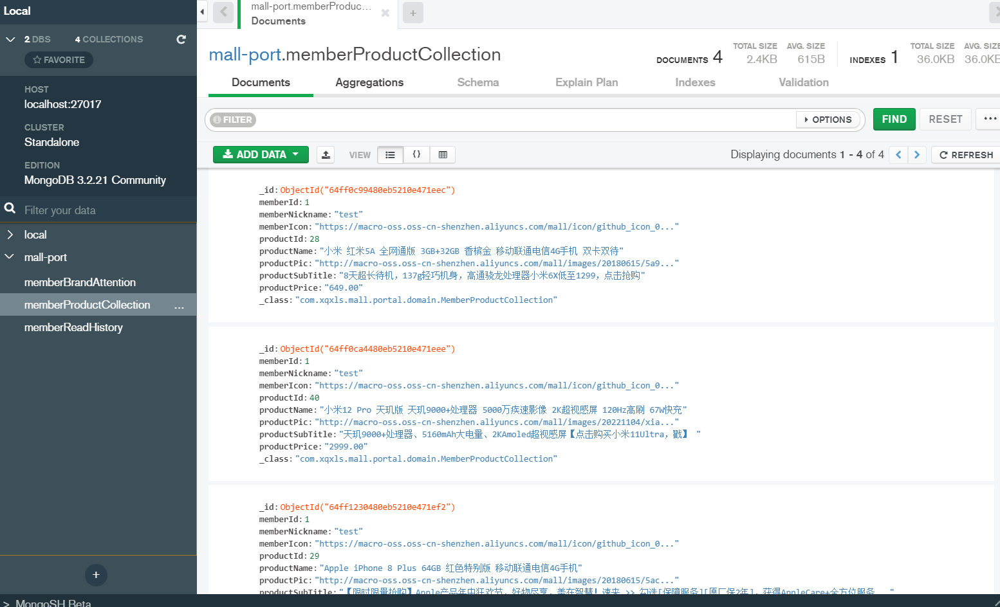

### 1.需求分析

当我们找到对应的商品页面，点击收藏，可以对商品进行收藏。点击取消，则从收藏的商品列表移除。点击清空，会清除掉当前会员的所有收藏的商品。点击我的收藏，会展示所有收藏的商品。点击某一个具体商品，会进入到商品详情页面。

### 2.方案设计

根据需求，需要设计五个接口，分别是：

- 添加收藏商品
- 删除收藏商品
- 清空当前会员所有收藏商品
- 查找当前会员收藏商品列表
- 根据ID查找收藏商品详情

### 3.数据库表设计

考虑使用MongDB实现



### 4.核心代码

1.添加收藏商品

```java
@Service
public class MemberCollectionServiceImpl implements MemberCollectionService {
    @Override
    public int add(MemberProductCollection productCollection) {
        int count = 0;
        if (productCollection.getProductId() == null) {
            return 0;
        }
        UmsMember member = memberService.getCurrentMember();
        productCollection.setMemberId(member.getId());
        productCollection.setMemberNickname(member.getNickname());
        productCollection.setMemberIcon(member.getIcon());
        MemberProductCollection findCollection = productCollectionRepository.findByMemberIdAndProductId(productCollection.getMemberId(), productCollection.getProductId());
        if (findCollection == null) {
            if (sqlEnable) {
                PmsProduct product = productMapper.selectByPrimaryKey(productCollection.getProductId());
                if (product == null || product.getDeleteStatus() == 1) {
                    return 0;
                }
                productCollection.setProductName(product.getName());
                productCollection.setProductSubTitle(product.getSubTitle());
                productCollection.setProductPrice(product.getPrice() + "");
                productCollection.setProductPic(product.getPic());
            }
            productCollectionRepository.save(productCollection);
            count = 1;
        }
        return count;
    }

}
```

添加收藏商品操作：

- 根据会员ID和商品ID从MongoDB查询
- 如果存在，直接返回0；如果不存在，则继续从数据库查找商品是否存在
- 如果不存在，返回0；如果存在，则给对应实体赋值
- 调用MongoDB的入库接口

2.删除收藏商品

```java
@Service
public class MemberCollectionServiceImpl implements MemberCollectionService {
    @Override
    public int delete(Long productId) {
        UmsMember member = memberService.getCurrentMember();
        return productCollectionRepository.deleteByMemberIdAndProductId(member.getId(), productId);
    }
}
```

直接调用MongoDB的接口，根据会员ID和商品ID删除

3.清空当前会员所有收藏商品

```java
@Service
public class MemberCollectionServiceImpl implements MemberCollectionService {
    @Override
    public void clear() {
        UmsMember member = memberService.getCurrentMember();
        productCollectionRepository.deleteAllByMemberId(member.getId());
    }
}
```

直接调用MongoDB的接口，根据会员ID删除

4.查找当前会员收藏商品列表

```java
@Service
public class MemberCollectionServiceImpl implements MemberCollectionService {
    @Override
    public Page<MemberProductCollection> list(Integer pageNum, Integer pageSize) {
        UmsMember member = memberService.getCurrentMember();
        Pageable pageable = PageRequest.of(pageNum - 1, pageSize);
        return productCollectionRepository.findByMemberId(member.getId(), pageable);
    }
}
```

直接调用MongoDB的接口，根据会员ID分页查找

5.根据ID查找收藏商品详情

```java
@Service
public class MemberCollectionServiceImpl implements MemberCollectionService {
    @Override
    public MemberProductCollection detail(Long productId) {
        UmsMember member = memberService.getCurrentMember();
        return productCollectionRepository.findByMemberIdAndProductId(member.getId(), productId);
    }
}
```

直接调用MongoDB的接口，根据会员ID和商品ID查找详情