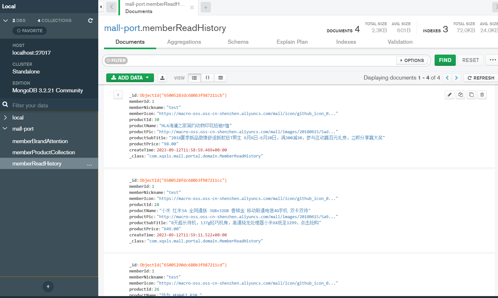

### 1.需求分析

当我们每次进入商品详情页面，浏览一个商品之后，就会新增一条商品的浏览记录。点击清空，会清除掉当前会员的所有浏览记录。点击我的足迹，会展示所有的浏览记录。

### 2.方案设计

根据需求，需要设计三个接口，分别是：

- 添加浏览记录
- 清空当前会员所有浏览记录
- 查找当前会员浏览记录列表

### 3.数据库表设计

考虑使用MongDB实现



### 4.核心代码

1.添加浏览记录

```java
@Service
public class MemberReadHistoryServiceImpl implements MemberReadHistoryService {
    @Override
    public int create(MemberReadHistory memberReadHistory) {
        if (memberReadHistory.getProductId() == null) {
            return 0;
        }
        UmsMember member = memberService.getCurrentMember();
        memberReadHistory.setMemberId(member.getId());
        memberReadHistory.setMemberNickname(member.getNickname());
        memberReadHistory.setMemberIcon(member.getIcon());
        memberReadHistory.setId(null);
        memberReadHistory.setCreateTime(new Date());
        if (sqlEnable) {
            PmsProduct product = productMapper.selectByPrimaryKey(memberReadHistory.getProductId());
            if (product == null || product.getDeleteStatus() == 1) {
                return 0;
            }
            memberReadHistory.setProductName(product.getName());
            memberReadHistory.setProductSubTitle(product.getSubTitle());
            memberReadHistory.setProductPrice(product.getPrice() + "");
            memberReadHistory.setProductPic(product.getPic());
        }
        memberReadHistoryRepository.save(memberReadHistory);
        return 1;
    }

}
```

添加浏览记录操作：

- 参数校验

- 从数据库查找商品是否存在
- 如果不存在，返回0；如果存在，则给对应实体赋值
- 调用MongoDB的入库接口

2.清空当前会员所有浏览记录

```java
@Service
public class MemberReadHistoryServiceImpl implements MemberReadHistoryService {
    @Override
    public void clear() {
        UmsMember member = memberService.getCurrentMember();
        memberReadHistoryRepository.deleteAllByMemberId(member.getId());
    }
}
```

直接调用MongoDB的接口，根据会员ID删除

3.查找当前会员浏览记录列表

```java
@Service
public class MemberReadHistoryServiceImpl implements MemberReadHistoryService {
    @Override
    public Page<MemberReadHistory> list(Integer pageNum, Integer pageSize) {
        UmsMember member = memberService.getCurrentMember();
        Pageable pageable = PageRequest.of(pageNum-1, pageSize);
        return memberReadHistoryRepository.findByMemberIdOrderByCreateTimeDesc(member.getId(),pageable);
    }
}
```

直接调用MongoDB的接口，根据会员ID分页查找