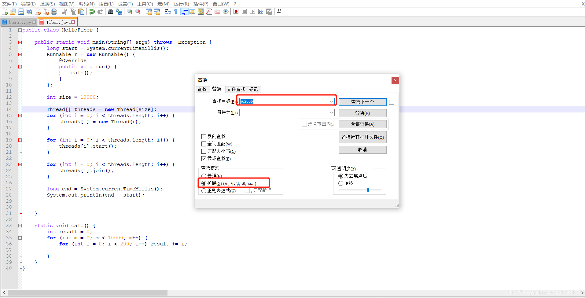

> ## 1.将原代码拷贝到notepad++
>
> ```java
> public class HelloFiber {
> 
>     public static void main(String[] args) throws  Exception {
>         long start = System.currentTimeMillis();
>         Runnable r = new Runnable() {
>             @Override
>             public void run() {
>                 calc();
>             }
>         };
> 
>         int size = 10000;
> 
>         Thread[] threads = new Thread[size];
>         for (int i = 0; i < threads.length; i++) {
>             threads[i] = new Thread(r);
>         }
> 
>         for (int i = 0; i < threads.length; i++) {
>             threads[i].start();
>         }
> 
>         for (int i = 0; i < threads.length; i++) {
>             threads[i].join();
>         }
> 
>         long end = System.currentTimeMillis();
>         System.out.println(end - start);
> 
> 
>     }
> 
>     static void calc() {
>         int result = 0;
>         for (int m = 0; m < 10000; m++) {
>             for (int i = 0; i < 200; i++) result += i;
> 
>         }
>     }
> }
> ```
> ## 2.按ctrl+F进行替换
> 选中扩展模式，将\u200b替换为空白
> 
