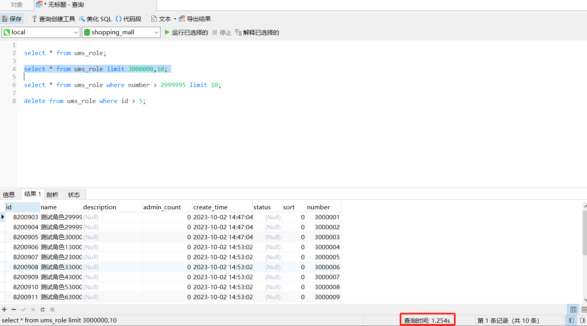
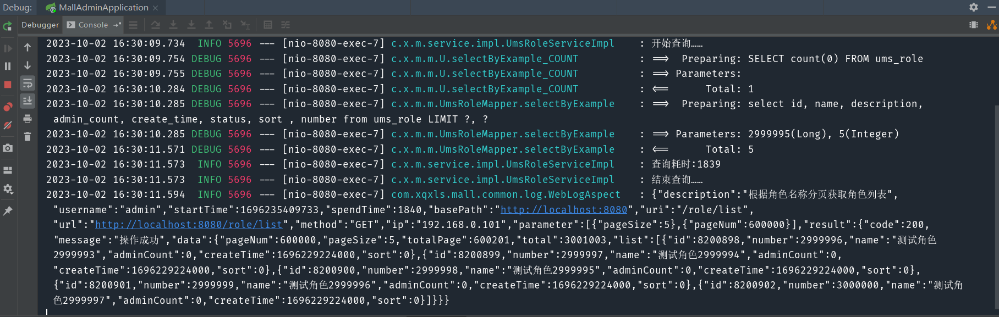
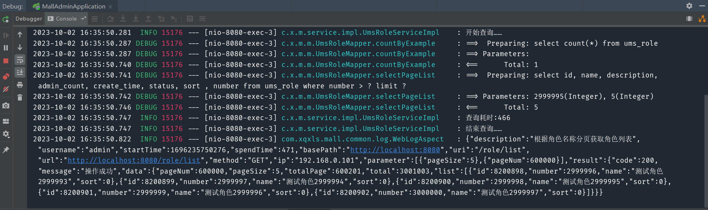
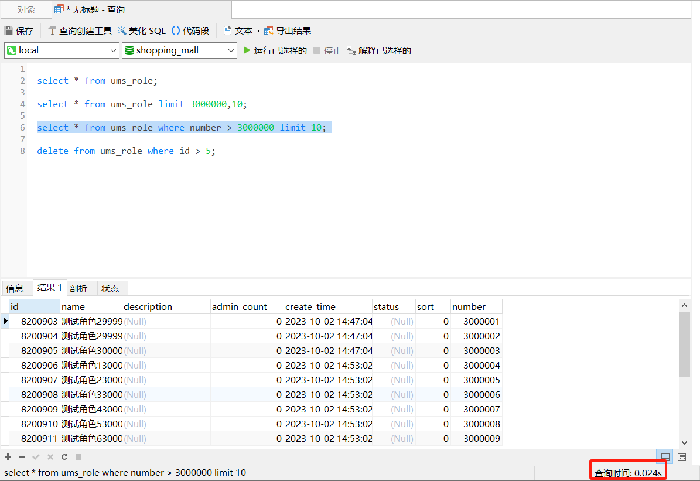

### 1.问题描述

当数据库中的数据逐渐积累，达到百万、千万级别后，使用PageHelper进行分页会拖慢查询的速度。



### 2.方案设计

PageHelper插件分页的原理是先查询总条数，然后使用limit a,b的方式查询每一页的数据。当参数a的值达到百万级别后，查询速度就会越来越慢。可以通过数据库新增一个自增字段的方式进行优化，新增的字段从1开始递增，并设置为索引，查询条件中加一个条件判断：新增的自增字段需要大于某一个值。

### 3.数据库表结构

```sql
CREATE TABLE `ums_role` (
  `id` bigint(20) NOT NULL AUTO_INCREMENT,
  `name` varchar(100) DEFAULT NULL COMMENT '名称',
  `description` varchar(500) DEFAULT NULL COMMENT '描述',
  `admin_count` int(11) DEFAULT NULL COMMENT '后台用户数量',
  `create_time` datetime DEFAULT NULL COMMENT '创建时间',
  `status` int(1) DEFAULT '1' COMMENT '启用状态：0->禁用；1->启用',
  `sort` int(11) DEFAULT '0',
  `number` bigint(20) NOT NULL DEFAULT '0' COMMENT '自增字段',
  PRIMARY KEY (`id`) USING BTREE,
  KEY `number_index` (`number`)
) ENGINE=InnoDB AUTO_INCREMENT=8201906 DEFAULT CHARSET=utf8 ROW_FORMAT=DYNAMIC COMMENT='后台用户角色表';
```

### 4.核心代码

优化前：

```java
@Service
@Slf4j
public class UmsRoleServiceImpl implements UmsRoleService {

    @Override
    public CommonPage<UmsRole> list(String keyword, Integer pageSize, Integer pageNum) {
        log.info("开始查询……");
        Long startTime = System.currentTimeMillis();
        PageHelper.startPage(pageNum,pageSize);
        UmsRoleExample example = new UmsRoleExample();
        if (!StrUtil.isEmpty(keyword)) {
            example.createCriteria().andNameLike("%" + keyword + "%");
        }
        List<UmsRole> list = roleMapper.selectByExample(example);
        CommonPage<UmsRole> result = CommonPage.restPage(list);
        Long endTime = System.currentTimeMillis();
        log.info("查询耗时:"+(endTime-startTime));
        log.info("结束查询……");
        return result;
    }
}
```

优化后：

```java
@Service
@Slf4j
public class UmsRoleServiceImpl implements UmsRoleService {

    @Override
    public CommonPage<UmsRole> list(String keyword, Integer pageSize, Integer pageNum) {
        log.info("开始查询……");
        Long startTime = System.currentTimeMillis();
        UmsRoleExample example = new UmsRoleExample();
        if (!StrUtil.isEmpty(keyword)) {
            example.createCriteria().andNameLike("%" + keyword + "%");
        }
        Long total = roleMapper.countByExample(example);
        List<UmsRole> list = roleMapper.selectPageList((pageNum-1)*pageSize,pageSize);
        CommonPage<UmsRole> result = new CommonPage<>();
        result.setPageNum(pageNum);
        result.setPageSize(pageSize);
        result.setTotal(total);
        result.setTotalPage((int) ((total+pageSize-1)/pageSize));
        result.setList(list);
        Long endTime = System.currentTimeMillis();
        log.info("查询耗时:"+(endTime-startTime));
        log.info("结束查询……");
        return result;
    }
}
```

```sql
<select id="selectPageList"  resultType="com.xqxls.mall.model.UmsRole">
    select
    <include refid="Base_Column_List" />
     from ums_role
     where number > #{offset,jdbcType=BIGINT} limit #{limit}
</select>
```

### 5.测试

优化前：



优化后：



优化后sql查询：



原来要1s多，现在只要24ms