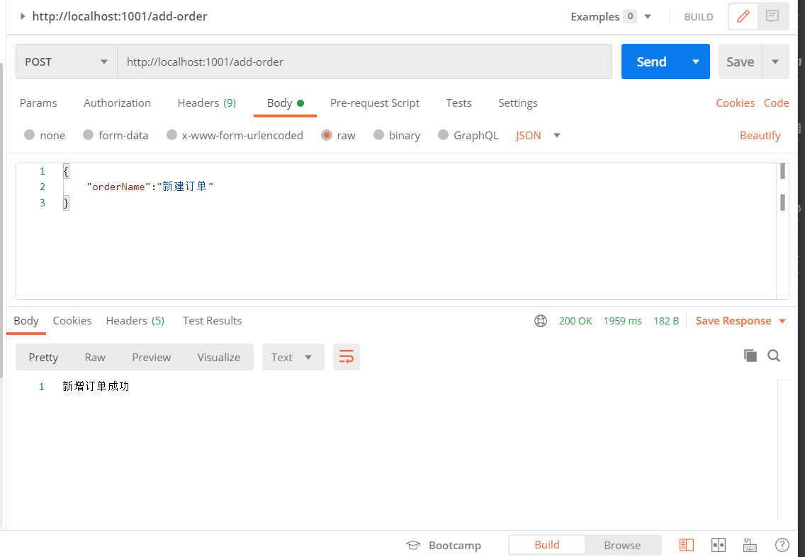
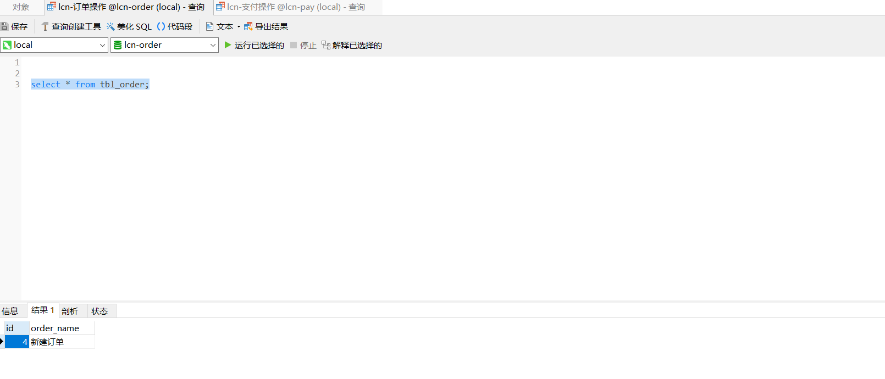
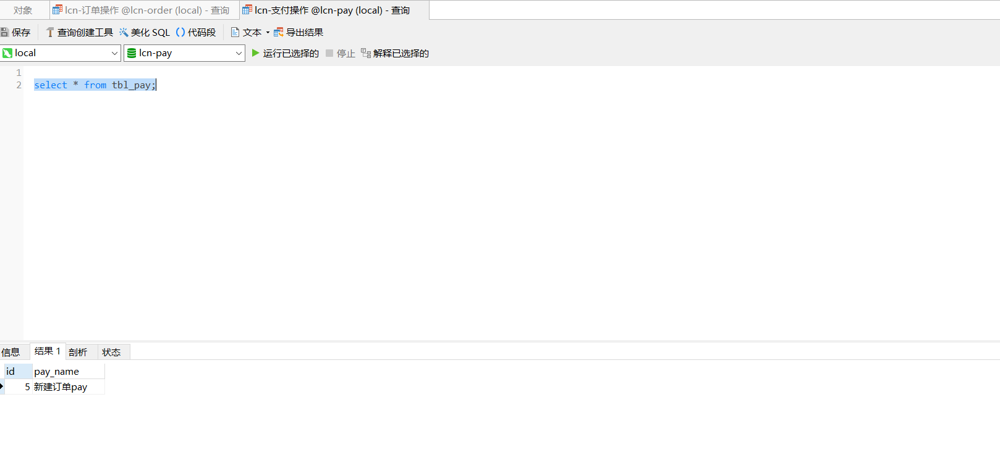

### 1.场景描述

微服务系统中，存在两个服务，订单服务和支付服务。要保证两个服务事务的一致性。也就是新增订单表时，保证新增支付表，产生异常时，回滚支付表，同时也要回滚订单表。

### 2.方案设计

可以采用lcn分布式事务框架的方案。

lcn分布式事务框架原理是基于base理论和两阶段提交。

lcn引入了事务管理器TM，以及资源管理器RM，本场景的RM包括订单服务和支付服务，首先所有的TM、RM会注册到注册中心eureka，然后所有参与事务的RM加入到事务组，由TM管理事务组的事务。在第一阶段RM会执行一次假提交，事务管理器利用代理机制，保留请求和db连接的对应。在第二阶段，如果所有的事务都提交了，则执行第一阶段的sql操作，否则进行回滚。

### 3.数据库表结构

```sql
CREATE TABLE `tbl_order` (
  `id` int(11) NOT NULL AUTO_INCREMENT,
  `order_name` varchar(255) DEFAULT NULL,
  PRIMARY KEY (`id`)
) ENGINE=InnoDB AUTO_INCREMENT=4 DEFAULT CHARSET=utf8;

CREATE TABLE `tbl_pay` (
  `id` int(11) NOT NULL AUTO_INCREMENT,
  `pay_name` varchar(255) DEFAULT NULL,
  PRIMARY KEY (`id`)
) ENGINE=InnoDB AUTO_INCREMENT=5 DEFAULT CHARSET=utf8;

CREATE TABLE `t_logger` (
  `id` bigint(20) NOT NULL AUTO_INCREMENT,
  `group_id` varchar(64) NOT NULL,
  `unit_id` varchar(32) NOT NULL,
  `tag` varchar(50) NOT NULL,
  `content` varchar(1024) NOT NULL,
  `create_time` varchar(30) NOT NULL,
  `app_name` varchar(128) NOT NULL,
  PRIMARY KEY (`id`) USING BTREE
) ENGINE=InnoDB DEFAULT CHARSET=utf8;

CREATE TABLE `t_tx_exception` (
  `id` bigint(20) NOT NULL AUTO_INCREMENT,
  `group_id` varchar(64) DEFAULT NULL,
  `unit_id` varchar(32) DEFAULT NULL,
  `mod_id` varchar(128) DEFAULT NULL,
  `transaction_state` tinyint(4) DEFAULT NULL,
  `registrar` tinyint(4) DEFAULT NULL,
  `ex_state` tinyint(4) DEFAULT NULL COMMENT '0 待处理 1已处理',
  `remark` varchar(10240) DEFAULT NULL COMMENT '备注',
  `create_time` datetime DEFAULT NULL,
  PRIMARY KEY (`id`) USING BTREE
) ENGINE=InnoDB DEFAULT CHARSET=utf8mb4 ROW_FORMAT=DYNAMIC;
```

### 4.核心代码

插入订单业务：

```java
@RestController
public class OrderController {

    @Autowired
    private TblOrderDao tblOrderDao;
    @Autowired
    private RestTemplate restTemplate;

    @PostMapping("/add-order")
    @Transactional(rollbackFor = Exception.class)
    @LcnTransaction
    public String add(@RequestBody TblOrder bean){
        JSONObject date = new JSONObject();
        date.put("payName",bean.getOrderName()+"pay");
        restTemplate.postForEntity("http://lcn-pay/add-pay",date,String.class);
        tblOrderDao.insert(bean);
        return "新增订单成功";
    }
}
```

插入支付业务：

```java
@RestController
public class PayController {

    @Autowired
    private TblPayDao tblPayDao;

    @PostMapping("/add-pay")
    @Transactional(rollbackFor = Exception.class)
    @LcnTransaction
    public String addPay(@RequestBody TblPay bean){
        tblPayDao.insert(bean);
        return "新增支付成功";

    }
}
```

### 5.测试

postman调用新增订单接口：



数据库：





### 6.github地址

https://github.com/xqxls/lcn