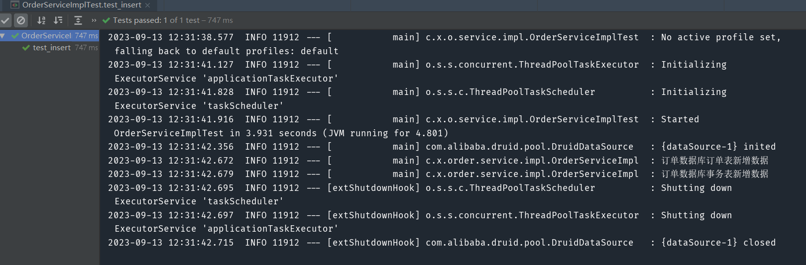
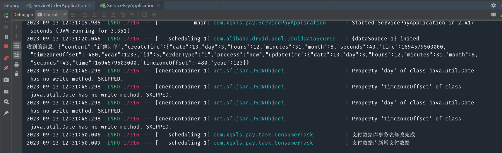
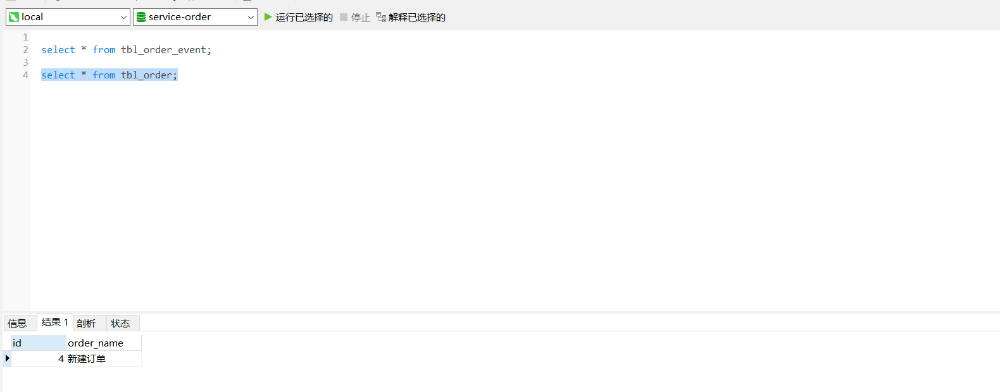
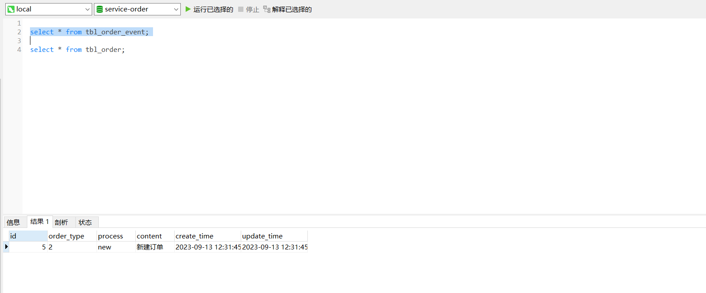
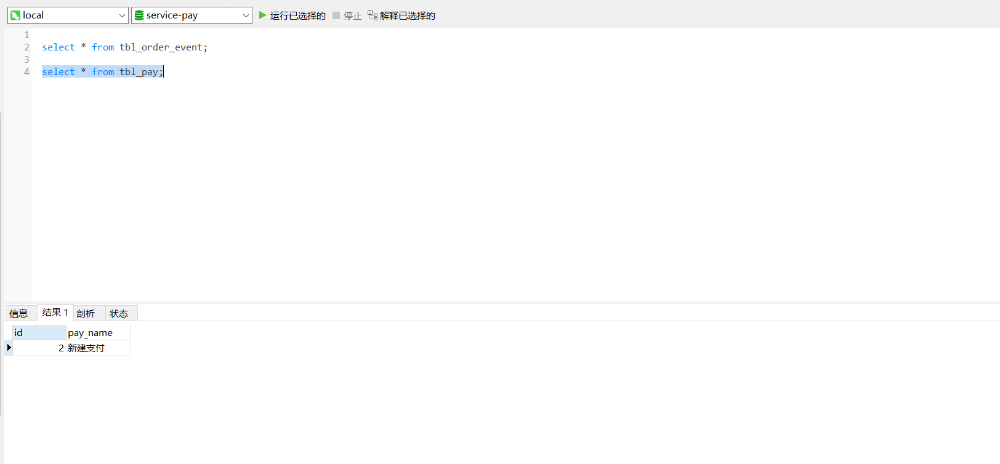
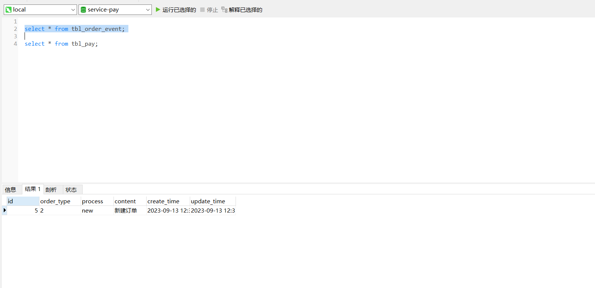

### 1.场景描述

微服务系统中，存在两个服务，订单服务和支付服务。要保证两个服务事务的一致性。也就是新增订单表时，保证新增支付表，产生异常时，回滚支付表，同时也要回滚订单表。

### 2.方案设计

可以采用消息队列+本地事件表+定时任务的方案，这种方案在数据量比较小的情况下是可行的。

首先我们要分别在订单服务和支付服务数据库分别建立一个对应的事件表。当新增订单数据时，保证订单表和订单事件表的事务一致性，然后开启一个定时任务，查询订单事件表中状态为新建的数据，将数据通过消息队列发送，同时更新事件表状态。在支付服务侧，定义一个消费者，消费队列里的数据，如果成功，则发送ack。如果失败，则回滚。同时在支付事件表里插入对应的数据。支付服务这边也要起一个定时任务，用于获取支付事件表中状态为已接收的数据，然后插入到支付表。支付服务内，保证支付事件表和支付表的事务一致性。

### 3.数据库表结构

```sql
CREATE TABLE `tbl_order` (
  `id` int(11) NOT NULL AUTO_INCREMENT,
  `order_name` varchar(255) DEFAULT NULL,
  PRIMARY KEY (`id`)
) ENGINE=InnoDB AUTO_INCREMENT=4 DEFAULT CHARSET=utf8;

CREATE TABLE `tbl_order_event` (
  `id` int(11) NOT NULL AUTO_INCREMENT,
  `order_type` varchar(255) DEFAULT NULL,
  `process` varchar(255) DEFAULT NULL,
  `content` varchar(255) DEFAULT NULL,
  `create_time` timestamp NULL DEFAULT NULL ON UPDATE CURRENT_TIMESTAMP,
  `update_time` timestamp NULL DEFAULT NULL ON UPDATE CURRENT_TIMESTAMP,
  PRIMARY KEY (`id`)
) ENGINE=InnoDB AUTO_INCREMENT=5 DEFAULT CHARSET=utf8;

CREATE TABLE `tbl_pay` (
  `id` int(11) NOT NULL AUTO_INCREMENT,
  `pay_name` varchar(255) DEFAULT NULL,
  PRIMARY KEY (`id`)
) ENGINE=InnoDB AUTO_INCREMENT=2 DEFAULT CHARSET=utf8;

CREATE TABLE `tbl_order_event` (
  `id` int(11) NOT NULL,
  `order_type` varchar(255) DEFAULT NULL,
  `process` varchar(255) DEFAULT NULL,
  `content` varchar(255) DEFAULT NULL,
  `create_time` timestamp NULL DEFAULT NULL ON UPDATE CURRENT_TIMESTAMP,
  `update_time` timestamp NULL DEFAULT NULL ON UPDATE CURRENT_TIMESTAMP,
  PRIMARY KEY (`id`)
) ENGINE=InnoDB DEFAULT CHARSET=utf8;
```

### 4.核心代码

插入订单业务：

```java
@Service
@Slf4j
public class OrderServiceImpl implements OrderService {

    @Autowired
    private TblOrderEventDao tblOrderEventDao;
    @Autowired
    private TblOrderDao tblOrderDao;

    @Transactional(rollbackFor = Exception.class)
    public void insertOrder(){
        TblOrder order = new TblOrder();
        order.setOrderName("新建订单");
        tblOrderDao.insert(order);
        log.info("订单数据库订单表新增数据");

        TblOrderEvent tblOrderEvent = new TblOrderEvent();
        tblOrderEvent.setOrderType("1");
        tblOrderEvent.setContent("新建订单");
        tblOrderEvent.setProcess("new");
        tblOrderEvent.setCreateTime(new Date());
        tblOrderEvent.setUpdateTime(new Date());
        tblOrderEventDao.insert(tblOrderEvent);
//        int i = 1/0;
        log.info("订单数据库事务表新增数据");
    }
}
```

生成者定时任务:

```java
@Component
@Slf4j
public class ProduceTask {

    @Autowired
    private TblOrderEventDao tblOrderEventDao;
    @Autowired
    private Queue queue;
    @Autowired
    JmsMessagingTemplate jmsMessagingTemplate;

    @Scheduled(cron="0/5 * * * * ?")
    @Transactional(rollbackFor = Exception.class)
    public void task(){
        log.info("生产者定时任务进行中……");
        List<TblOrderEvent> tblOrderEventList = tblOrderEventDao.selectByOrderType("1");
        for (int i = 0; i < tblOrderEventList.size(); i++) {
            TblOrderEvent event = tblOrderEventList.get(i);
            // 更改这条数据的orderType为2
            tblOrderEventDao.updateEvent(event.getOrderType());
            log.info("订单数据库事务表修改完成");
            jmsMessagingTemplate.convertAndSend(queue,JSONObject.fromObject(event).toString());
        }
    }
}
```

消费者监听：

```java
@Component
public class ConsumerQueue {

    @Autowired
    private TblOrderEventDao tblOrderEventDao;

    @JmsListener(destination = "ActiveMQQueue",containerFactory = "jmsListenerContainerFactory")
    public void receive(TextMessage textMessage, Session session) throws JMSException {
        try {
            System.out.println("收到的消息："+textMessage.getText());
            String content = textMessage.getText();
            TblOrderEvent tblOrderEvent = (TblOrderEvent) JSONObject.toBean(JSONObject.fromObject(content),TblOrderEvent.class);
            tblOrderEventDao.insert(tblOrderEvent);
            // 业务完成，确认消息 消费成功
            textMessage.acknowledge();
        }catch (Exception e){
            // 回滚消息
            e.printStackTrace();
            System.out.println("异常了");
            session.recover();
        }
    }

    /**
     * 补偿 处理（人工，脚本）。自己根据自己情况。
     * @param text
     */
    @JmsListener(destination = "DLQ.ActiveMQQueue")
    public void receive2(String text){
        System.out.println("死信队列:"+text);
    }
}
```

消费者定时任务：

```java
@Component
@Slf4j
public class ConsumerTask {

    @Autowired
    private TblOrderEventDao tblOrderEventDao;
    @Autowired
    private TblPayDao tblPayDao;

    @Scheduled(cron="0/5 * * * * ?")
    @Transactional(rollbackFor = Exception.class)
    public void task(){
        List<TblOrderEvent> tblOrderEventList = tblOrderEventDao.selectByOrderType("1");
        for (int i = 0; i < tblOrderEventList.size(); i++) {
            TblOrderEvent event = tblOrderEventList.get(i);
            // 更改这条数据的orderType为2
            tblOrderEventDao.updateEvent(event.getOrderType());
            log.info("支付数据库事务表修改完成");
            TblPay pay = new TblPay();
            pay.setPayName("新建支付");
            tblPayDao.insert(pay);
            log.info("支付数据库新增支付数据");
        }
    }
}
```

### 5.测试

```java
@RunWith(SpringRunner.class)
@SpringBootTest
public class OrderServiceImplTest {

    @Autowired
    private OrderService orderService;

    @Test
    public void test_insert() {
        orderService.insertOrder();
    }
}
```











