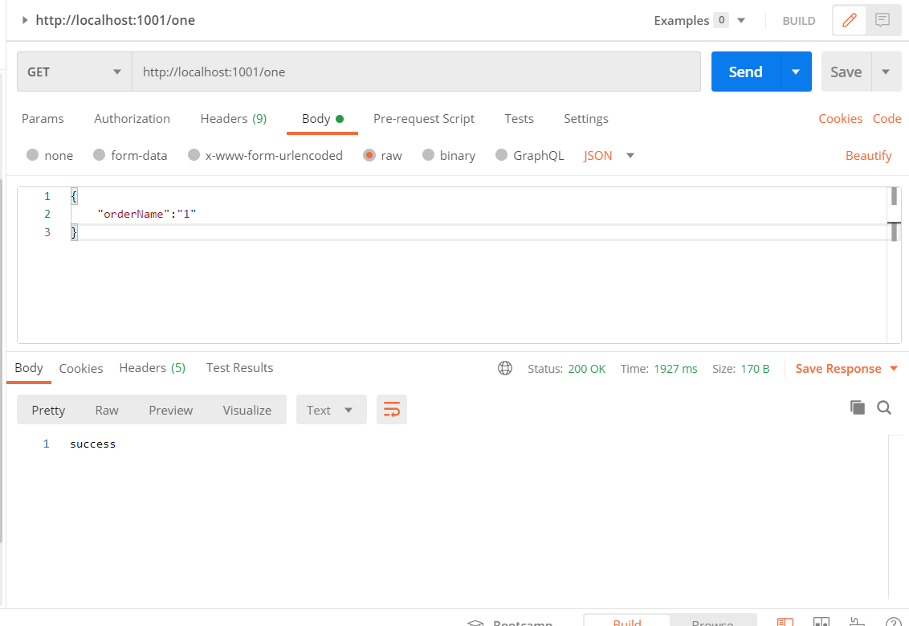
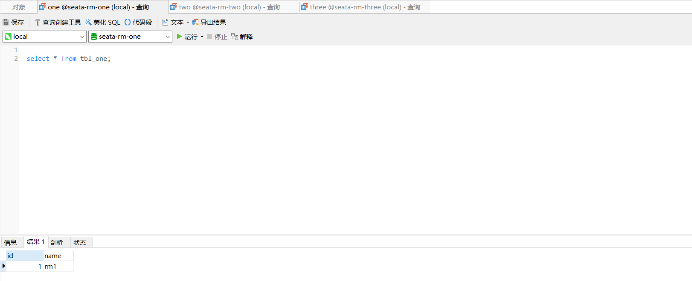
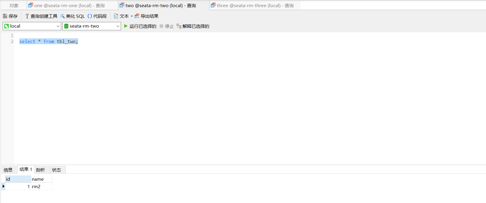
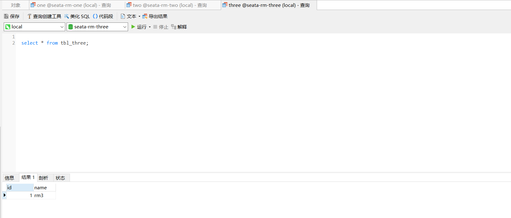

### 1.场景描述

微服务系统中，存在三个服务，one服务、two服务和three服务。要保证三个服务事务的一致性。也就是one服务新增订单时，保证two服务、three服务也新增订单，产生异常时，回滚one服务订单表，同时也要回滚two服务和three服务订单表。

### 2.方案设计

可以采用seata分布式事务框架的方案。

seata分布式事务框架原理是基于base理论和两阶段提交。

seata引入了事务协调者TC，事务发起方TM以及事务参与者RM，本场景的TM是one服务，RM包括two服务和three服务。第一步，TM会开启一个全局事务；第二步，每一个RM作为事务参与者注册一个分支事务；第三步，RM执行业务sql，回滚sql，业务数据和回滚数据一起提交，释放掉本地资源（如果要回滚，可以利用回滚日志）；第四步，TM执行commit或rollback操作；第五步，TC通知RM执行commit或rollback操作。

### 3.数据库表结构

```sql
CREATE TABLE `tbl_one` (
  `id` int(16) NOT NULL AUTO_INCREMENT,
  `name` varchar(16) DEFAULT NULL,
  PRIMARY KEY (`id`)
) ENGINE=InnoDB AUTO_INCREMENT=2 DEFAULT CHARSET=utf8

CREATE TABLE `undo_log` (
  `id` bigint(20) NOT NULL AUTO_INCREMENT,
  `branch_id` bigint(20) NOT NULL,
  `xid` varchar(100) NOT NULL,
  `context` varchar(128) NOT NULL,
  `rollback_info` longblob NOT NULL,
  `log_status` int(11) NOT NULL,
  `log_created` datetime NOT NULL,
  `log_modified` datetime NOT NULL,
  `ext` varchar(100) DEFAULT NULL,
  PRIMARY KEY (`id`),
  UNIQUE KEY `ux_undo_log` (`xid`,`branch_id`)
) ENGINE=InnoDB AUTO_INCREMENT=2 DEFAULT CHARSET=utf8;

CREATE TABLE `tbl_two` (
  `id` int(16) NOT NULL AUTO_INCREMENT,
  `name` varchar(16) DEFAULT NULL,
  PRIMARY KEY (`id`)
) ENGINE=InnoDB AUTO_INCREMENT=2 DEFAULT CHARSET=utf8;

CREATE TABLE `undo_log` (
  `id` bigint(20) NOT NULL AUTO_INCREMENT,
  `branch_id` bigint(20) NOT NULL,
  `xid` varchar(100) NOT NULL,
  `context` varchar(128) NOT NULL,
  `rollback_info` longblob NOT NULL,
  `log_status` int(11) NOT NULL,
  `log_created` datetime NOT NULL,
  `log_modified` datetime NOT NULL,
  `ext` varchar(100) DEFAULT NULL,
  PRIMARY KEY (`id`),
  UNIQUE KEY `ux_undo_log` (`xid`,`branch_id`)
) ENGINE=InnoDB AUTO_INCREMENT=2 DEFAULT CHARSET=utf8;

CREATE TABLE `tbl_three` (
  `id` int(16) NOT NULL AUTO_INCREMENT,
  `name` varchar(16) DEFAULT NULL,
  PRIMARY KEY (`id`)
) ENGINE=InnoDB AUTO_INCREMENT=2 DEFAULT CHARSET=utf8;

CREATE TABLE `undo_log` (
  `id` bigint(20) NOT NULL AUTO_INCREMENT,
  `branch_id` bigint(20) NOT NULL,
  `xid` varchar(100) NOT NULL,
  `context` varchar(128) NOT NULL,
  `rollback_info` longblob NOT NULL,
  `log_status` int(11) NOT NULL,
  `log_created` datetime NOT NULL,
  `log_modified` datetime NOT NULL,
  `ext` varchar(100) DEFAULT NULL,
  PRIMARY KEY (`id`),
  UNIQUE KEY `ux_undo_log` (`xid`,`branch_id`)
) ENGINE=InnoDB AUTO_INCREMENT=2 DEFAULT CHARSET=utf8;

CREATE TABLE `global_table` (
  `xid` varchar(128) NOT NULL,
  `transaction_id` bigint(20) DEFAULT NULL,
  `status` tinyint(4) NOT NULL,
  `application_id` varchar(32) DEFAULT NULL,
  `transaction_service_group` varchar(32) DEFAULT NULL,
  `transaction_name` varchar(128) DEFAULT NULL,
  `timeout` int(11) DEFAULT NULL,
  `begin_time` bigint(20) DEFAULT NULL,
  `application_data` varchar(2000) DEFAULT NULL,
  `gmt_create` datetime DEFAULT NULL,
  `gmt_modified` datetime DEFAULT NULL,
  PRIMARY KEY (`xid`),
  KEY `idx_gmt_modified_status` (`gmt_modified`,`status`),
  KEY `idx_transaction_id` (`transaction_id`)
) ENGINE=InnoDB DEFAULT CHARSET=utf8;

CREATE TABLE `branch_table` (
  `branch_id` bigint(20) NOT NULL,
  `xid` varchar(128) NOT NULL,
  `transaction_id` bigint(20) DEFAULT NULL,
  `resource_group_id` varchar(32) DEFAULT NULL,
  `resource_id` varchar(256) DEFAULT NULL,
  `branch_type` varchar(8) DEFAULT NULL,
  `status` tinyint(4) DEFAULT NULL,
  `client_id` varchar(64) DEFAULT NULL,
  `application_data` varchar(2000) DEFAULT NULL,
  `gmt_create` datetime(6) DEFAULT NULL,
  `gmt_modified` datetime(6) DEFAULT NULL,
  PRIMARY KEY (`branch_id`),
  KEY `idx_xid` (`xid`)
) ENGINE=InnoDB DEFAULT CHARSET=utf8;

CREATE TABLE `lock_table` (
  `row_key` varchar(128) NOT NULL,
  `xid` varchar(96) DEFAULT NULL,
  `transaction_id` bigint(20) DEFAULT NULL,
  `branch_id` bigint(20) NOT NULL,
  `resource_id` varchar(256) DEFAULT NULL,
  `table_name` varchar(32) DEFAULT NULL,
  `pk` varchar(36) DEFAULT NULL,
  `gmt_create` datetime DEFAULT NULL,
  `gmt_modified` datetime DEFAULT NULL,
  PRIMARY KEY (`row_key`),
  KEY `idx_branch_id` (`branch_id`)
) ENGINE=InnoDB DEFAULT CHARSET=utf8;
```

### 4.核心代码

one服务插入业务：

```java
@RestController
public class OneController {
    
    @GetMapping("/one")
    @GlobalTransactional(rollbackFor = Exception.class)
    public String one() throws InterruptedException {
        rmOneService.rm1();
//        TimeUnit.MINUTES.sleep(1);
//        System.out.println(1/0);
        return "success";
    }
}

@Service
public class RmOneService {
    public String rm1() {
		TblOne o = new TblOne();
		o.setId(1);
		o.setName("rm1");
		mapper.insertSelective(o);

		rm2();
		rm3();
		return "";
	}
    
	private void rm2() {
		restTemplate.getForEntity("http://two/rm2", null);
	}
	
	private void rm3() {
		restTemplate.getForEntity("http://three/rm3", null);
	}
}
```

two服务插入业务：

```java
@RestController
public class TwoController {
    
    @GetMapping("/rm2")
    public String two(){
        rmTwoService.rm2();
//        int i = 1/0;
        return "success";
    }
}

@Service
public class RmTwoService {

	public String rm2() {
		TblTwo o = new TblTwo();
		o.setId(2);
		o.setName("rm2");
		mapper.insertSelective(o);
		return "";
	}
}
```

three服务插入业务：

```java
@RestController
public class ThreeController {
    
    @GetMapping("/rm3")
    public String three(){
        rmThreeService.rm3();
//        int i = 1/0;
        return "成功";
    }
}

@Service
public class RmThreeService {
    
	public String rm3() {
		TblThree o = new TblThree();
		o.setId(3);
		o.setName("rm3");
		mapper.insertSelective(o);
		
		return "";
	}
}
```


### 5.测试

postman调用新增订单接口：



数据库：







### 6.github地址

https://github.com/xqxls/seata